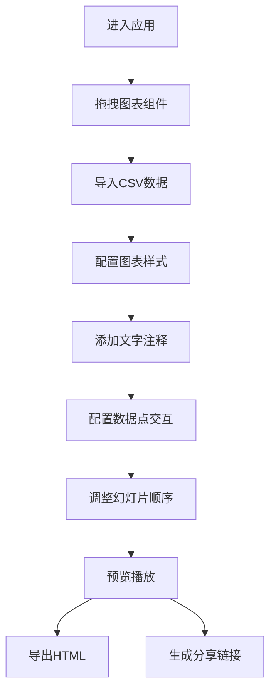

## 1. 产品概述

数据故事（Data Story）应用是一款帮助用户快速创建和分享互动式数据叙事的工具，解决传统数据分析报告枯燥、缺乏叙事性的问题。用户可以通过导入CSV数据、拖拽图表组件、配置交互事件，轻松创建富有感染力的数据故事。

- 目标用户：数据分析师、市场人员、教育工作者、内容创作者
- 产品价值：让数据可视化更具故事性和交互性，降低数据叙事门槛

## 2. 核心功能

### 2.1 功能模块

1. **可视化组件库**：提供4种图表组件（折线图、柱状图、饼图、散点图），支持基础配置，数据通过CSV导入
2. **故事编辑器**：拖拽图表到时间线画布，支持排序、Markdown文字注释、过渡动画
3. **交互式叙述**：播放模式下点击数据点弹出详情卡片，支持事件名称、描述、关联图片配置
4. **导出与分享**：导出为独立HTML文件，生成localStorage分享链接
5. **响应式预览**：桌面和移动端自适应显示

### 2.2 页面详情

| 页面名称 | 模块名称 | 功能描述 |
|---------|---------|----------|
| 主应用 | 组件库面板 | 展示可用图表类型，支持拖拽触发，CSV导入 |
| 主应用 | 时间线画布 | 接收拖拽放置，幻灯片排序，播放模式渲染 |
| 主应用 | 属性编辑面板 | 文本编辑（Markdown），数据点交互配置，图表样式设置 |
| 主应用 | 播放模式 | 全屏播放，进度条，翻页按钮，数据点交互弹窗 |
| 主应用 | 导出分享 | HTML导出，分享链接生成 |

## 3. 核心流程

用户进入应用 → 从组件库拖拽图表到画布 → 导入CSV数据 → 配置图表样式 → 添加Markdown注释 → 配置数据点交互事件 → 调整幻灯片顺序 → 预览播放 → 导出HTML或生成分享链接

## 4. 用户界面设计

### 4.1 设计风格
- **主色调**：深蓝 #1A237E（导航、按钮、选中态）
- **背景色**：浅灰 #F5F5F5（页面背景）
- **图表配色**：暖色渐变（橙→黄→红）用于数据可视化
- **按钮风格**：圆角4px，悬停轻微上浮效果，深蓝填充配白色文字
- **字体**：现代无衬线字体，标题18px/600，正文14px/400
- **布局风格**：三栏布局（左：组件库，中：画布，右：属性面板），卡片式设计
- **图标**：Lucide React图标库，简洁线性风格

### 4.2 页面设计概述

| 页面名称 | 模块名称 | UI元素 |
|---------|---------|--------|
| 主应用 | 组件库面板 | 图表缩略图卡片，拖拽预览阴影，CSV导入按钮 |
| 主应用 | 时间线画布 | 幻灯片缩略图，拖拽排序，弹性动画，播放按钮 |
| 主应用 | 属性编辑面板 | 表单输入，颜色选择器，Markdown编辑器，交互配置列表 |
| 主应用 | 播放模式 | 全屏容器，底部进度条，左右翻页按钮，详情弹窗 |

### 4.3 交互细节
- **拖拽**：组件跟随鼠标半透明阴影（box-shadow: 0 8px 32px rgba(0,0,0,0.3)），松开后弹性动画（cubic-bezier(0.34, 1.56, 0.64, 1)）
- **动画**：页面切换从右向左滑动（transform: translateX(100%) → translateX(0)，0.4s ease）
- **悬停**：卡片边框高亮，按钮背景微亮
- **响应式**：<768px时三栏合并为单栏，Tab切换面板

### 4.4 响应式
- **桌面端**（≥768px）：三栏布局，组件库240px，属性面板300px，画布自适应
- **移动端**（<768px）：单栏布局，顶部Tab切换（组件库/画布/属性面板），图表自动堆叠
- **触控优化**：按钮最小高度44px，拖拽区域放大

## 5. 性能指标

- 拖拽响应延迟 ≤ 100ms
- 图表渲染帧率 ≥ 30fps
- 页面切换动画流畅无卡顿
- CSV解析支持1000行以内数据
