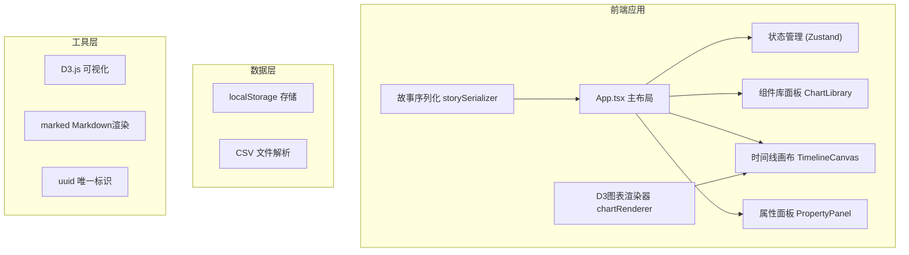

## 1. 架构设计



## 2. 技术描述

- **前端框架**：React 18 + TypeScript
- **构建工具**：Vite
- **可视化库**：D3.js v7 + d3-drag
- **状态管理**：Zustand
- **Markdown渲染**：marked
- **图标库**：lucide-react
- **唯一标识**：uuid
- **样式方案**：CSS Modules + CSS Variables

## 3. 项目结构

```
├── package.json
├── vite.config.js
├── tsconfig.json
├── index.html
└── src/
    ├── main.tsx              # 应用入口
    ├── App.tsx               # 主布局组件
    ├── store/
    │   └── useStoryStore.ts  # Zustand状态管理
    ├── components/
    │   ├── ChartLibrary.tsx  # 可视化组件库面板
    │   ├── TimelineCanvas.tsx# 时间线画布
    │   ├── PropertyPanel.tsx # 属性编辑面板
    │   ├── SlideCard.tsx     # 幻灯片卡片
    │   ├── ChartPreview.tsx  # 图表预览组件
    │   ├── PlayMode.tsx      # 播放模式组件
    │   └── DataPointModal.tsx# 数据点详情弹窗
    ├── utils/
    │   ├── chartRenderer.ts  # D3图表渲染
    │   ├── storySerializer.ts# 故事序列化
    │   └── csvParser.ts      # CSV解析工具
    ├── types/
    │   └── index.ts          # TypeScript类型定义
    └── styles/
        ├── global.css        # 全局样式
        └── variables.css     # CSS变量
```

## 4. 数据模型

### 4.1 核心类型定义

```typescript
// 图表类型
type ChartType = 'line' | 'bar' | 'pie' | 'scatter';

// 图表配置
interface ChartConfig {
  id: string;
  type: ChartType;
  title: string;
  xAxisLabel: string;
  yAxisLabel: string;
  showLegend: boolean;
  colors: string[];
  data: DataPoint[];
}

// 数据点
interface DataPoint {
  x: string | number;
  y: number;
  category?: string;
}

// 数据点交互配置
interface DataPointInteraction {
  dataIndex: number;
  eventName: string;
  description: string;
  imageUrl: string;
}

// 幻灯片
interface Slide {
  id: string;
  chartConfig: ChartConfig;
  notes: string; // Markdown
  transition: 'fade' | 'slide';
  interactions: DataPointInteraction[];
  order: number;
}

// 故事配置
interface Story {
  id: string;
  title: string;
  slides: Slide[];
  createdAt: number;
  updatedAt: number;
}
```

## 5. 状态管理（Zustand）

```typescript
interface StoryState {
  story: Story;
  selectedSlideId: string | null;
  isPlayMode: boolean;
  currentSlideIndex: number;
  draggedChartType: ChartType | null;
  
  // Actions
  addSlide: (chartType: ChartType) => void;
  removeSlide: (slideId: string) => void;
  reorderSlides: (fromIndex: number, toIndex: number) => void;
  selectSlide: (slideId: string | null) => void;
  updateSlide: (slideId: string, updates: Partial<Slide>) => void;
  updateChartConfig: (slideId: string, config: Partial<ChartConfig>) => void;
  importCSVData: (slideId: string, data: DataPoint[]) => void;
  setPlayMode: (isPlaying: boolean) => void;
  setCurrentSlideIndex: (index: number) => void;
  setDraggedChartType: (type: ChartType | null) => void;
  exportHTML: () => string;
  generateShareLink: () => string;
  loadFromShareLink: (storyId: string) => void;
}
```

## 6. 核心功能实现要点

### 6.1 拖拽系统
- 使用HTML5原生拖拽API（dragstart/dragover/drop）
- 拖拽时显示半透明跟随效果
- 放置时弹性动画（CSS transition + cubic-bezier）

### 6.2 D3图表渲染
- 每种图表独立渲染函数
- 返回SVG DOM节点，React通过ref挂载
- 响应式重绘：监听容器尺寸变化

### 6.3 播放模式动画
- CSS transform实现页面切换
- 从右向左滑动：translateX(100%) → translateX(0)
- 进度条：width百分比动画

### 6.4 数据导出
- HTML导出：序列化所有配置为JSON，嵌入到HTML模板中
- 分享链接：存储到localStorage，URL参数携带storyId

### 6.5 响应式布局
- CSS媒体查询：@media (max-width: 768px)
- 移动端使用Tab组件切换三栏
- 图表容器在移动端100%宽度堆叠
