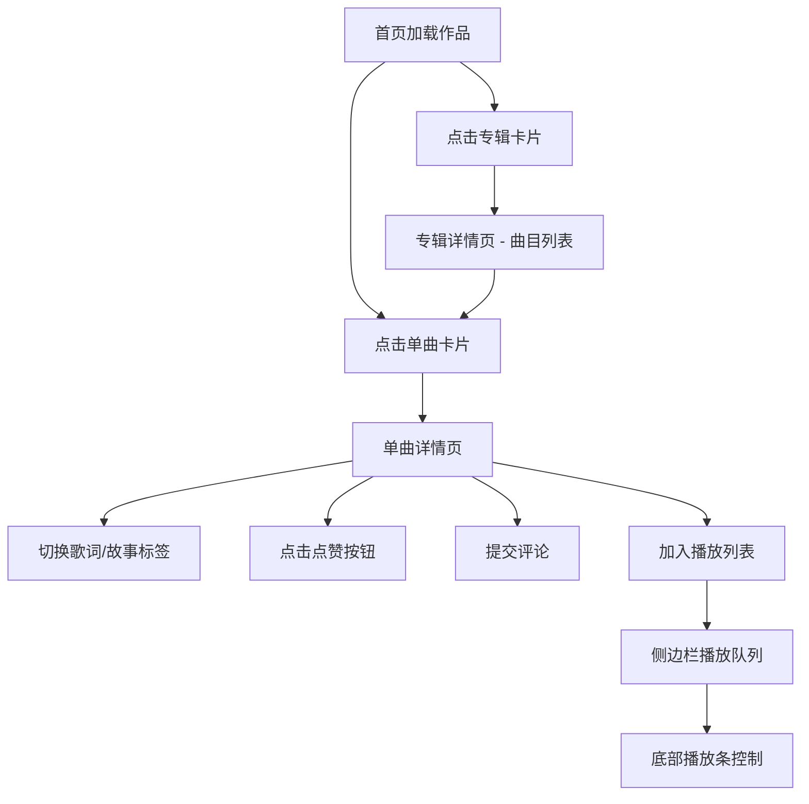

## 1. 产品概述

SoundCanvas是一个独立音乐人个人作品展示与粉丝互动空间，让访客能按专辑和单曲浏览音乐、查看歌词与创作故事，并留下评论和点赞。无需后端服务器，所有数据本地持久化。

- 主要目的：为独立音乐人提供优雅的作品展示平台，同时建立与粉丝的互动桥梁
- 目标用户：独立音乐人（内容创作）、音乐爱好者（浏览、互动）
- 产品价值：零成本搭建个人音乐作品集，打造沉浸式音乐欣赏体验

## 2. 核心功能

### 2.1 功能模块

1. **首页（推荐作品）**：作品卡片网格展示，专辑与单曲混合排列
2. **专辑详情页**：大色块背景、曲目列表、专辑信息
3. **单曲详情页**：歌词滚动、创作故事、评论区、点赞功能
4. **收藏列表页**：已点赞的单曲收藏展示
5. **播放列表抽屉**：侧边栏播放队列管理、拖拽排序
6. **底部播放条**：当前曲目播放控制、进度拖动、音量调节

### 2.2 页面详情

| 页面名称 | 模块名称 | 功能描述 |
|---------|---------|---------|
| 首页 | 作品卡片网格 | 专辑卡片（封面色块、名称、年份、曲目数）、单曲卡片（星形标记、名称、所属专辑） |
| 首页 | 侧边栏 | 专辑概览列表、播放列表抽屉（150px固定高度） |
| 专辑详情页 | 顶部区域 | 大色块背景（专辑封面色）、专辑名称、发行年份、简介 |
| 专辑详情页 | 曲目列表 | 曲目标题、时长、加入播放列表按钮、跳转单曲详情 |
| 单曲详情页 | 信息区域 | 大色块背景、曲名、所属专辑、创作时间 |
| 单曲详情页 | 标签切换区 | 歌词标签（带行号、悬停高亮）、故事标签（衬线体、浅金色竖线装饰） |
| 单曲详情页 | 评论区 | 昵称输入、内容输入（200字限制）、提交按钮、评论列表（无限滚动） |
| 单曲详情页 | 点赞区 | 心形点赞按钮、点赞数、弹跳动画 |
| 收藏列表页 | 收藏列表 | 已点赞单曲卡片、取消收藏、跳转详情 |
| 全局组件 | 底部播放条 | 曲目信息、进度条（可拖）、上一首/播放/下一首、音量滑块 |
| 全局组件 | 顶部导航 | 品牌名（渐变色）、导航链接、毛玻璃半透明效果 |

## 3. 核心流程

### 3.1 访客浏览与互动流程

访客进入首页 → 浏览作品卡片网格 → 点击专辑/单曲卡片进入详情 → 在单曲详情页切换歌词/故事标签 → 阅读歌词 → 阅读创作故事 → 点赞单曲 → 输入评论并提交 → 将单曲加入播放列表 → 通过播放条控制播放

### 3.2 音乐人内容管理流程

（通过代码预置初始数据，界面展示已存在的作品内容）

### 3.3 播放列表流程

用户点击单曲卡片"加入播放列表" → 按钮闪烁变为对勾 → 播放列表抽屉新增条目 → 用户可拖拽排序 → 点击底部播放条控制播放 → 上一首/下一首切换曲目

### 3.4 Mermaid流程图

## 4. 用户界面设计

### 4.1 设计风格

**色彩方案（深色霓虹主题）：**
- 主背景色：#1a1a2e（深邃暗蓝紫）
- 次背景色：#16213e（暗蓝灰）
- 强调色1（霓虹蓝）：#0f3460
- 强调色2（金色/玫瑰红）：#e94560
- 歌词区域背景：#1e2a45
- 分割线：#2a3a5c
- 播放条背景：#0d1b2a（0.9透明度）

**字体排版：**
- 品牌名/标题：无衬线字体 + 水平渐变（#0f3460 → #e94560）
- 歌词文本：等宽字体（monospace），行高1.6
- 创作故事：衬线字体（serif），行高1.8
- 正文/评论：系统无衬线字体

**组件样式：**
- 卡片圆角：专辑16px，评论12px
- 卡片背景：rgba(255,255,255,0.05) 半透明深色
- 悬停效果：卡片上移6px + 阴影增强
- 导航栏：半透明毛玻璃（backdrop-filter: blur(10px)）
- 点赞图标：24px，空心灰 → 实心红
- 过渡动画：0.3s~0.5s平滑过渡

### 4.2 页面设计概览

| 页面名称 | 模块名称 | UI元素与动画 |
|---------|---------|---------|
| 首页 | 作品卡片网格 | 网格布局，卡片悬停上移6px+阴影，封面色块悬停放大1.1倍旋转5度 |
| 首页 | 侧边栏 | 固定宽度，底部150px播放列表抽屉，支持拖拽排序 |
| 专辑详情 | 顶部大色块 | 全屏宽度色块背景，渐变叠加，标题居中浮于色块上方 |
| 单曲详情 | 歌词区域 | 等宽字体带行号，行悬停浅灰背景，垂直滚动容器 |
| 单曲详情 | 故事区域 | 衬线体行高1.8，左侧浅金色3px竖线装饰，首字下沉效果 |
| 单曲详情 | 评论卡片 | 淡入动画0.4s，删除时左滑消失，5分钟内可删除标识 |
| 单曲详情 | 点赞按钮 | 心形弹跳动画（缩放1.3→1.0，0.3s），点击后填充红心 |
| 全局 | 底部播放条 | 64px高度固定底部，圆形进度拖动手柄，金色已播放部分，竖排音量滑块 |

### 4.3 响应式适配

- **桌面端（>768px）**：左侧边栏固定，主内容区右侧展示，底部播放条全宽
- **移动端（≤768px）**：侧边栏折叠为顶部汉堡菜单抽屉，播放列表抽屉变为底部全宽滑块，网格布局改为单列
- **触控优化**：按钮最小触控区域44x44px，滚动容器惯性滚动

### 4.4 性能优化

- IndexedDB懒加载：首屏500ms内完成初始渲染
- 评论无限滚动：滚动加载延迟≤100ms
- 播放进度拖动：界面响应间隔≤50ms
- 点赞状态更新：DOM更新≤16ms
- 所有动画采用CSS transform/opacity，触发GPU加速
