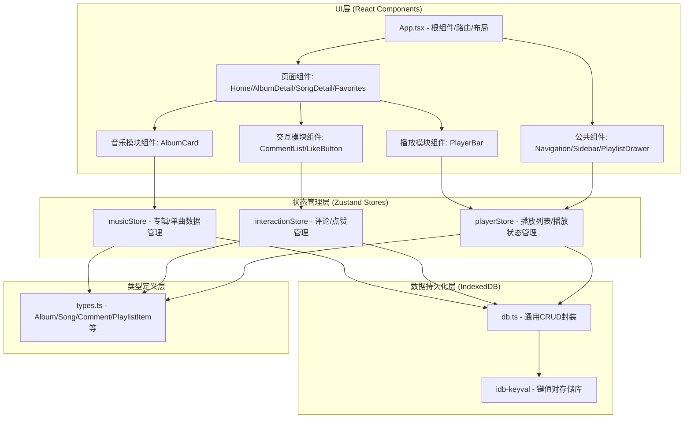
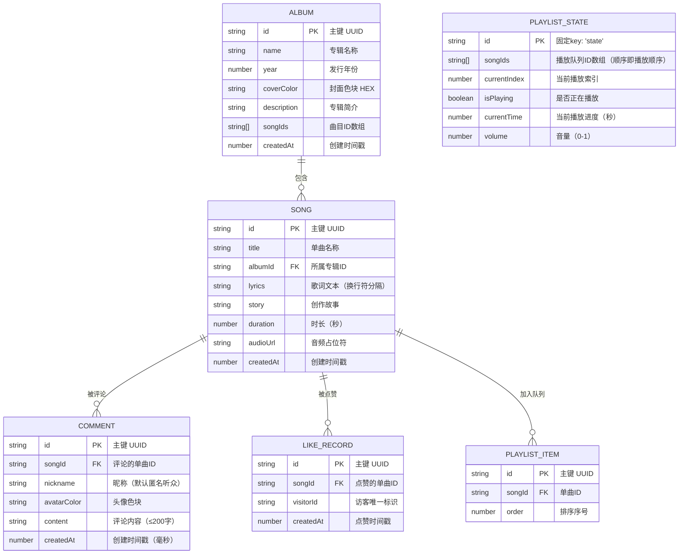

## 1. 架构设计



## 2. 技术说明

### 2.1 技术栈选型
- **前端框架**：React@18 + React DOM@18（函数组件+Hooks）
- **构建工具**：Vite@5（极速热更新，ES2020目标）
- **开发语言**：TypeScript@5（严格模式strict: true）
- **路由管理**：react-router-dom@6（声明式路由）
- **状态管理**：Zustand@4（轻量、不可变、无Provider嵌套）
- **本地数据库**：IndexedDB（通过idb-keyval库封装）
- **辅助工具**：uuid（唯一ID生成），lucide-react（SVG图标）

### 2.2 初始化工具与方式
- 使用Vite脚手架初始化项目：`vite-init` + react-ts模板
- 手动调整package.json依赖版本，确保react@18/react-dom@18/react-router-dom@6
- 通过npm install安装所有依赖

### 2.3 数据存储方案
- **存储引擎**：浏览器IndexedDB（无后端，纯前端）
- **封装库**：idb-keyval（Promise化的简洁KV API）
- **数据结构**：
  - albums: 专辑列表（含封面色块、年份、曲目ID数组）
  - songs: 单曲列表（含歌词、创作故事、所属专辑ID）
  - comments: 评论记录（按songId索引）
  - likes: 点赞记录（songId + session标识）
  - playlist: 播放队列（songId数组 + 当前索引）
  - favorites: 收藏的单曲ID数组

## 3. 路由定义

| 路由路径 | 页面组件 | 用途说明 |
|---------|---------|---------|
| `/` | `HomePage` | 首页：作品卡片网格展示（专辑+单曲混合） |
| `/album/:albumId` | `AlbumDetailPage` | 专辑详情页：顶部大色块 + 曲目列表 |
| `/song/:songId` | `SongDetailPage` | 单曲详情页：歌词/故事标签 + 评论 + 点赞 |
| `/favorites` | `FavoritesPage` | 收藏列表页：已点赞的单曲展示 |

## 4. 数据模型

### 4.1 实体关系图



### 4.2 初始预置数据（Seed）

预置3张专辑、共12首单曲示例数据，确保首屏即可展示完整功能：

**专辑1 - 《Midnight Echoes》(2024)**：#4a1942（深紫）
- 01 Starlight Serenade（星空小夜曲）
- 02 Neon Dreams（霓虹梦境）
- 03 Velvet Rain（丝绒雨）
- 04 Midnight Whisper（午夜私语）

**专辑2 - 《Solar Flare》(2023)**：#c2410c（琥珀橙）
- 05 Golden Hour（黄金时刻）
- 06 Sunflower Blues（向日葵蓝调）
- 07 Warm Horizon（温暖地平线）

**专辑3 - 《Ocean Depths》(2022)**：#0369a1（深海蓝）
- 08 Deep Blue Lullaby（深蓝摇篮曲）
- 09 Tidal Memory（潮汐记忆）
- 10 Coral Garden（珊瑚花园）
- 11 Whale's Song（鲸之歌）
- 12 Abyss Light（深渊之光）

每首单曲预置：中文歌词示例（6-10行）、创作故事（150-200字）
评论区预置3-5条历史评论数据
热门单曲预置50-200不等的点赞数

## 5. 文件结构

```
d:\P\tasks\auto100\
├── package.json              # 项目依赖与脚本配置
├── vite.config.js            # Vite构建配置（React插件）
├── tsconfig.json             # TypeScript严格模式配置
├── index.html                # 入口HTML页面
└── src/
    ├── main.tsx              # React应用入口
    ├── App.tsx               # 根组件（路由+布局）
    ├── types.ts              # 全局类型定义
    ├── db.ts                 # IndexedDB通用封装
    ├── styles/
    │   └── global.css        # 全局样式、CSS变量、动画
    ├── modules/
    │   ├── music/
    │   │   ├── index.ts          # musicStore状态管理
    │   │   ├── components/
    │   │   │   └── AlbumCard.tsx # 专辑卡片组件
    │   │   └── data.ts           # 初始种子数据
    │   ├── interaction/
    │   │   ├── index.ts          # interactionStore状态管理
    │   │   └── components/
    │   │       ├── CommentList.tsx   # 评论列表组件
    │   │       └── LikeButton.tsx    # 点赞按钮组件
    │   └── player/
    │       ├── index.ts          # playerStore状态管理
    │       └── components/
    │           ├── PlayerBar.tsx      # 底部播放条组件
    │           └── PlaylistDrawer.tsx # 播放列表抽屉
    ├── components/             # 公共组件
    │   ├── Navigation.tsx      # 顶部导航栏
    │   ├── Sidebar.tsx         # 侧边栏
    │   └── SongCard.tsx        # 单曲卡片组件
    └── pages/                  # 页面组件
        ├── HomePage.tsx            # 首页
        ├── AlbumDetailPage.tsx     # 专辑详情页
        ├── SongDetailPage.tsx      # 单曲详情页
        └── FavoritesPage.tsx       # 收藏列表页
```

### 5.1 调用关系与数据流向说明

**数据流入方向：**
1. 用户交互（点击卡片/提交评论/点赞/加入播放列表）
2. → 页面/组件回调函数
3. → 对应Zustand Store的action方法
4. → db.ts写入IndexedDB
5. → Store状态不可变更新
6. → 订阅Store的组件自动重新渲染

**数据流出方向：**
1. IndexedDB初始化读取（应用启动时懒加载）
2. → Zustand Store初始化hydrate
3. → Store selector暴露给组件
4. → 组件接收props渲染UI

**模块间调用关系：**
- `App.tsx` → 路由配置 → 引入全部pages和全局组件
- `pages/*Page.tsx` → 引入三个modules的store和components
- `modules/*/index.ts` → 引入`db.ts`和`types.ts`
- `components/*.tsx` → 引入对应module的store
- `db.ts` → 引入`idb-keyval`和`types.ts`

## 6. 性能优化策略

### 6.1 IndexedDB懒加载
- 应用启动时不阻塞渲染，先展示空骨架屏
- Store使用`onRehydrate`模式：先同步初始化默认数据
- 异步从IndexedDB读取完成后merge状态，触发最小范围重渲染
- 首屏渲染目标：<500ms（含框架启动）

### 6.2 组件级优化
- 使用Zustand selector精确订阅：组件只订阅自身使用的字段
- 长列表（评论/曲目）使用虚拟滚动（IntersectionObserver实现）
- `React.memo`包裹纯展示组件，避免父级无关重渲染
- 评论列表无限滚动：每次加载10条，滚动到底部100px提前触发

### 6.3 动画性能
- 所有交互动画使用CSS `transform` + `opacity`
- 使用`will-change: transform`提示GPU加速
- 点赞弹跳使用CSS keyframes动画，非JS逐帧
- 卡片悬停使用`translate3d`触发合成层

### 6.4 状态更新性能
- Zustand原生不可变更新，避免深拷贝
- 点赞操作：只更新对应songId的计数数组，O(1)更新
- 播放进度：使用`requestAnimationFrame`节流，目标60fps
- 拖拽排序：HTML5原生拖拽API，减少JS计算量
