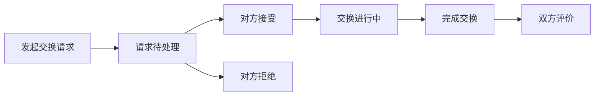
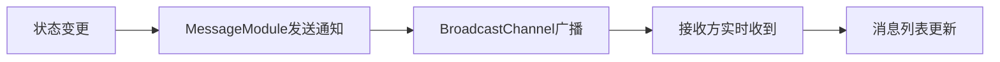

## 1. 产品概述
SkillSwapHub 是一个在线技能交换平台，让用户可以发布自己擅长的技能，搜索他人的技能，发起技能交换请求，并通过实时通讯进行沟通协商，最后评价交换体验。平台旨在建立一个无货币化的技能共享社区，帮助用户以技能换技能的方式互相学习成长。

- 核心价值：零成本技能交换，打破知识付费壁垒
- 目标用户：希望学习新技能同时愿意分享自己专长的各年龄段用户
- 产品定位：简洁现代的卡片式技能交换社区

## 2. 核心功能

### 2.1 用户角色
| 角色 | 注册方式 | 核心权限 |
|------|----------|----------|
| 普通用户 | 用户名注册（本地存储） | 发布技能、搜索技能、发起交换、实时聊天、发布评价 |

### 2.2 功能模块
1. **技能广场**：技能分类展示、关键词搜索、技能卡片浏览
2. **个人中心**：个人信息管理、技能发布与管理、交换请求管理、收到的评价
3. **交换请求**：发起交换请求、接受/拒绝请求、完成交换
4. **即时消息**：实时聊天、对话列表、消息通知
5. **评价系统**：星级评分、文字评价、平均评分计算

### 2.3 页面详情
| 页面名称 | 模块名称 | 功能描述 |
|----------|----------|----------|
| 技能广场 | 技能列表 | 按类别分栏展示（编程/设计/语言/其他），支持关键词模糊搜索 |
| 技能广场 | 搜索框 | 顶部搜索栏，0.1秒延迟模糊匹配，支持名称/描述/标签匹配 |
| 技能广场 | 技能卡片 | 280px宽卡片，圆角16px，2px边框，悬停上浮+阴影动画 |
| 个人中心 | 用户信息 | 头像（首字母圆形）、用户名、注册时间、综合评分 |
| 个人中心 | 技能管理 | 网格布局展示已发布技能，支持发布新技能 |
| 个人中心 | 交换请求 | 收到/发出的交换请求列表，支持接受/拒绝/完成操作 |
| 个人中心 | 评价列表 | 按时间倒序展示收到的评价，包含评分星级和文字 |
| 交换请求模态框 | 发起请求 | 选择自己的技能、填写请求说明、提交交换请求 |
| 聊天面板 | 对话列表 | 左侧头像列表，点击切换对话 |
| 聊天面板 | 消息区域 | 气泡式消息展示，支持发送消息和实时同步 |
| 评价页面 | 评分评价 | 1-5星选择 + 文字评价（10-500字） |

## 3. 核心流程

### 3.1 用户使用主流程
用户注册登录 → 发布个人技能 → 浏览技能广场 → 搜索感兴趣的技能 → 发起交换请求 → 对方接受请求 → 双方实时聊天协商 → 完成交换 → 互相评价

### 3.2 交换请求流程

### 3.3 消息通知流程

## 4. 用户界面设计

### 4.1 设计风格
- **主色调**：蓝色 #1890ff，深蓝色 #003a8c
- **辅助色**：橙色 #fa8c16，绿色 #52c41a
- **背景色**：极浅蓝色 #f0f5ff
- **卡片样式**：白色背景，圆角设计，轻微阴影
- **按钮样式**：圆角8px，轻微阴影，点击缩放0.95反馈
- **字体**：现代无衬线字体，清晰的层级关系
- **动效**：卡片fadeIn入场动画，悬停过渡效果，平滑页面切换

### 4.2 页面设计概览
| 页面名称 | 模块名称 | UI元素 |
|----------|----------|--------|
| 技能广场 | 导航栏 | 固定顶部56px，品牌Logo，三个导航项，下划线指示器 |
| 技能广场 | 搜索区域 | 顶部搜索框，圆角设计，搜索图标 |
| 技能广场 | 技能分栏 | 四列布局，类别标题，卡片网格 |
| 技能广场 | 技能卡片 | 280px宽，圆角16px，2px边框，悬停上浮效果 |
| 个人中心 | 用户头部 | 80px圆形头像，用户名，评分，注册时间 |
| 个人中心 | 技能网格 | 每行3个卡片，网格布局 |
| 个人中心 | 标签切换 | 技能/请求/评价三个标签页 |
| 聊天面板 | 对话列表 | 左侧50px宽头像列表 |
| 聊天面板 | 消息气泡 | 左白右蓝，特殊圆角设计 |
| 聊天面板 | 输入区域 | 底部固定输入框+发送按钮 |

### 4.3 响应式设计
- 桌面端（>768px）：多列布局，完整导航
- 平板端：自适应列数调整
- 移动端（<768px）：单列布局，汉堡菜单导航

### 4.4 动画与交互
- 页面入场：卡片从下往上fadeIn（0.4s）
- 悬停效果：卡片上浮4px + 阴影加深（0.2s过渡）
- 导航切换：下划线平滑过渡（0.3s）
- 提示条：从上方滑入 + 自动淡出（0.3s过渡）
- 按钮点击：缩放0.95反馈
