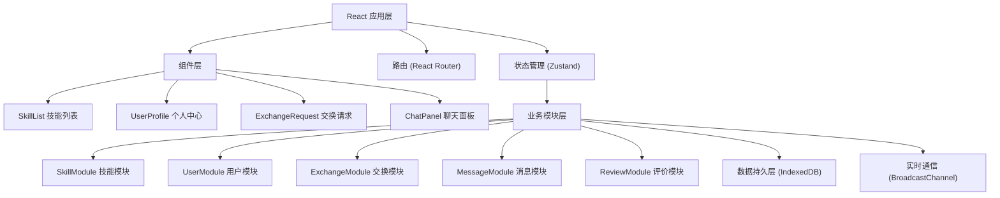
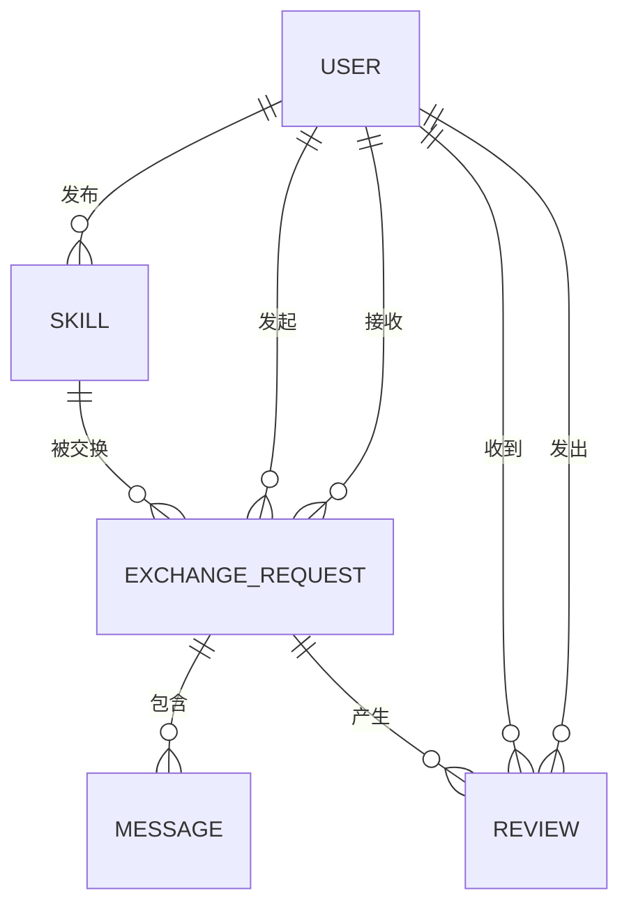

## 1. 架构设计



## 2. 技术描述

### 2.1 前端技术栈
- **框架**: React 18 + TypeScript
- **构建工具**: Vite
- **状态管理**: Zustand
- **路由**: React Router DOM v6
- **数据持久化**: idb-keyval (IndexedDB 封装)
- **唯一ID**: uuid
- **实时通信**: BroadcastChannel API
- **样式方案**: 原生 CSS + CSS Modules 风格（类名组织）

### 2.2 核心特性
- **无后端依赖**: 所有数据存储在浏览器 IndexedDB 中
- **同源实时通信**: 使用 BroadcastChannel API 实现多标签页实时消息同步
- **本地数据缓存**: 搜索结果缓存，提升响应速度
- **纯前端应用**: 零服务端依赖，可直接静态部署

## 3. 目录结构

```
src/
├── main.tsx              # 应用入口，初始化路由和全局状态
├── types.ts              # 共享类型定义
├── styles/
│   └── global.css        # 全局样式
├── modules/              # 业务模块层
│   ├── skill/
│   │   └── SkillModule.ts    # 技能模块
│   ├── user/
│   │   └── UserModule.ts     # 用户模块
│   ├── exchange/
│   │   └── ExchangeModule.ts # 交换模块
│   ├── message/
│   │   └── MessageModule.ts  # 消息模块
│   └── review/
│       └── ReviewModule.ts   # 评价模块
├── store/                # Zustand 状态管理
│   ├── useUserStore.ts
│   ├── useSkillStore.ts
│   ├── useExchangeStore.ts
│   └── useMessageStore.ts
├── components/           # 组件层
│   ├── Navbar.tsx
│   ├── SkillCard.tsx
│   ├── SkillList.tsx
│   ├── UserProfile.tsx
│   ├── ExchangeRequest.tsx
│   ├── ChatPanel.tsx
│   ├── Modal.tsx
│   └── Toast.tsx
├── pages/                # 页面层
│   ├── SkillSquare.tsx
│   ├── Profile.tsx
│   └── Chat.tsx
└── utils/                # 工具函数
    ├── avatar.ts
    ├── debounce.ts
    └── idb.ts
```

## 4. 路由定义

| 路由 | 页面 | 用途 |
|------|------|------|
| `/` | 技能广场 | 展示所有技能，支持搜索和分类浏览 |
| `/profile` | 个人中心 | 展示和管理个人信息、技能、请求、评价 |
| `/profile/:userId` | 用户详情 | 查看其他用户的个人主页 |
| `/chat` | 聊天面板 | 实时消息对话列表和聊天界面 |
| `/exchange/:requestId` | 交换详情 | 交换请求详情和操作 |

## 5. 数据模型

### 5.1 实体关系图



### 5.2 类型定义

#### User (用户)
```typescript
interface User {
  id: string;
  username: string;
  description: string;
  avatarColor: string;
  createdAt: number;
  averageRating: number;
  reviewCount: number;
}
```

#### Skill (技能)
```typescript
interface Skill {
  id: string;
  userId: string;
  name: string;
  category: 'programming' | 'design' | 'language' | 'other';
  description: string;
  tags: string[];
  createdAt: number;
}
```

#### ExchangeRequest (交换请求)
```typescript
interface ExchangeRequest {
  id: string;
  requesterId: string;
  recipientId: string;
  targetSkillId: string;
  offeredSkillId: string;
  message: string;
  status: 'pending' | 'accepted' | 'rejected' | 'completed';
  createdAt: number;
  updatedAt: number;
}
```

#### Message (消息)
```typescript
interface Message {
  id: string;
  exchangeRequestId: string;
  senderId: string;
  content: string;
  timestamp: number;
  status: 'sending' | 'sent' | 'delivered';
}
```

#### Review (评价)
```typescript
interface Review {
  id: string;
  exchangeRequestId: string;
  reviewerId: string;
  revieweeId: string;
  rating: number; // 1-5
  content: string;
  createdAt: number;
}
```

## 6. 模块设计

### 6.1 SkillModule (技能模块)
- **发布技能**: `createSkill(skillData)`
- **搜索技能**: `searchSkills(keyword)` - 模糊匹配名称、描述、标签
- **分类浏览**: `getSkillsByCategory(category)`
- **用户技能**: `getUserSkills(userId)`
- **技能详情**: `getSkillById(skillId)`

### 6.2 UserModule (用户模块)
- **注册**: `registerUser(userData)`
- **登录**: `loginUser(username)`
- **更新信息**: `updateUser(userId, userData)`
- **获取用户**: `getUserById(userId)`
- **获取用户技能**: 调用 SkillModule

### 6.3 ExchangeModule (交换模块)
- **发起请求**: `createExchangeRequest(requestData)`
- **接受请求**: `acceptRequest(requestId)`
- **拒绝请求**: `rejectRequest(requestId)`
- **完成交换**: `completeExchange(requestId)`
- **获取用户请求**: `getUserExchangeRequests(userId)`
- **状态校验**: 调用 UserModule 和 SkillModule 校验数据

### 6.4 MessageModule (消息模块)
- **发送消息**: `sendMessage(messageData)`
- **接收消息**: 通过 BroadcastChannel 监听
- **对话列表**: `getConversations(userId)`
- **消息历史**: `getMessages(requestId)`
- **通知触发**: 由 ExchangeModule 在状态变更时调用

### 6.5 ReviewModule (评价模块)
- **发布评价**: `createReview(reviewData)`
- **用户评价**: `getUserReviews(userId)`
- **平均评分**: `calculateAverageRating(userId)`
- **交换评价校验**: 交换完成后才能评价

## 7. 性能优化

### 7.1 搜索性能
- 搜索防抖：0.1秒延迟触发
- 结果缓存：首次搜索后缓存结果
- 索引优化：预构建搜索索引

### 7.2 渲染性能
- 组件懒加载：路由级别代码分割
- 列表虚拟滚动：长列表优化
- 记忆化组件：React.memo 减少重渲染

### 7.3 数据性能
- IndexedDB 索引：常用查询字段建立索引
- 批量操作：减少数据库读写次数
- 内存缓存：Zustand store 缓存热点数据

### 7.4 动画性能
- CSS transforms：使用 transform 实现动画
- will-change：提前告知浏览器优化
- 减少重排：避免布局抖动

## 8. 数据持久化方案

### 8.1 IndexedDB Store 设计
| Store 名称 | 主键 | 索引 |
|------------|------|------|
| users | id | username |
| skills | id | userId, category |
| exchangeRequests | id | requesterId, recipientId, status |
| messages | id | exchangeRequestId, timestamp |
| reviews | id | revieweeId, reviewerId |

### 8.2 初始化流程
1. 应用启动时检查 IndexedDB
2. 如无数据，初始化 mock 数据（演示用）
3. 加载当前用户数据到 Zustand store
4. 设置 BroadcastChannel 监听

### 8.3 BroadcastChannel 消息协议
```typescript
interface ChannelMessage {
  type: 'new_message' | 'request_status_change' | 'new_review';
  payload: any;
  timestamp: number;
}
```
