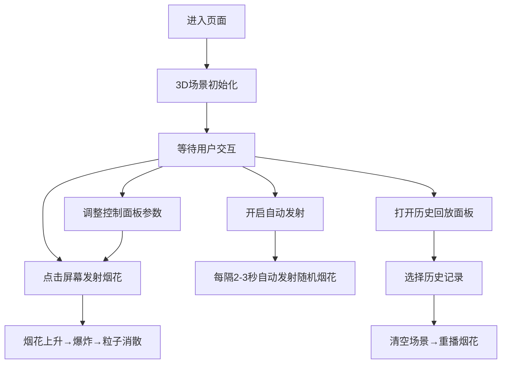

## 1. 产品概述

烟花绽放模拟器是一个基于Three.js的交互式3D烟花效果创作应用，解决用户在浏览器中无法实时创作并观赏自定义烟花效果的痛点。用户可以通过点击发射烟花、自定义颜色、形状、粒子数量等参数，创造个性化的夜空烟花表演。

- **核心价值**：让用户在浏览器中实时创作并观赏自定义烟花效果，提供沉浸式的夜空烟花体验
- **目标用户**：视觉效果爱好者、创意设计师、普通大众用户
- **市场定位**：轻量级、沉浸式的Web端3D互动娱乐应用

## 2. 核心功能

### 2.1 用户角色

| 角色 | 注册方式 | 核心权限 |
|------|---------|---------|
| 普通用户 | 无需注册 | 使用所有烟花创作与观赏功能 |

### 2.2 功能模块

1. **主场景模块**：3D夜空场景渲染、背景星空、相机控制
2. **烟花粒子系统**：烟花发射、尾迹效果、爆炸粒子物理模拟、多种爆炸形状
3. **颜色控制系统**：12色色板选择、多色渐变生成、粒子颜色随生命周期变化
4. **交互控制面板**：颜色选择器、形状选择器、粒子数量滑块、自动发射开关、面板最小化
5. **历史回放系统**：烟花发射记录、快照缩略图、重播功能

### 2.3 页面详情

| 页面名称 | 模块名称 | 功能描述 |
|---------|---------|---------|
| 主页面 | 3D烟花场景 | 点击发射烟花、鼠标拖拽旋转视角、滚轮缩放 |
| 主页面 | 控制面板 | 颜色选择（最多3色）、形状选择（圆/星/心）、粒子数量调节、自动发射开关 |
| 主页面 | 历史回放面板 | 显示最近10次发射记录、点击重播任意烟花 |

## 3. 核心流程

用户进入页面后，默认看到深蓝色渐变夜空背景和闪烁星星。用户可以点击屏幕任意位置发射烟花，烟花上升并爆炸成彩色粒子。用户可通过右下角控制面板调整颜色、形状、粒子数量等参数，开启自动发射模式欣赏连续烟花表演。点击左上角回放按钮可查看历史记录并重播任意烟花。

## 4. 用户界面设计

### 4.1 设计风格

- **主色调**：深蓝紫色渐变背景（#0a0a2a → #1a1a3a），营造深邃夜空氛围
- **强调色**：12种预设颜色（柔和粉、日落橙、柠檬黄、草坪绿、天蓝、靛紫、玫瑰红、青绿、雪白、金色、珊瑚、银灰）
- **UI材质**：半透明毛玻璃效果，背景rgba(255,255,255,0.15)，白色1px边框，圆角设计
- **交互反馈**：hover时背景提亮25%并放大1.05倍，点击时缩小至0.95再恢复，0.2s ease-out过渡
- **字体**：sans-serif，文字颜色#e0e0e0浅灰色

### 4.2 页面设计概述

| 页面名称 | 模块名称 | UI元素 |
|---------|---------|--------|
| 主页面 | 3D场景 | 深蓝紫色渐变背景、数十个闪烁白色星光点、点光源闪光效果 |
| 主页面 | 控制面板 | 右下角固定位置，半透明毛玻璃，圆角16px，背景模糊20px，右上角最小化箭头按钮 |
| 控制面板 | 颜色选择器 | 4×3网格12色圆点（直径28px），选中时放大1.2倍+白色2px外圈+外发光动画 |
| 控制面板 | 形状选择器 | 三个圆形图标按钮（圆/星/心，18×18px简约线条），点击时旋转一圈+反弹动画 |
| 控制面板 | 粒子数量滑块 | 50-300范围，拖动时显示当前数值浮动标签 |
| 控制面板 | 自动发射开关 | 开关式切换按钮，开启状态高亮 |
| 主页面 | 回放按钮 | 左上角圆形按钮，内含向后箭头图标 |
| 主页面 | 历史记录面板 | 右侧滑出，竖排列表，每个记录含发射时间、形状图标、缩略快照 |

### 4.3 响应式设计

- **桌面端**：控制面板固定右下角，历史面板右侧滑出
- **移动端（<768px）**：控制面板全宽固定底部，控件自动换行；历史面板改为全屏抽屉式覆盖
- **触摸优化**：增大点击区域，支持触摸滑动操作

### 4.4 3D场景设计

- **环境**：深蓝紫色渐变夜空，散布数十个大小不一的静止白色星光点（微弱闪烁）
- **光照**：烟花爆炸时瞬间点亮点光源，持续0.15秒后渐变恢复
- **相机**：默认固定透视视角，支持鼠标拖拽绕Y轴旋转、滚轮缩放视距
- **粒子效果**：
  - 上升尾迹：白色→黄色渐隐光点
  - 爆炸粒子：初始速度随机，受重力衰减，随机横向飘移模拟风
  - 粒子生命周期：约2.5秒，逐渐缩小+透明度降为0
  - 爆炸形状：圆形均匀散射、星形沿5主轴聚集、心形对称分布
  - 颜色渐变：粒子颜色随时间从选中色1渐变为最后一色，中心亮外围暗形成立体感

## 5. 性能要求

- 同时150个粒子、3枚烟花爆炸时，帧率≥45fps
- 粒子数量300时，单次爆炸帧率≥30fps
