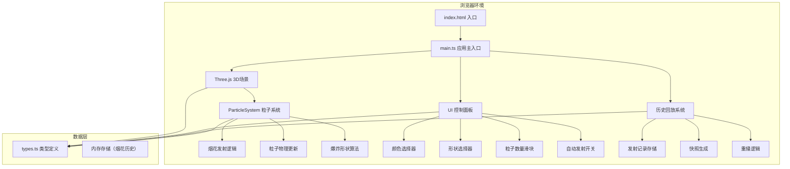

## 1. 架构设计



## 2. 技术描述

- **前端框架**：原生 TypeScript + Vite 构建
- **3D引擎**：Three.js @0.160.0
- **UI构建**：原生 DOM API（无UI框架）
- **工具库**：uuid（用于生成唯一标识）
- **构建工具**：Vite @5.x
- **语言**：TypeScript（严格模式）

### 核心技术选型理由

1. **Three.js**：成熟的WebGL 3D引擎，提供高效的粒子系统渲染能力，支持PointsMaterial和自定义Shader
2. **原生DOM**：轻量级UI需求，避免引入React/Vue等重型框架，减少包体积
3. **Vite**：极速开发体验，原生ES模块支持，TypeScript开箱即用
4. **TypeScript严格模式**：确保类型安全，减少运行时错误

## 3. 项目文件结构

```
auto103/
├── package.json
├── vite.config.js
├── tsconfig.json
├── index.html
└── src/
    ├── main.ts              # 应用入口，Three场景初始化，事件绑定
    ├── particleSystem.ts    # 粒子系统模块
    ├── controlPanel.ts      # UI控制面板模块
    └── types.ts             # 类型定义
```

### 文件职责说明

| 文件 | 职责 |
|-----|------|
| [types.ts](file:///d:/P/tasks/auto103/src/types.ts) | 定义 ParticleConfig、ExplosionHistory、ControlCallbacks 等接口 |
| [particleSystem.ts](file:///d:/P/tasks/auto103/src/particleSystem.ts) | 粒子几何体创建、材质定义、粒子物理更新、发射/回放API |
| [controlPanel.ts](file:///d:/P/tasks/auto103/src/controlPanel.ts) | DOM元素创建、事件绑定、与主程序的回调通信 |
| [main.ts](file:///d:/P/tasks/auto103/src/main.ts) | Three.js场景/相机/渲染器初始化、动画循环、事件分发 |

## 4. 数据模型

### 4.1 类型定义

```typescript
// 爆炸形状类型
export type ExplosionShape = 'circle' | 'star' | 'heart';

// 粒子配置
export interface ParticleConfig {
  id: string;
  launchPosition: { x: number; y: number; z: number };
  explosionHeight: number;
  colors: string[];
  shape: ExplosionShape;
  particleCount: number;
  timestamp: number;
}

// 爆炸历史记录
export interface ExplosionHistory {
  config: ParticleConfig;
  snapshot: string; // base64缩略图
  timestamp: number;
}

// 控制面板回调
export interface ControlCallbacks {
  onColorChange: (colors: string[]) => void;
  onShapeChange: (shape: ExplosionShape) => void;
  onParticleCountChange: (count: number) => void;
  onAutoFireChange: (enabled: boolean) => void;
  onReplay: (config: ParticleConfig) => void;
}

// 粒子状态
export interface Particle {
  position: THREE.Vector3;
  velocity: THREE.Vector3;
  color: THREE.Color;
  life: number;
  maxLife: number;
  size: number;
}
```

## 5. 核心算法

### 5.1 爆炸形状分布算法

| 形状 | 算法描述 |
|-----|---------|
| 圆形 | 球坐标系均匀分布，theta ∈ [0, 2π), phi ∈ [0, π]，速度随机范围 [2, 5] |
| 星形 | 5个主轴方向，每个主轴聚集粒子（沿主轴方向高斯分布），速度沿主轴方向 |
| 心形 | 心形参数方程：x = 16sin³t, y = 13cost - 5cos2t - 2cos3t - cos4t，映射到3D空间 |

### 5.2 颜色渐变算法

```
粒子颜色(t) = 颜色1 * (1-t) + 颜色2 * t  (两种颜色时)
粒子颜色(t) = 多段线性插值，根据t在颜色数组中的区间插值
t = 当前生命 / 总生命
中心亮度系数 = 1.0 - 0.5 * (粒子距离爆炸中心 / 最大爆炸半径)
最终颜色 = 渐变颜色 * 中心亮度系数
```

### 5.3 粒子物理更新

```
速度.y -= 重力 * deltaTime
速度.x += (随机值 - 0.5) * 风力系数 * deltaTime
速度.z += (随机值 - 0.5) * 风力系数 * deltaTime
位置 += 速度 * deltaTime
大小 = 初始大小 * (1 - t)
透明度 = 1 - t
```

## 6. 性能优化策略

1. **粒子池化**：预分配粒子几何体，复用BufferGeometry避免频繁GC
2. **实例化渲染**：使用THREE.Points批量渲染所有粒子
3. **材质复用**：同类型烟花共享PointsMaterial实例
4. **BufferGeometry更新**：仅更新position、color、size属性数组，避免重建几何体
5. **帧率控制**：requestAnimationFrame + deltaTime，确保物理更新与帧率解耦
6. **历史记录限制**：最多保留10条记录，超出自动删除最早记录
7. **缩略图压缩**：快照使用64×64像素，JPEG质量0.6

## 7. 构建配置

### vite.config.js
- 开发服务器端口：3000
- 构建目标：ES2020
- Sourcemap：开发环境启用

### tsconfig.json
- strict: true（严格模式）
- target: ES2020
- module: ESNext
- moduleResolution: Bundler
