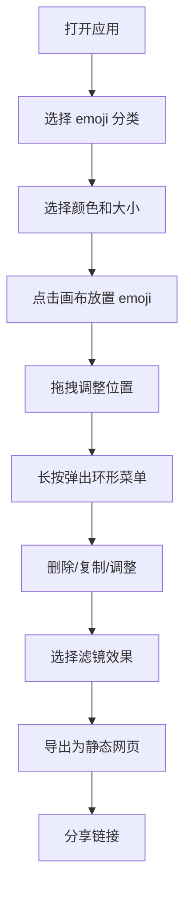

## 1. 产品概述

EmojiCanvas 是一款创意拼贴工具，用户可以在无限画布上使用各种尺寸和颜色的 emoji 符号创作艺术作品，添加滤镜效果后生成可分享的静态网页。

- 主要用途：创意表达、快速制作 emoji 拼贴画、生成社交分享内容
- 目标用户：创意爱好者、社交媒体用户、设计师
- 产品价值：将 emoji 从简单的表情符号提升为艺术创作媒介

## 2. 核心功能

### 2.1 功能模块

1. **画布交互**：无限平移、缩放，点击放置 emoji，拖拽移动，长按操作
2. **工具栏**：颜色选择器、emoji 分类标签、大小滑块、导出按钮
3. **emoji 管理**：多分类 emoji 库，支持自定义颜色和尺寸
4. **滤镜系统**：高斯模糊、复古棕、霓虹光三种滤镜效果
5. **导出分享**：生成可分享的静态网页

### 2.2 页面详情

| 页面名称 | 模块名称 | 功能描述 |
|----------|----------|----------|
| 主画布页 | 顶部工具栏 | 毛玻璃效果浮动工具栏，包含颜色、emoji 分类、大小、导出 |
| 主画布页 | 无限画布 | 支持平移、缩放，放置和管理 emoji |
| 主画布页 | 环形菜单 | 长按 emoji 弹出操作菜单（删除、复制、调整大小、调整颜色） |
| 主画布页 | 颜色选择器 | 圆形色块，点击弹出 HSL 取色面板 |
| 主画布页 | 滤镜效果 | 高斯模糊、复古棕、霓虹光三种滤镜 |

## 3. 核心流程

## 4. 用户界面设计

### 4.1 设计风格

- **设计风格**：极简主义 + 毛玻璃拟态
- **主色调**：纯白色背景 (#FFFFFF)
- **强调色**：柔和的渐变色系用于选中状态
- **工具栏**：半透明白色 + 毛玻璃效果 (backdrop-filter: blur)
- **阴影**：微弱柔和阴影，避免厚重感
- **圆角**：中等圆角，保持现代感

### 4.2 交互细节

- **工具栏固定顶部**，页面滚动时保持位置，底部有微弱边框
- **emoji 拖拽动画**：弹性缩放效果（原大 → 放大1.2倍 → 恢复原大）
- **环形菜单动画**：扇形收缩消失动画
- **缩放时 emoji 平滑无锯齿**：使用高质量渲染

### 4.3 页面设计概览

| 页面名称 | 模块名称 | UI 元素 |
|----------|----------|---------|
| 主画布页 | 顶部工具栏 | 毛玻璃背景、圆形色块、emoji 标签、滑块、导出按钮 |
| 主画布页 | 画布区域 | 纯白色背景、emoji 元素、拖拽反馈 |
| 主画布页 | 环形菜单 | 四个选项均匀分布、扇形动画 |
| 主画布页 | 颜色面板 | HSL 取色器、圆形色块 |

### 4.4 响应式设计

- 桌面端优先设计
- 触摸设备支持：手势缩放、长按检测
- 工具栏自适应宽度

### 4.5 性能指标

- 同时渲染 200 个 emoji 时，拖拽帧率保持 55fps 以上
- 离屏 Canvas 缓存静态图层
- 只重绘变动区域
