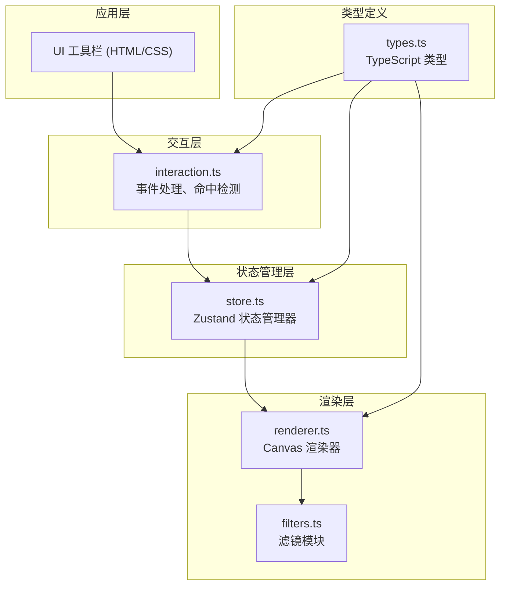

## 1. 架构设计



## 2. 技术描述

- **前端框架**：原生 HTML5 Canvas + TypeScript
- **构建工具**：Vite
- **状态管理**：Zustand
- **唯一ID生成**：uuid
- **渲染优化**：离屏 Canvas 缓存、局部重绘

## 3. 模块说明

### 3.1 文件结构

| 文件 | 职责 |
|------|------|
| `package.json` | 项目依赖和脚本配置 |
| `index.html` | 入口页面，包含 Canvas 和工具栏 DOM |
| `vite.config.js` | Vite 构建配置 |
| `tsconfig.json` | TypeScript 严格模式配置 |
| `src/main.ts` | 应用入口，初始化 Canvas 和状态 |
| `src/renderer.ts` | 渲染层，Canvas 绘制优化 |
| `src/interaction.ts` | 交互层，事件处理和命中检测 |
| `src/store.ts` | Zustand 状态管理器 |
| `src/filters.ts` | 滤镜模块（高斯模糊、复古棕、霓虹光） |
| `src/types.ts` | TypeScript 类型定义 |

### 3.2 核心模块职责

**渲染层 (renderer.ts)**
- 使用离屏 Canvas 缓存静态图层
- 只重绘变动区域（脏矩形优化）
- 支持缩放时高质量渲染（无锯齿）
- 调用滤镜模块应用效果
- 管理视口变换（平移、缩放矩阵）

**交互层 (interaction.ts)**
- 处理鼠标/触摸事件
- 坐标转换（屏幕坐标 ↔ 画布坐标）
- 命中检测（判断点击哪个 emoji）
- 拖拽逻辑（带弹性缩放动画）
- 长按检测（触发环形菜单）
- 平移滚动画布

**状态管理 (store.ts)**
- 存储所有 emoji 数据（坐标、尺寸、颜色、z-index）
- 提供增删改方法
- 存储当前选中的 emoji、颜色、大小
- 存储视口变换状态
- 存储当前滤镜类型

**滤镜模块 (filters.ts)**
- 高斯模糊滤镜
- 复古棕（Sepia）滤镜
- 霓虹光滤镜
- 可组合使用多个滤镜

## 4. 数据模型

### 4.1 Emoji 数据结构

```typescript
interface EmojiItem {
  id: string;
  emoji: string;
  x: number;
  y: number;
  size: number;
  color: string;
  zIndex: number;
}
```

### 4.2 视口状态

```typescript
interface Viewport {
  offsetX: number;
  offsetY: number;
  scale: number;
}
```

### 4.3 工具状态

```typescript
interface ToolState {
  currentEmoji: string;
  currentColor: string;
  currentSize: number;
  currentCategory: string;
  currentFilter: string | null;
}
```

## 5. 性能优化策略

1. **离屏 Canvas 缓存**：将静态 emoji 渲染到离屏画布，减少重复绘制
2. **脏矩形重绘**：只更新发生变化的区域
3. **分层渲染**：静态层和动态层分离
4. **requestAnimationFrame**：使用 RAF 进行渲染调度
5. **对象池**：复用临时对象，减少 GC
