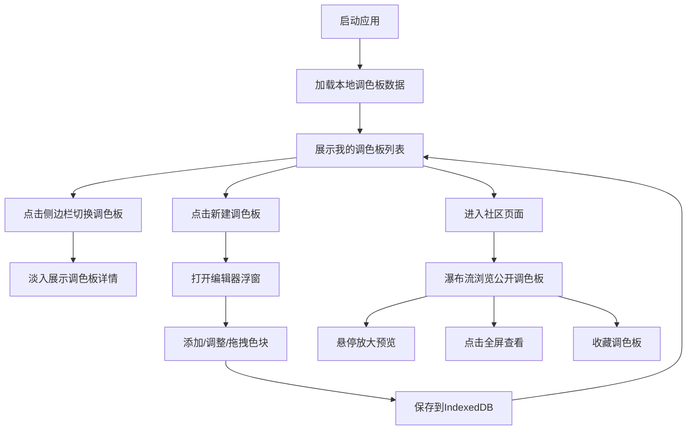

## 1. 产品概述

ColorBlock 是一款在线配色方案管理与分享工具，专为设计师和普通用户打造，提供直观的调色板创建、管理和浏览体验。
- 核心价值：让用户轻松创建、保存、组织和分享个性化配色方案，激发设计灵感
- 目标用户：UI设计师、平面设计师、前端开发者、艺术爱好者及普通用户

## 2. 核心特性

### 2.1 用户角色
| 角色 | 注册方式 | 核心权限 |
|------|---------|---------|
| 普通用户 | 本地匿名使用 | 创建、编辑、删除调色板；收藏调色板；浏览社区公开调色板 |

### 2.2 功能模块
1. **我的调色板页面**：调色板列表展示、侧边栏导航、调色板详情查看
2. **调色板编辑器**：色块无限添加、拾色器调整、拖拽排序、命名保存
3. **社区浏览页面**：瀑布流卡片布局、缩略图悬停动画、全屏预览
4. **收藏功能**：心形图标切换、缩放脉冲动画反馈

### 2.3 页面详情
| 页面名称 | 模块名称 | 功能描述 |
|---------|---------|---------|
| 我的调色板 | 侧边栏导航 | 深蓝绿色背景，展示调色板列表（彩色小方块+名称），点击淡入切换 |
| 我的调色板 | 内容展示区 | 浅灰背景+白色卡片（2px圆角、18px边框），展示调色板详情 |
| 我的调色板 | 调色板详情 | 渐变条纹封面图、名称、创建时间、点赞数、收藏按钮 |
| 调色板编辑器 | 浮窗模态框 | 半透明遮罩层，无限色块网格 |
| 调色板编辑器 | 色块管理 | HSL/十六进制拾色器、拖拽排序（半透明克隆块跟随）、平滑让位动画 |
| 社区浏览 | 瀑布流布局 | 卡片缩略图（180px高度等比缩小） |
| 社区浏览 | 悬停交互 | 缩略图平滑放大至原始比例、轻微上浮阴影 |
| 社区浏览 | 全屏展示 | 点击卡片打开调色板全屏详情 |

## 3. 核心流程

用户打开应用 → 查看"我的调色板"列表 → 点击侧边栏项切换查看详情 → 点击"新建调色板"打开编辑器 → 添加/调整/拖拽色块 → 保存调色板 → 切换到社区页面浏览公开调色板 → 悬停查看效果 → 收藏喜欢的调色板

## 4. 用户界面设计

### 4.1 设计风格
- **主色调**：深蓝绿色 (#0d4f4c) 用于侧边栏，浅灰色 (#f5f5f5) 用于背景
- **辅助色**：白色卡片 (#ffffff)，边框细线条，强调精致感
- **按钮风格**：极简圆角按钮，收藏用心形图标
- **字体**：现代无衬线字体，清晰易读
- **布局风格**：左侧固定侧边栏 + 右侧内容区的经典双栏布局
- **卡片样式**：2px柔和圆角，18px细边框，干净留白
- **图标风格**：线性简约图标，心形收藏图标

### 4.2 页面设计概览
| 页面名称 | 模块名称 | UI元素 |
|---------|---------|--------|
| 我的调色板 | 侧边栏 | 深蓝绿色背景、白色文字、彩色小方块、列表项、淡入过渡 |
| 我的调色板 | 内容卡片 | 浅灰背景、白色卡片、2px圆角、18px边框、渐变封面、元信息、收藏按钮 |
| 调色板编辑器 | 模态浮窗 | 半透明遮罩、色块网格、拾色器弹窗、拖拽克隆块、平滑让位 |
| 社区浏览 | 瀑布流卡片 | 180px缩略图、悬停放大、上浮阴影、点击全屏 |

### 4.3 响应式设计
- 桌面端优先设计
- 侧边栏在小屏幕可折叠
- 瀑布流在不同宽度自适应列数
- 触摸设备优化拖拽体验

### 4.4 动效设计
- 页面切换：淡入过渡动画（300ms）
- 拖拽色块：半透明克隆块跟随手指，松开后其他块平滑移动让位
- 收藏按钮：心形图标实心/空心切换 + 缩放脉冲动画
- 社区卡片悬停：缩略图从180px平滑放大至原始比例，轻微上浮阴影
- 性能要求：列表滚动60fps，拖拽响应延迟≤100ms
