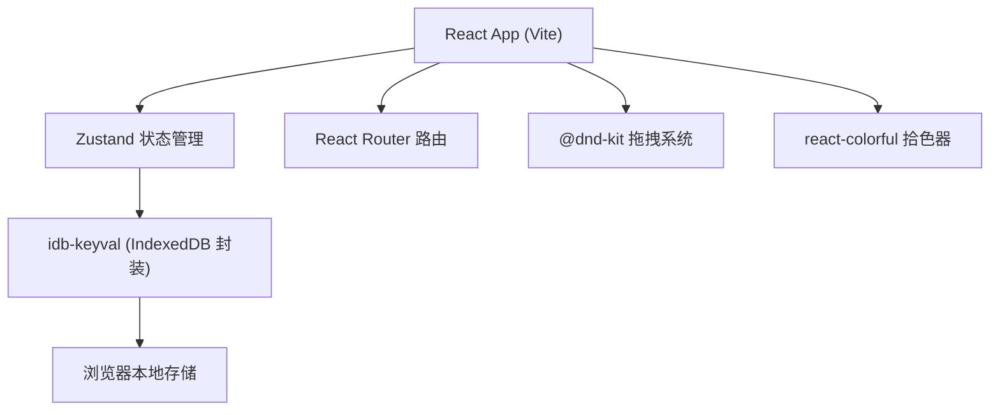
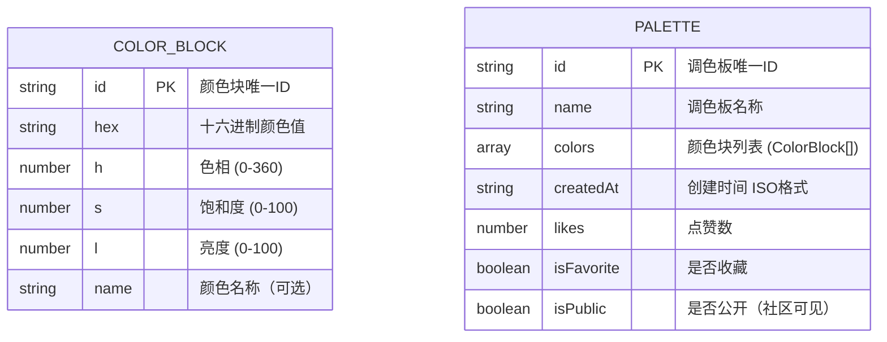

## 1. 架构设计



## 2. 技术选型说明
- **前端框架**: React@18 + TypeScript
- **构建工具**: Vite
- **路由**: React Router DOM
- **状态管理**: Zustand
- **本地存储**: IndexedDB (通过 idb-keyval 封装)
- **拖拽排序**: @dnd-kit/core + @dnd-kit/sortable
- **拾色器**: react-colorful
- **唯一ID**: uuid
- **后端**: 无，纯前端应用，数据完全存储在浏览器本地

## 3. 路由定义
| 路由路径 | 页面组件 | 功能说明 |
|---------|---------|---------|
| / | MyPalettes | 默认跳转至我的调色板 |
| /my-palettes | MyPalettes | 我的调色板管理页面 |
| /community | Community | 社区调色板浏览页面 |

## 4. 数据模型

### 4.1 数据结构定义



### 4.2 IndexedDB 存储
- 数据库名: `colorblock-db`
- 存储表: `palettes` - 存储所有调色板数据
- 主键: `id`
- 索引: `createdAt` (按创建时间排序)

## 5. 项目文件结构
```
src/
├── main.tsx              # 应用入口，初始化路由和全局样式
├── types.ts              # TypeScript 类型定义
├── store.ts              # Zustand 全局状态管理
├── components/
│   ├── Sidebar.tsx       # 左侧侧边栏导航
│   └── PaletteEditor.tsx # 调色板编辑器弹窗
├── pages/
│   ├── MyPalettes.tsx    # 我的调色板页面
│   └── Community.tsx     # 社区浏览页面
└── utils/
    ├── db.ts             # IndexedDB 数据持久化封装
    └── cover.ts          # 渐变封面图生成工具函数
```

## 6. 核心模块说明

### 6.1 状态管理 (store.ts)
- `palettes`: 调色板列表
- `selectedPaletteId`: 当前选中的调色板ID
- `isEditorOpen`: 编辑器弹窗开关
- `editingPalette`: 正在编辑的调色板
- Actions: 增删改查调色板、切换收藏、加载社区数据

### 6.2 封面图生成 (cover.ts)
- 输入: 颜色数组
- 输出: CSS linear-gradient 字符串
- 规则: 所有颜色等宽排列，颜色边界锐利（无渐变过渡）

### 6.3 拖拽系统 (@dnd-kit)
- 使用 `DndContext` 管理拖拽上下文
- 使用 `SortableContext` + `useSortable` 实现色块排序
- 拖拽时显示半透明克隆块，其他色块平滑让位

### 6.4 性能优化策略
- 列表虚拟化/按需渲染（长列表优化）
- 拖拽使用 CSS transform 而非改变 DOM 顺序（≤100ms延迟）
- 封面图使用 CSS 渐变而非 Canvas 生成，减少内存占用
- 使用 `will-change` 和 GPU 加速动画
