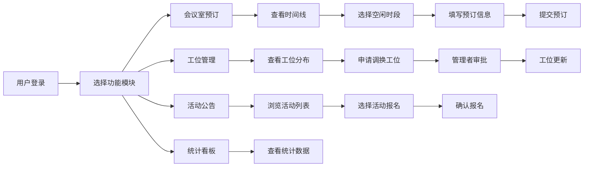

## 1. 产品概述

HubDesk是一个共享办公空间管理应用，为入驻团队提供会议室预订、工位管理、活动发布和空间使用统计的一体化平台。目标用户包括共享办公空间管理者和入驻团队成员，解决了传统办公资源管理效率低下、信息不透明的问题。

## 2. 核心功能

### 2.1 用户角色

| 角色 | 注册方式 | 核心权限 |
|------|----------|----------|
| 管理者 | 系统预置 | 团队管理、工位分配、活动发布、数据统计、预订审批 |
| 团队成员 | 管理员添加 | 会议室预订、活动报名、工位查看与申请调换 |

### 2.2 功能模块

1. **会议室管理页面**：会议室卡片网格、30分钟粒度时间线、预订弹窗、占用状态展示
2. **团队与工位管理页面**：团队卡片列表、工位平面图、工位调换申请与审批
3. **活动公告页面**：活动卡片列表、日期筛选、报名功能、已结束标签
4. **统计仪表板**：空间使用率、会议室占用率、团队活跃度、本周报名趋势柱状图

### 2.3 页面详情

| 页面名称 | 模块名称 | 功能描述 |
|----------|----------|----------|
| 会议室管理 | 会议室卡片 | 显示名称、容量、设施、当前状态（空闲/占用/维护中）、预订团队、剩余时长 |
| 会议室管理 | 时间线视图 | 以30分钟为粒度展示当日所有时段占用状态，不同团队用不同颜色区分 |
| 会议室管理 | 预订弹窗 | 选择日期、时间段、团队、填写用途，支持编辑和取消预订 |
| 团队管理 | 团队卡片 | 显示团队名称、成员数量、工位需求，支持增删改操作 |
| 团队管理 | 工位平面图 | 展示工位分布，标记已分配工位所属团队，支持临时调换申请 |
| 活动公告 | 活动卡片 | 显示标题、日期、地点、报名人数，已过期自动变灰并标记"已结束" |
| 活动公告 | 日期筛选 | 按日期范围筛选活动，支持查看即将开始和已结束活动 |
| 统计仪表板 | 数据卡片 | 展示会议室当日使用率、团队工位使用率、空间整体使用率 |
| 统计仪表板 | 柱状图 | 展示本周每日活动报名人数，带入场动画效果 |

## 3. 核心流程

### 3.1 会议室预订流程
用户进入会议室页面 → 查看会议室状态和时间线 → 选择空闲时段 → 打开预订弹窗 → 选择团队和填写用途 → 提交预订 → 时间线更新显示预订状态

### 3.2 工位调换流程
团队成员查看工位平面图 → 选择目标工位 → 提交调换申请 → 管理者审批 → 审批通过后工位状态更新

### 3.3 活动报名流程
用户浏览活动列表 → 选择活动 → 点击报名 → 名额充足则报名成功 → 卡片显示"已报名"状态和剩余名额

### 3.4 Mermaid流程图

## 4. 用户界面设计

### 4.1 设计风格
- **主色调**：冷灰色背景 #f0f2f5，白色卡片 #ffffff，深灰蓝侧边栏 #1e2a3a
- **边框与阴影**：圆角12px，1px浅灰边框 #e0e0e0，盒阴影 0 2px 8px rgba(0,0,0,0.04)
- **按钮样式**：悬停背景色变深（0.2秒过渡），点击scale(0.95)按压反馈
- **字体**：专业无衬线字体，保持清晰易读的办公风格
- **布局**：左侧固定侧边栏（240px）+ 顶部导航条（56px）+ 内容区
- **图标**：使用简洁的SVG图标，与整体专业风格一致

### 4.2 页面设计概述

| 页面名称 | 模块名称 | UI元素 |
|----------|----------|--------|
| 会议室管理 | 会议室卡片 | 网格布局、状态标签、设施图标、剩余时长倒计时 |
| 会议室管理 | 时间线视图 | 水平时间轴、30分钟刻度、彩色时段块、悬停详情 |
| 会议室管理 | 预订弹窗 | 半透明遮罩、底部滑入动画、表单组件、日期选择器 |
| 团队管理 | 团队卡片 | 卡片列表、成员数徽章、工位数指示器、操作按钮 |
| 团队管理 | 工位平面图 | 网格布局、颜色编码、悬停信息、申请按钮 |
| 活动公告 | 活动卡片 | 列表布局、日期标签、地点图标、报名状态、已结束灰化效果 |
| 统计仪表板 | 数据卡片 | 大数字展示、趋势箭头、对比指标 |
| 统计仪表板 | 柱状图 | 从底部向上生长动画（0.4秒缓出）、颜色渐变柱体 |

### 4.3 动画效果
- **页面切换**：内容区淡入动画（opacity 0→1，0.25秒）
- **预订弹窗**：从底部向上滑入弹性动画（0.3秒，cubic-bezier(0.34, 1.56, 0.64, 1)），关闭时反向滑出
- **柱状图**：从底部向上生长入场动画（0.4秒，缓出函数）
- **按钮交互**：悬停背景加深（0.2秒），点击scale(0.95)

### 4.4 响应式设计
- **桌面端**（≥768px）：侧边栏固定240px，卡片网格3列
- **移动端**（<768px）：侧边栏收缩为顶部汉堡菜单，卡片网格1列，字体略缩
- **触摸优化**：按钮最小点击区域44px，手势支持

### 4.5 性能约束
- 所有交互操作响应时间 ≤ 150ms
- 30天时间线视图渲染时间 ≤ 200ms
- 统计计算与图表更新重绘时间 ≤ 100ms
