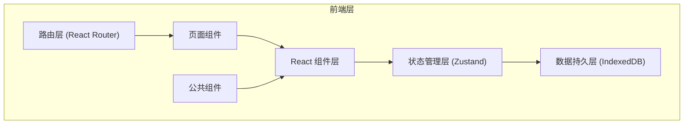
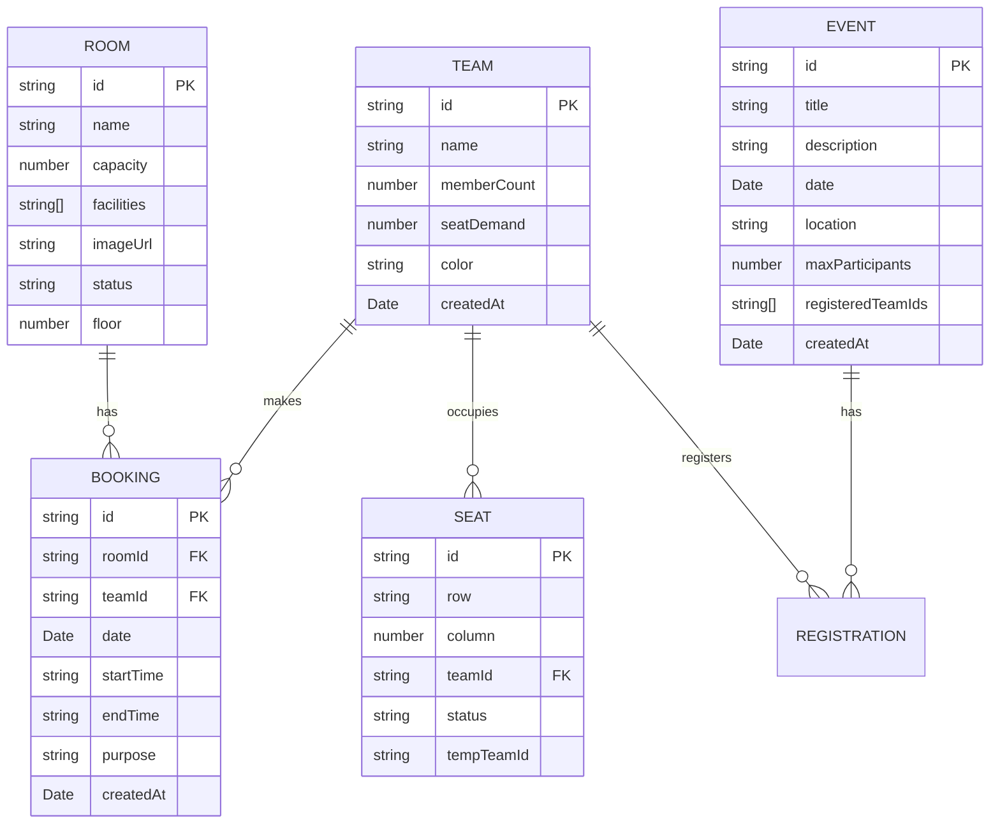

## 1. 架构设计



## 2. 技术描述

- **前端框架**：React@18 + React DOM@18 + TypeScript
- **构建工具**：Vite
- **路由管理**：react-router-dom@6
- **状态管理**：zustand
- **数据持久化**：idb-keyval（IndexedDB封装）
- **工具库**：uuid
- **样式方案**：原生CSS + CSS变量（不使用Tailwind CSS，按用户要求自定义样式）

## 3. 目录结构

```
src/
├── main.tsx              # React应用入口，挂载Router和全局Provider
├── types.ts              # 类型定义（Team, Room, Booking, Event等）
├── store.ts              # Zustand状态仓库，CRUD操作和统计计算
├── App.tsx               # 根组件，包含布局和路由
├── components/           # 公共组件
│   ├── BookingModal.tsx  # 预订弹窗组件
│   ├── StatsDashboard.tsx # 统计仪表板组件
│   ├── Sidebar.tsx       # 侧边栏组件
│   ├── Navbar.tsx        # 顶部导航条组件
│   ├── RoomCard.tsx      # 会议室卡片组件
│   ├── TeamCard.tsx      # 团队卡片组件
│   ├── EventCard.tsx     # 活动卡片组件
│   ├── Timeline.tsx      # 时间线组件
│   └── SeatMap.tsx       # 工位平面图组件
├── pages/                # 页面组件
│   ├── RoomsPage.tsx     # 会议室资源页面
│   ├── TeamsPage.tsx     # 团队管理页面
│   ├── EventsPage.tsx    # 活动公告页面
│   └── StatsPage.tsx     # 统计仪表板页面
├── utils/                # 工具函数
│   ├── dateUtils.ts      # 日期时间处理
│   ├── colorUtils.ts     # 颜色生成工具
│   └── statsUtils.ts     # 统计计算工具
└── styles/               # 样式文件
    ├── global.css        # 全局样式
    └── variables.css     # CSS变量定义
```

## 4. 路由定义

| 路由 | 页面 | 用途 |
|------|------|------|
| / | RoomsPage | 会议室资源管理首页 |
| /rooms | RoomsPage | 会议室预订与管理 |
| /teams | TeamsPage | 团队与工位管理 |
| /events | EventsPage | 活动公告与报名 |
| /stats | StatsPage | 统计仪表板 |

## 5. 数据模型

### 5.1 实体关系图



### 5.2 数据流向

1. **组件层** → 调用store中的actions → **状态管理层** → 读写IndexedDB → **数据持久层**
2. **状态管理层** → 计算派生状态（统计数据）→ **组件层** 订阅状态更新
3. **路由层** → 根据URL渲染对应页面 → **页面组件** → 组合公共组件

### 5.3 核心类型定义

```typescript
// 团队
interface Team {
  id: string;
  name: string;
  memberCount: number;
  seatDemand: number;
  color: string;
  createdAt: Date;
}

// 会议室
interface Room {
  id: string;
  name: string;
  capacity: number;
  facilities: string[];
  imageUrl: string;
  status: 'available' | 'occupied' | 'maintenance';
  floor: number;
}

// 预订记录
interface Booking {
  id: string;
  roomId: string;
  teamId: string;
  date: string; // YYYY-MM-DD
  startTime: string; // HH:mm
  endTime: string; // HH:mm
  purpose: string;
  createdAt: Date;
}

// 活动
interface Event {
  id: string;
  title: string;
  description: string;
  date: string; // YYYY-MM-DD
  time: string; // HH:mm
  location: string;
  maxParticipants: number;
  registeredTeamIds: string[];
  createdAt: Date;
}

// 工位
interface Seat {
  id: string;
  row: string;
  column: number;
  teamId: string | null;
  status: 'available' | 'occupied' | 'pending';
  tempTeamId: string | null;
}

// 工位调换申请
interface SeatSwapRequest {
  id: string;
  fromSeatId: string;
  toSeatId: string;
  teamId: string;
  status: 'pending' | 'approved' | 'rejected';
  createdAt: Date;
}
```

## 6. Store 设计

### 6.1 State 结构

```typescript
interface HubDeskState {
  teams: Team[];
  rooms: Room[];
  bookings: Booking[];
  events: Event[];
  seats: Seat[];
  seatSwapRequests: SeatSwapRequest[];
  
  // 统计数据
  stats: {
    roomUtilizationRate: number;
    teamSeatUtilization: Record<string, number>;
    weeklyEventRegistrations: number[];
    overallSpaceUtilization: number;
  };
  
  // Actions
  loadFromDB: () => Promise<void>;
  saveToDB: () => Promise<void>;
  
  // Team CRUD
  addTeam: (team: Omit<Team, 'id' | 'createdAt' | 'color'>) => void;
  updateTeam: (id: string, updates: Partial<Team>) => void;
  deleteTeam: (id: string) => void;
  
  // Room CRUD
  addRoom: (room: Omit<Room, 'id'>) => void;
  updateRoom: (id: string, updates: Partial<Room>) => void;
  deleteRoom: (id: string) => void;
  
  // Booking CRUD
  addBooking: (booking: Omit<Booking, 'id' | 'createdAt'>) => void;
  updateBooking: (id: string, updates: Partial<Booking>) => void;
  deleteBooking: (id: string) => void;
  getBookingsForRoom: (roomId: string, date: string) => Booking[];
  
  // Event CRUD
  addEvent: (event: Omit<Event, 'id' | 'createdAt' | 'registeredTeamIds'>) => void;
  updateEvent: (id: string, updates: Partial<Event>) => void;
  deleteEvent: (id: string) => void;
  registerForEvent: (eventId: string, teamId: string) => boolean;
  
  // Seat management
  assignSeat: (seatId: string, teamId: string) => void;
  requestSeatSwap: (fromSeatId: string, toSeatId: string, teamId: string) => void;
  approveSeatSwap: (requestId: string) => void;
  rejectSeatSwap: (requestId: string) => void;
  
  // Stats calculation
  calculateStats: () => void;
}
```

## 7. 性能优化策略

1. **状态选择器优化**：使用Zustand的selectors避免不必要的重渲染
2. **记忆化计算**：统计数据使用useMemo缓存
3. **虚拟滚动**：长列表使用虚拟滚动（如活动列表、30天时间线）
4. **批量更新**：IndexedDB操作使用批量读写减少IO次数
5. **防抖节流**：高频操作（如搜索、筛选）使用防抖
6. **组件懒加载**：非核心组件使用React.lazy按需加载
7. **CSS硬件加速**：动画使用transform和opacity，触发GPU加速

## 8. 文件调用关系

```
main.tsx
  └── App.tsx
        ├── components/Sidebar.tsx
        ├── components/Navbar.tsx
        ├── pages/RoomsPage.tsx
        │     ├── components/RoomCard.tsx
        │     ├── components/Timeline.tsx
        │     └── components/BookingModal.tsx
        ├── pages/TeamsPage.tsx
        │     ├── components/TeamCard.tsx
        │     └── components/SeatMap.tsx
        ├── pages/EventsPage.tsx
        │     └── components/EventCard.tsx
        └── pages/StatsPage.tsx
              └── components/StatsDashboard.tsx

所有页面和组件 ──> store.ts (状态管理)
store.ts ──> types.ts (类型定义)
store.ts ──> idb-keyval (数据持久化)
组件 ──> utils/ (工具函数)
```
