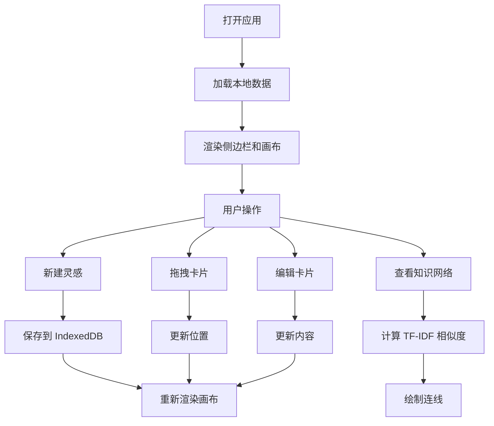

## 1. 产品概述

MemoMosaic 是一款创意灵感管理工具，让用户能够将零散的灵感碎片——文本片段、截图、URL、手绘草图——像拼贴画一样自由放置在无限大的虚拟版面上，并基于内容相似度自动连线形成知识网络图。

- 核心价值：打破传统笔记的线性束缚，以视觉化、空间化的方式组织灵感，激发创意联结
- 目标用户：设计师、作家、研究者、创意工作者
- 市场定位：轻量级、纯前端、离线可用的灵感拼贴工具

## 2. 核心特性

### 2.1 用户角色
| 角色 | 注册方式 | 核心权限 |
|------|----------|----------|
| 普通用户 | 无需注册，本地存储 | 创建、编辑、删除灵感卡片，管理文件夹，查看知识网络 |

### 2.2 功能模块
1. **侧边栏**：用户头像、新建灵感按钮、文件夹列表（按创建时间分组）
2. **无限画布**：拖拽平移、滚轮缩放、米黄网格背景
3. **灵感卡片**：毛玻璃效果、拖拽排序、双击编辑、涟漪动画
4. **新建灵感浮窗**：三选项卡（文字、图片、绘图）
5. **知识网络**：TF-IDF 相似度算法、半透明曲线连线、悬停显示相似度

### 2.3 页面详情
| 页面名称 | 模块名称 | 功能描述 |
|----------|----------|----------|
| 主画布页 | 侧边栏 | 固定左侧，深色渐变背景，头像+新建按钮+文件夹列表 |
| 主画布页 | 无限画布 | 米黄底色网格，支持平移缩放，渲染卡片和连线 |
| 主画布页 | 卡片组件 | 拖拽移动、双击编辑、内容展示、动画效果 |
| 主画布页 | 新建浮窗 | 底部弹出，三选项卡切换，文字/图片/绘图输入 |
| 主画布页 | 知识网络 | 切换按钮，相似度连线，悬停显示百分比 |

## 3. 核心流程

### 3.1 创建灵感流程
用户点击侧边栏「新建灵感」按钮 → 底部弹出三选项卡浮窗 → 选择类型（文字/图片/绘图）→ 输入内容 → 点击确认 → 卡片从画布中心淡入放大出现 → 带涟漪扩散动画

### 3.2 编辑卡片流程
用户双击卡片 → 卡片背景变白进入编辑模式 → 修改内容 → 双击空白处退出 → 内容更新，脉冲光晕反馈

### 3.3 知识网络流程
用户点击侧边栏「知识网络」按钮 → 计算所有卡片文本相似度 → 相似度高于0.3的卡片之间绘制渐变曲线 → 鼠标悬停连线高亮并显示百分比 → 再次点击按钮隐藏连线

### 3.4 流程图

## 4. 用户界面设计

### 4.1 设计风格
- **主色调**：深灰（#2a2a2e）、米黄（#f5f0e1）、暖橙（#ff8c42）
- **辅助色**：蓝色（#4a90d9）、粉色（#e8a0bf）用于渐变连线
- **卡片风格**：圆角 12px，半透明毛玻璃效果（backdrop-filter: blur(8px)）
- **按钮风格**：圆角 8px，暖橙主色，悬停微放大
- **字体**：展示字体使用 Playfair Display，正文字体使用 Source Han Sans / 思源黑体
- **布局风格**：左右布局，左侧固定侧边栏，右侧无限画布
- **图标风格**：线性简约图标，暖橙点缀

### 4.2 页面设计概述
| 页面名称 | 模块名称 | UI 元素 |
|----------|----------|----------|
| 主画布页 | 侧边栏 | 深灰渐变背景、微光效果、头像、新建按钮、彩色圆点文件夹 |
| 主画布页 | 画布区 | 米黄底色、浅灰网格线、毛玻璃卡片、涟漪动画 |
| 主画布页 | 新建浮窗 | 底部滑入、三选项卡切换、textarea / 上传区 / 画板 |
| 主画布页 | 知识网络 | 蜘蛛图标按钮、蓝粉渐变曲线、悬停高亮+百分比 |

### 4.3 响应式
- 桌面优先设计，移动端自适应
- 768px 以下切换为上下布局
- 移动端侧边栏默认隐藏，从左侧滑入
- 触摸优化：支持双指缩放、长按拖拽

### 4.4 动效设计
- 页面加载：卡片错落淡入（staggered animation-delay）
- 新卡片：从中心扩散的涟漪动画 + 淡入放大
- 拖拽中：卡片半透明跟随鼠标
- 拖拽结束：平滑移动到新位置（transition 0.3s ease）
- 内容更新：脉冲光晕反馈
- 所有过渡动画持续 0.2-0.4 秒
