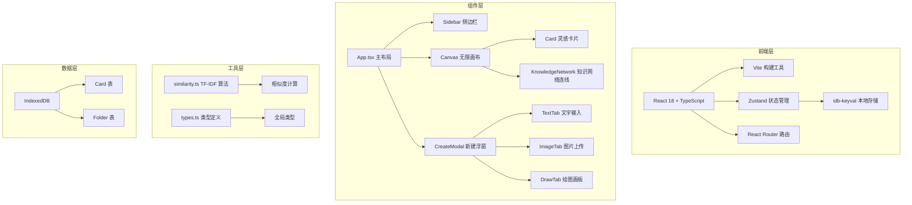
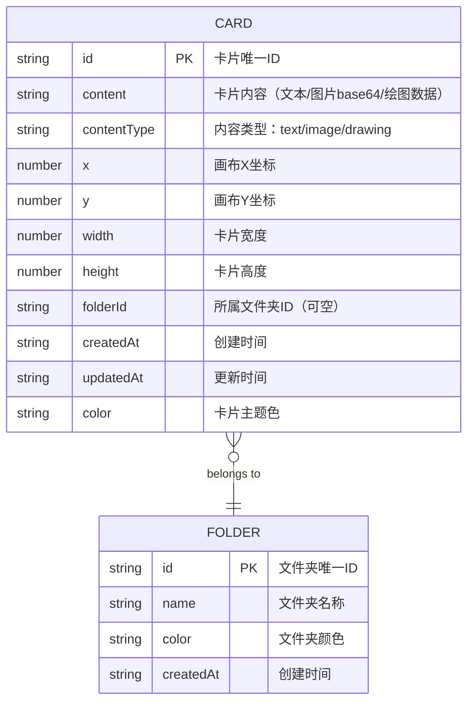

## 1. 架构设计



## 2. 技术描述

- **前端框架**：React@18 + TypeScript
- **构建工具**：Vite@5（快速冷启动、HMR）
- **状态管理**：Zustand（轻量级、API简洁）
- **路由**：react-router-dom@6
- **本地存储**：idb-keyval（IndexedDB 封装）
- **唯一标识**：uuid
- **样式方案**：纯 CSS + CSS 变量（无额外 CSS 框架，保持轻量）

## 3. 路由定义

| 路由 | 用途 |
|------|------|
| / | 主画布页面（唯一页面，所有功能在此页完成） |

> 说明：本应用为单页应用，所有交互在同一画布内完成，无需多页面路由。react-router-dom 用于未来扩展性支持。

## 4. 数据模型

### 4.1 数据模型定义



### 4.2 类型定义（types.ts）

```typescript
export type ContentType = 'text' | 'image' | 'drawing';

export interface Card {
  id: string;
  content: string;
  contentType: ContentType;
  x: number;
  y: number;
  width: number;
  height: number;
  folderId?: string;
  createdAt: string;
  updatedAt: string;
  color: string;
}

export interface Folder {
  id: string;
  name: string;
  color: string;
  createdAt: string;
}

export interface CanvasTransform {
  x: number;
  y: number;
  scale: number;
}

export interface StoreState {
  cards: Card[];
  folders: Folder[];
  selectedCardId: string | null;
  editingCardId: string | null;
  showKnowledgeNetwork: boolean;
  canvasTransform: CanvasTransform;
  showCreateModal: boolean;
}
```

## 5. 核心模块说明

### 5.1 store.ts - Zustand 全局状态

- 管理卡片列表、文件夹列表、选中状态、编辑状态
- 管理知识网络开关、画布变换、新建浮窗显示
- 提供增删改查操作：addCard、updateCard、deleteCard、moveCard
- 提供相似度计算方法，调用 similarity 工具模块
- 数据持久化：状态变化时自动同步到 IndexedDB

### 5.2 Canvas.tsx - 无限画布容器

- 管理画布的平移（pan）和缩放（zoom）
- 鼠标拖拽平移、滚轮缩放（带边界限制）
- 背景网格绘制（Canvas 或 CSS 实现）
- 卡片渲染循环（基于 cards 数组）
- 知识网络连线渲染（SVG 实现）
- 拖拽排序逻辑（拖拽中更新卡片位置）

### 5.3 Card.tsx - 单个灵感卡片

- 内容渲染：根据 contentType 渲染文本/图片/绘图
- 拖拽交互：mousedown/mousemove/mouseup 事件
- 双击编辑：进入编辑模式，内容可编辑
- 动画效果：涟漪动画、淡入放大、脉冲光晕
- 毛玻璃样式：backdrop-filter: blur(8px)

### 5.4 similarity.ts - TF-IDF 相似度算法

- 纯函数实现，无副作用
- 分词：中文按字/词切分（简单实现）
- TF（词频）计算
- IDF（逆文档频率）计算
- 余弦相似度计算
- 返回 0-1 之间的相似度值

### 5.5 性能优化策略

- 卡片使用 CSS transform 定位，避免重排
- 拖拽时使用 will-change 和 requestAnimationFrame
- 相似度计算防抖，避免频繁计算
- 画布使用 CSS transform + will-change 提升渲染性能
- 50-80 张卡片保持 30fps 以上

## 6. 文件结构

```
project/
├── package.json
├── index.html
├── vite.config.js
├── tsconfig.json
├── src/
│   ├── main.tsx          # React 入口
│   ├── App.tsx           # 主布局组件
│   ├── store.ts          # Zustand 状态管理
│   ├── components/
│   │   ├── Card.tsx      # 卡片组件
│   │   ├── Canvas.tsx    # 画布组件
│   │   ├── Sidebar.tsx   # 侧边栏组件
│   │   ├── CreateModal.tsx # 新建浮窗
│   │   └── KnowledgeNetwork.tsx # 知识网络连线
│   └── utils/
│       ├── similarity.ts # TF-IDF 算法
│       └── types.ts      # 类型定义
```
