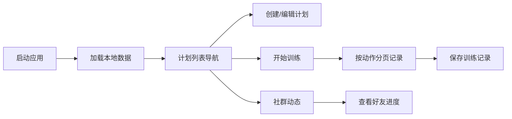

## 1. 产品概述

IronTrack 是一款面向健身爱好者社群的力量训练计划与进度分享应用。用户可以创建个性化训练计划、记录每次锻炼的组数和重量，并在社群内分享训练日历和比较进度。

- **目标用户**：健身爱好者、力量训练者
- **核心价值**：提供专业的训练计划管理与数据追踪，结合社群互动激励持续训练
- **技术特点**：纯前端应用，数据本地持久化，无需后端服务

## 2. 核心功能

### 2.1 功能模块

1. **训练计划管理**：创建、编辑、删除多个训练计划，每个计划最多包含8个动作
2. **训练记录**：按动作分页记录每组的重量、次数和完成状态
3. **社群动态**：查看好友周训练日历、重量增长曲线，支持点赞和评论

### 2.2 页面详情

| 页面名称 | 模块名称 | 功能描述 |
|---------|---------|---------|
| 计划管理页 | 计划列表 | 左侧导航栏展示所有计划，支持点击选择、编辑、删除 |
| 计划管理页 | 计划构建器 | 左右布局，左侧动作预设库，右侧拖放区域，支持拖拽排序 |
| 训练记录页 | 动作分页 | 按动作顺序分页展示，底部圆点导航，滑入切换动画 |
| 训练记录页 | 组数据输入 | 每组可输入重量、次数、完成状态，显示上次最大重量提醒 |
| 社群动态页 | 好友卡片 | 瀑布流布局，用户头像、周日历、重量增长图 |
| 社群动态页 | 互动功能 | 点赞、评论按钮，悬停显示训练详情 |

## 3. 核心流程

### 3.1 创建训练计划
用户进入计划创建页面 → 从左侧预设库拖拽动作到右侧计划区域 → 调整顺序（最多8个）→ 填写计划名称和说明 → 保存到IndexedDB → 计划显示在左侧导航栏

### 3.2 记录训练
用户选择一个计划进入训练模式 → 按动作顺序分页展示 → 输入每组的重量和次数 → 点击完成进入下一个动作 → 所有动作完成后生成训练记录 → 保存到IndexedDB

### 3.3 查看社群动态
用户进入社群页面 → 加载模拟好友数据 → 渲染瀑布流卡片 → 展示周训练日历和重量增长曲线 → 可切换查看不同好友 → 支持点赞和评论交互

## 4. 用户界面设计

### 4.1 设计风格

- **主题**：深色主题，健身/力量感
- **主色调**：#BB86FC（淡紫），悬停色 #CE93D8
- **背景色**：#121212（深黑）
- **卡片/导航色**：#1E1E1E（深灰）
- **文字色**：白色
- **点缀色**：绿色（训练日）、红色（休息日）
- **按钮**：圆角设计，悬停0.2s颜色过渡，点击scale 0.95下陷动画

### 4.2 字体与排版

- **字体**：现代无衬线字体，清晰有力
- **标题**：粗体，较大字号
- **正文**：常规字重，适中行高
- **数据数字**：等宽字体，突出显示

### 4.3 页面设计概览

| 页面名称 | 模块名称 | UI元素 |
|---------|---------|--------|
| 计划管理页 | 动作预设卡片 | 白色边框圆角12px，悬停背景变#333 |
| 计划管理页 | 计划槽位 | 虚线占位框（#444），拖入后变实线填充#2A2A2A |
| 训练记录页 | 分页导航 | 底部圆点，当前白色，其他灰色半透明 |
| 训练记录页 | 页面切换 | 从右向左滑入动画 |
| 社群动态页 | 好友卡片 | 瀑布流布局，左上角渐变圆形头像 |
| 社群动态页 | 日历/图表 | 淡入动画过渡（0.3s） |

### 4.4 响应式设计

- **桌面端（>768px）**：左右布局，左侧导航栏 + 右侧内容区
- **移动端（≤768px）**：上下堆叠布局，导航栏变为横向滚动标签栏
- **触摸优化**：按钮和可点击区域确保足够大的触摸目标

### 4.5 动画与交互

- **拖拽排序**：缓动动画，流畅的拖放体验
- **页面切换**：滑入/淡入过渡效果
- **按钮交互**：悬停颜色过渡（0.2s），点击下陷（scale 0.95）
- **数据加载**：骨架屏或淡入效果
