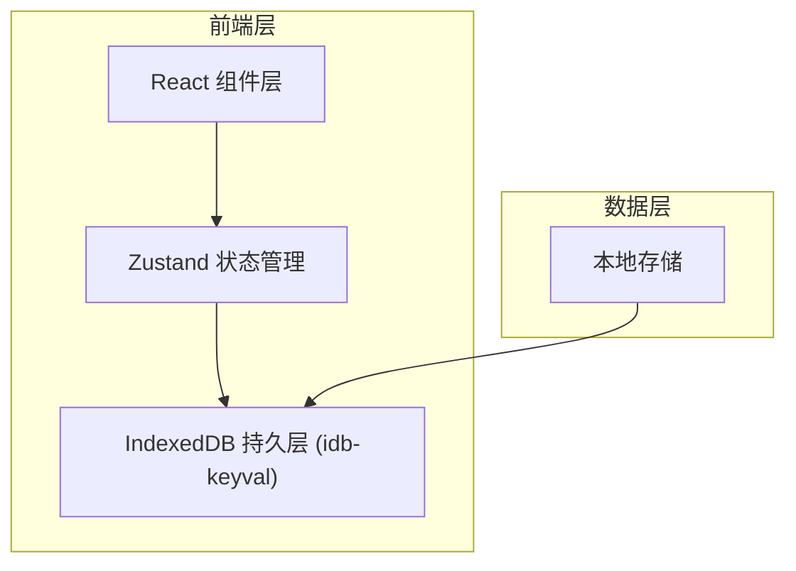
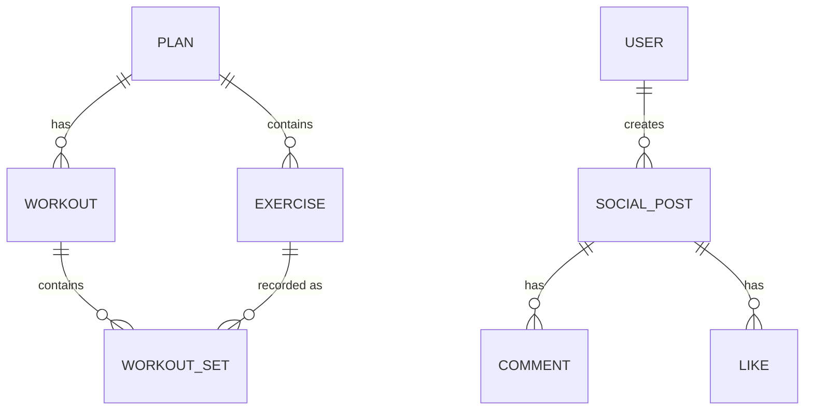

## 1. 架构设计



## 2. 技术描述

- **前端框架**：React 18 + TypeScript
- **构建工具**：Vite
- **路由管理**：React Router v6
- **状态管理**：Zustand
- **数据持久化**：IndexedDB（idb-keyval）
- **唯一ID生成**：uuid
- **样式方案**：CSS Modules / 内联样式（不使用Tailwind）
- **后端**：无（纯前端应用）
- **数据库**：IndexedDB 本地存储

## 3. 路由定义

| 路由 | 页面组件 | 用途 |
|------|---------|------|
| / | PlansPage | 训练计划列表与创建 |
| /workout/:planId | WorkoutPage | 训练记录页面 |
| /social | SocialPage | 社群动态页面 |

## 4. 数据模型

### 4.1 数据实体关系



### 4.2 数据类型定义

**Plan（训练计划）**
- id: string (uuid)
- name: string
- description: string
- exercises: Exercise[]（最多8个）
- createdAt: number

**Exercise（动作）**
- id: string
- name: string
- presetId: string（关联预设动作）
- order: number

**Workout（训练记录）**
- id: string (uuid)
- planId: string
- planName: string
- date: number (timestamp)
- duration: number (minutes)
- exercises: WorkoutExercise[]

**WorkoutExercise（训练动作详情）**
- exerciseId: string
- exerciseName: string
- sets: WorkoutSet[]

**WorkoutSet（训练组）**
- setNumber: number
- weight: number
- reps: number
- completed: boolean

**User（用户）**
- id: string
- name: string
- avatarInitial: string

**SocialPost（社群动态）**
- id: string
- userId: string
- userName: string
- workoutId: string
- date: number
- likes: number
- liked: boolean
- comments: Comment[]

**Comment（评论）**
- id: string
- userId: string
- userName: string
- content: string
- date: number

## 5. 文件结构

```
src/
├── main.tsx              # 应用入口，初始化路由与全局状态
├── types.ts              # TypeScript类型定义
├── store.ts              # Zustand状态管理
├── pages/
│   ├── PlansPage.tsx     # 计划管理页面
│   ├── WorkoutPage.tsx   # 训练记录页面
│   └── SocialPage.tsx    # 社群动态页面
├── components/
│   ├── PlanBuilder.tsx   # 计划构建器组件
│   ├── WorkoutLogger.tsx # 训练记录组件
│   ├── SocialFeed.tsx    # 社群动态组件
│   ├── ExerciseCard.tsx  # 动作卡片组件
│   ├── WorkoutSetInput.tsx # 组数据输入组件
│   ├── WeeklyCalendar.tsx # 周日历组件
│   ├── WeightChart.tsx   # 重量增长图表组件
│   ├── UserAvatar.tsx    # 用户头像组件
│   └── Navigation.tsx    # 导航栏组件
├── utils/
│   ├── db.ts             # IndexedDB操作封装
│   ├── mockData.ts       # 模拟数据生成
│   └── helpers.ts        # 工具函数
└── styles/
    └── globals.css       # 全局样式
```

## 6. 数据流

1. **计划创建**：PlanBuilder组件 → 用户交互 → Zustand store → IndexedDB持久化
2. **训练记录**：WorkoutLogger组件 → 读取当前计划 → 记录组数据 → 生成Workout → store → IndexedDB
3. **社群动态**：SocialFeed组件 → 从store获取模拟数据 → 渲染日历和图表 → 交互（点赞/评论）→ 更新store

## 7. 性能约束

- IndexedDB写入响应时间：≤ 200ms
- 社群页面首屏渲染（50条动态）：≤ 1秒
- 动画帧率：≥ 60fps
- 首次加载包体积：≤ 200KB gzipped

## 8. 预设动作库

包含以下预设动作供用户选择：
- 深蹲 (Squat)
- 卧推 (Bench Press)
- 硬拉 (Deadlift)
- 肩推 (Shoulder Press)
- 弯举 (Bicep Curl)
- 划船 (Row)
- 引体向上 (Pull-up)
- 腿举 (Leg Press)
