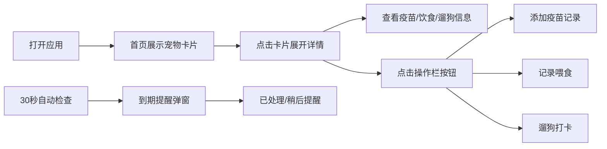
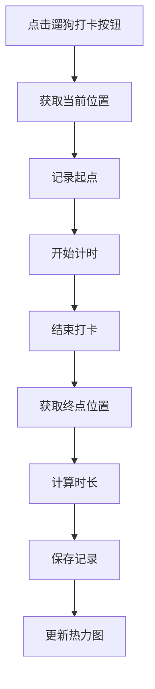

## 1. 产品概述

宠物健康管理应用是一款专为养宠物家庭设计的日常健康管理工具，解决宠物健康信息分散在纸质本、手机备忘和聊天记录里难以统一追踪，以及忘记定期打疫苗和驱虫的问题。帮助用户系统化管理宠物档案、疫苗驱虫提醒、饮食记录和遛狗打卡，全方位守护宠物健康。

## 2. 核心功能

### 2.1 用户角色

| 角色 | 注册方式 | 核心权限 |
|------|----------|----------|
| 普通用户 | 本地使用，无需注册 | 添加/编辑宠物档案、记录疫苗驱虫、记录饮食、遛狗打卡、查看统计图表 |

### 2.2 功能模块

1. **首页**：多宠物卡片网格展示、快速操作入口
2. **宠物档案管理**：添加/编辑宠物信息、头像上传、品种配色
3. **疫苗驱虫提醒**：记录疫苗/驱虫、到期提醒、30秒自动检查
4. **饮食记录与统计**：喂食记录、每日柱状图、详情查看
5. **遛狗打卡与统计**：地理位置打卡、热力图日历、路径记录

### 2.3 页面详情

| 页面名称 | 模块名称 | 功能描述 |
|----------|----------|----------|
| 首页 | 宠物卡片网格 | 展示所有宠物，卡片展开/收起动画，悬停浮起效果 |
| 首页 | 侧边栏导航 | 深暖棕色侧边栏，宠物头像快捷导航 |
| 宠物详情 | 档案信息 | 完整宠物信息展示，编辑入口 |
| 宠物详情 | 疫苗驱虫 | 记录列表、添加记录、到期状态标记 |
| 宠物详情 | 饮食统计 | 每日进食量柱状图、喂食详情列表 |
| 宠物详情 | 遛狗统计 | 热力图日历、遛狗路径列表、总时长统计 |
| 全局 | 提醒浮窗 | 疫苗/驱虫到期提醒，半透明毛玻璃效果 |

## 3. 核心流程

### 3.1 主要用户流程

用户打开应用后，首页展示所有宠物卡片。点击卡片展开详情，可查看疫苗、饮食、遛狗信息，也可进行快速操作。系统每30秒自动检查疫苗/驱虫到期情况，如有到期则弹出提醒浮窗。

### 3.2 遛狗打卡流程

## 4. 用户界面设计

### 4.1 设计风格

- **主色调**：温暖柔和的宠物主题配色
  - 主背景：米白色 (#FFF8E7)
  - 卡片背景：白色 (#FFFFFF)
  - 卡片边框：暖灰色 (#E0D6C8)，2px
  - 侧边栏：深暖棕色 (#5D4037)
  - 文字：深棕色/白色
- **食物类型配色**：
  - 干粮：#FFD54F（暖黄色）
  - 湿粮：#81C784（浅绿色）
  - 零食：#FF8A65（橙红色）
- **按钮样式**：圆角按钮，柔和阴影，悬停微放大
- **字体**：系统无衬线字体
- **布局风格**：卡片式布局，网格排列
- **图标/emoji**：使用emoji作为宠物品种图标，风格统一活泼

### 4.2 页面设计概览

| 页面名称 | 模块名称 | UI元素 |
|----------|----------|--------|
| 首页 | 宠物卡片 | 圆形头像/品种emoji、渐变背景、悬停浮起8px、展开动画160px→480px、底部操作栏 |
| 首页 | 侧边栏 | 深暖棕色背景、白色文字、260px宽度、彩色圆形小头像 |
| 提醒浮窗 | 弹窗 | 半透明遮罩、毛玻璃效果、圆角20px、缩放消失动画 |
| 饮食统计 | 柱状图 | 圆角卡片包裹、渐变柱色、悬停显示数值、点击弹出详情 |
| 遛狗统计 | 热力图 | Nivo Calendar、浅绿到深绿渐变、点击显示详情 |

### 4.3 响应式设计

- **桌面端**：三列卡片网格，侧边栏260px固定宽度
- **平板端**：两列卡片网格，侧边栏可收起
- **手机端**：单列全宽卡片，侧边栏变为抽屉式导航
- **触摸优化**：按钮最小触摸区域44px，卡片点击区域扩大

### 4.4 动画与交互

- 卡片展开/收起：0.3秒 ease-in-out 过渡动画
- 悬停效果：卡片上浮8px + 阴影扩散
- 提醒弹窗：缩放出现/消失动画
- 数据更新：平滑过渡，避免突兀跳动
- 所有过渡：统一使用0.3秒 ease-in-out 缓动函数

## 5. 性能要求

- **首屏加载**：30只宠物卡片 + 热力图，加载时间 ≤ 1.5秒
- **动画帧率**：卡片展开动画稳定60fps
- **后台检查**：每30秒数据检查不引起页面卡顿
- **数据持久化**：使用IndexedDB，读写操作异步执行不阻塞UI
