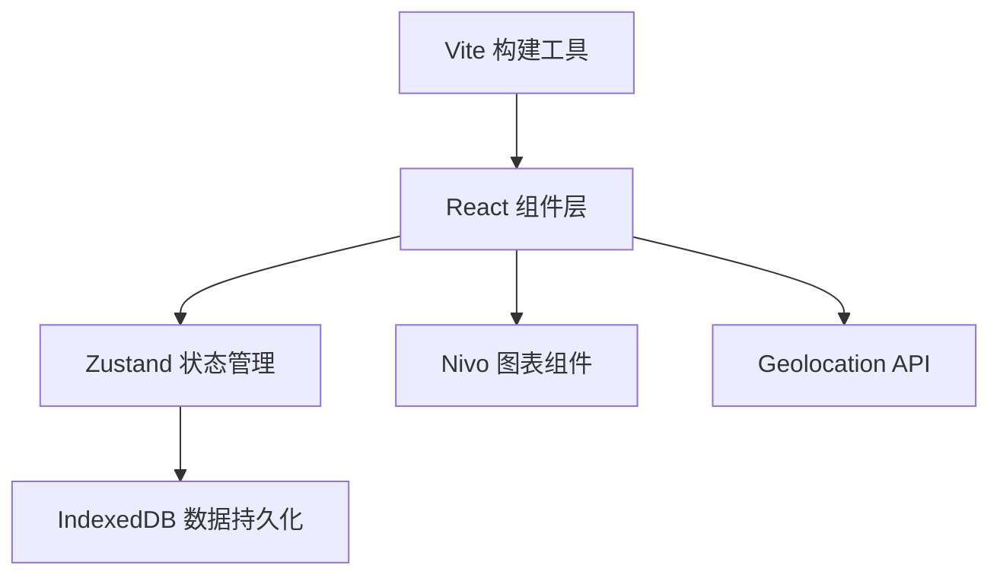
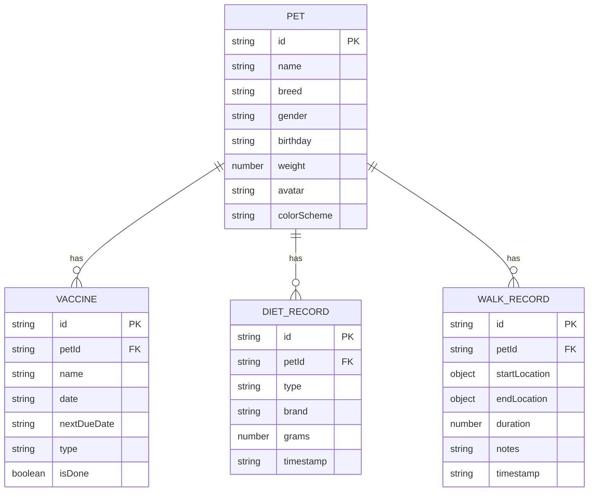

## 1. 架构设计

本应用为纯前端单页应用，无后端依赖，所有数据存储在浏览器本地IndexedDB中。



## 2. 技术栈说明

- **前端框架**：React@18 + TypeScript
- **构建工具**：Vite
- **状态管理**：Zustand
- **数据持久化**：IndexedDB (idb-keyval)
- **图表库**：@nivo/core, @nivo/calendar, @nivo/bar
- **路由**：react-router-dom@6
- **工具库**：uuid

## 3. 路由定义

| 路由 | 用途 |
|------|------|
| / | 首页，展示所有宠物卡片网格 |
| /pet/:id | 宠物详情页，展示疫苗、饮食、遛狗统计 |

## 4. 数据模型

### 4.1 数据模型定义



### 4.2 Store 结构

Zustand store 包含以下状态和方法：

- **State**:
  - pets: Pet[]
  - vaccines: Vaccine[]
  - dietRecords: DietRecord[]
  - walkRecords: WalkRecord[]
  - loading: boolean

- **Actions**:
  - addPet(pet): void
  - updatePet(id, data): void
  - deletePet(id): void
  - addVaccine(vaccine): void
  - updateVaccine(id, data): void
  - addDietRecord(record): void
  - addWalkRecord(record): void
  - fetchData(): Promise<void>
  - checkDueVaccines(): Vaccine[]

## 5. 目录结构

```
src/
├── main.tsx              # 入口文件
├── App.tsx               # 顶层路由与布局
├── stores/
│   └── petStore.ts       # Zustand 状态管理
├── components/
│   ├── PetCard.tsx       # 宠物卡片组件
│   ├── VaccineReminder.tsx # 疫苗提醒组件
│   ├── DietChart.tsx     # 饮食统计柱状图
│   ├── WalkCalendar.tsx  # 遛狗热力图
│   ├── Sidebar.tsx       # 侧边栏导航
│   └── PetForm.tsx       # 宠物表单组件
├── utils/
│   └── geo.ts            # 地理位置工具
└── types/
    └── index.ts          # 类型定义
```

## 6. 性能优化策略

1. **组件懒加载**：图表组件使用 React.lazy 延迟加载
2. **记忆化计算**：使用 useMemo 缓存统计数据
3. **虚拟列表**：大量宠物卡片时考虑虚拟滚动
4. **Web Workers**：（可选）复杂计算移至Worker
5. **IndexedDB 异步读写**：避免阻塞主线程
6. **requestAnimationFrame**：动画优化，确保60fps
7. **防抖/节流**：高频操作使用防抖节流
