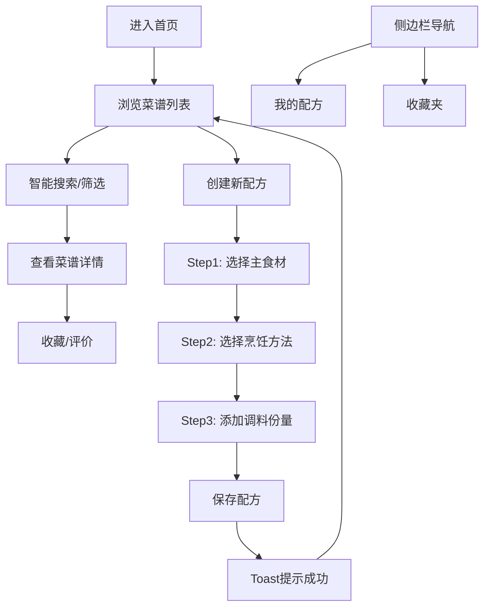

## 1. 产品概述

FlavorFuse是一个创意菜谱分享平台，让用户可以混合不同食材、调料和烹饪方法，生成独特的菜谱配方并分享给他人。用户可以搜索已有菜谱、按食材组合筛选、保存自己的配方，并查看其他用户的评价和改良版本。

- **目标用户**：烹饪爱好者、美食创意者、家庭厨师
- **核心价值**：激发烹饪创意，简化配方管理，促进美食社区交流

## 2. 核心功能

### 2.1 用户角色
| 角色 | 注册方式 | 核心权限 |
|------|----------|----------|
| 普通用户 | 本地存储（无需注册） | 浏览菜谱、创建配方、收藏管理、评价打分 |

### 2.2 功能模块
1. **菜谱浏览模块**：菜谱列表展示、智能搜索、分类筛选、推荐菜谱
2. **配方创建模块**：三步式创建流程、食材选择、烹饪方法、调料配比
3. **个人中心模块**：我的配方、收藏夹、评价记录
4. **推荐引擎模块**：基于食材组合和评分的智能推荐

### 2.3 页面详情
| 页面名称 | 模块名称 | 功能描述 |
|----------|----------|----------|
| 首页 | 菜谱列表 | 网格展示菜谱卡片、搜索栏、分类筛选、推荐排序 |
| 配方创建 | 三步创建浮窗 | 主食材选择 → 烹饪方法 → 调料份量，实时营养估算 |
| 菜谱详情 | 详情展示 | 完整配方、食材列表、步骤说明、评分评价、改良版本 |
| 我的配方 | 个人管理 | 我创建的配方列表、编辑删除操作 |
| 收藏夹 | 收藏管理 | 收藏的菜谱列表、取消收藏 |

## 3. 核心流程

### 3.1 浏览和搜索菜谱
用户进入首页 → 查看推荐菜谱列表 → 使用搜索栏输入关键词 → 实时过滤结果 → 点击菜谱卡片查看详情

### 3.2 创建新配方
用户点击创建按钮 → 弹出三步创建浮窗 → 第一步选择主食材 → 第二步选择烹饪方法 → 第三步添加调料和份量 → 保存配方 → 成功提示 → 返回列表

### 3.3 收藏和管理
用户浏览菜谱 → 点击收藏按钮 → 加入收藏夹 → 在侧边栏切换到收藏夹查看 → 可取消收藏

## 4. 用户界面设计

### 4.1 设计风格
- **主色调**：温暖橙黄系，传递美食的温馨感
  - 主背景：#FFF8E7（奶油白）
  - 主色：#FF8C00（南瓜橙）
  - 侧边栏渐变：#E65100 → #BF360C（深橙渐变）
  - 卡片背景：#FFFFFF
- **卡片样式**：2px南瓜色边框，16px圆角，悬停上浮6px带阴影扩散
- **字体**：标题使用圆润有特色的字体，正文清晰易读
- **图标风格**：食材图标采用彩色卡通风格，操作图标使用线性风格
- **动效**：
  - 页面切换淡入动画
  - 卡片悬停上浮阴影
  - 点赞星光爆炸动画
  - 食材选中凹陷动画

### 4.2 页面设计概览
| 页面名称 | 模块名称 | UI元素 |
|----------|----------|--------|
| 首页 | 顶部搜索栏 | 毛玻璃效果、智能下拉建议、分类标签 |
| 首页 | 左侧侧边栏 | 固定220px、深橙渐变、白色文字、淡入切换 |
| 首页 | 菜谱卡片网格 | 菜品名称、食材拼接占位图、辣椒难度、评分、预览按钮 |
| 创建浮窗 | 三步进度条 | Step 1 of 3 进度指示 |
| 创建浮窗 | 食材选择 | 网格彩色图标卡片、选中凹陷动画 |
| 创建浮窗 | 烹饪方法 | 圆形按钮、温度范围、时长显示 |
| 创建浮窗 | 调料份量 | 滑动条调节、实时营养估算卡片 |
| 菜谱卡片 | 点赞动画 | 心形白色光点炸开渐隐 |

### 4.3 响应式设计
- 桌面端优先设计（1280px+）
- 侧边栏固定宽度220px
- 菜谱卡片自适应网格布局
- 平板端侧边栏可收起
- 移动端单列布局，底部导航

### 4.4 性能指标
- 搜索结果过滤响应：≤ 50ms
- 配方保存操作：≤ 1s（含Toast提示）
- 页面切换动画：平滑流畅
