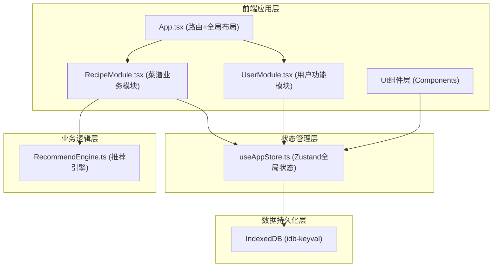

## 1. 架构设计



## 2. 技术选型

- **前端框架**：React@18 + TypeScript
- **构建工具**：Vite@5
- **路由管理**：react-router-dom@6
- **状态管理**：zustand@4
- **数据持久化**：IndexedDB (idb-keyval)
- **唯一ID生成**：uuid
- **样式方案**：CSS Modules + CSS Variables（无UI框架，纯CSS实现设计效果）
- **图标库**：lucide-react

## 3. 目录结构

```
src/
├── main.tsx              # React入口
├── App.tsx               # 路由和全局布局
├── modules/
│   ├── RecipeModule.tsx  # 菜谱业务模块
│   └── UserModule.tsx    # 用户功能模块
├── engine/
│   └── RecommendEngine.ts # 推荐引擎
├── store/
│   └── useAppStore.ts    # Zustand全局状态
├── components/           # 通用UI组件
│   ├── SearchBar.tsx
│   ├── RecipeCard.tsx
│   ├── CreateRecipeModal.tsx
│   ├── Sidebar.tsx
│   └── Toast.tsx
├── types/                # TypeScript类型定义
│   └── index.ts
├── utils/                # 工具函数
│   ├── db.ts             # IndexedDB封装
│   └── nutrition.ts      # 营养计算
└── styles/               # 全局样式
    └── index.css
```

## 4. 路由定义

| 路由路径 | 页面/组件 | 说明 |
|----------|-----------|------|
| / | 首页/菜谱列表 | RecipeModule渲染，展示所有菜谱 |
| /recipe/:id | 菜谱详情 | RecipeModule渲染详情视图 |
| /my-recipes | 我的配方 | UserModule渲染，用户创建的配方 |
| /favorites | 收藏夹 | UserModule渲染，收藏的菜谱 |

## 5. 数据模型

### 5.1 类型定义

```typescript
// 食材类型
interface Ingredient {
  id: string;
  name: string;
  category: 'protein' | 'vegetable' | 'grain' | 'dairy' | 'seasoning';
  color: string;
  icon: string;
  caloriesPer100g: number;
  proteinPer100g: number;
  carbsPer100g: number;
  fatPer100g: number;
}

// 烹饪方法
interface CookingMethod {
  id: string;
  name: string;
  icon: string;
  tempRange: string;
  duration: string;
}

// 调料
interface Seasoning {
  id: string;
  name: string;
  icon: string;
  caloriesPerGram: number;
}

// 菜谱
interface Recipe {
  id: string;
  name: string;
  mainIngredients: { ingredientId: string; amount: number }[];
  cookingMethod: string;
  seasonings: { seasoningId: string; amount: number }[];
  difficulty: 1 | 2 | 3;
  rating: number;
  ratingCount: number;
  createdAt: number;
  author: string;
  description: string;
  steps: string[];
  isFavorite?: boolean;
}

// 评价
interface Review {
  id: string;
  recipeId: string;
  userId: string;
  rating: number;
  comment: string;
  createdAt: number;
}

// 用户
interface User {
  id: string;
  name: string;
  avatar: string;
}
```

### 5.2 数据流向

1. **初始化**：应用启动时从IndexedDB加载菜谱、收藏等数据到Zustand store
2. **读取**：各模块从Zustand store获取数据进行渲染
3. **写入**：用户操作（创建、收藏、评分）更新Zustand store → 同步到IndexedDB
4. **推荐**：RecipeModule调用RecommendEngine，传入菜谱列表和用户偏好，返回推荐结果

## 6. 核心模块说明

### 6.1 RecommendEngine（推荐引擎）
- 输入：菜谱列表、用户收藏/历史、当前筛选条件
- 输出：排序后的推荐菜谱列表
- 算法：基于食材组合匹配度 + 评分加权 + 热门程度综合排序

### 6.2 useAppStore（全局状态）
- recipes: 所有菜谱列表
- myRecipes: 用户创建的菜谱
- favorites: 收藏的菜谱ID列表
- currentView: 当前视图（all/favorites/my-recipes）
- searchQuery: 搜索关键词
- 操作方法：addRecipe, toggleFavorite, updateRating, filterRecipes

### 6.3 RecipeModule（菜谱模块）
- 菜谱列表展示（网格布局）
- 智能搜索（实时过滤，50ms内响应）
- 创建配方（三步浮窗）
- 菜谱详情
- 调用推荐引擎

### 6.4 UserModule（用户模块）
- 我的配方管理
- 收藏夹展示
- 评价记录
- 与RecipeModule共享状态
