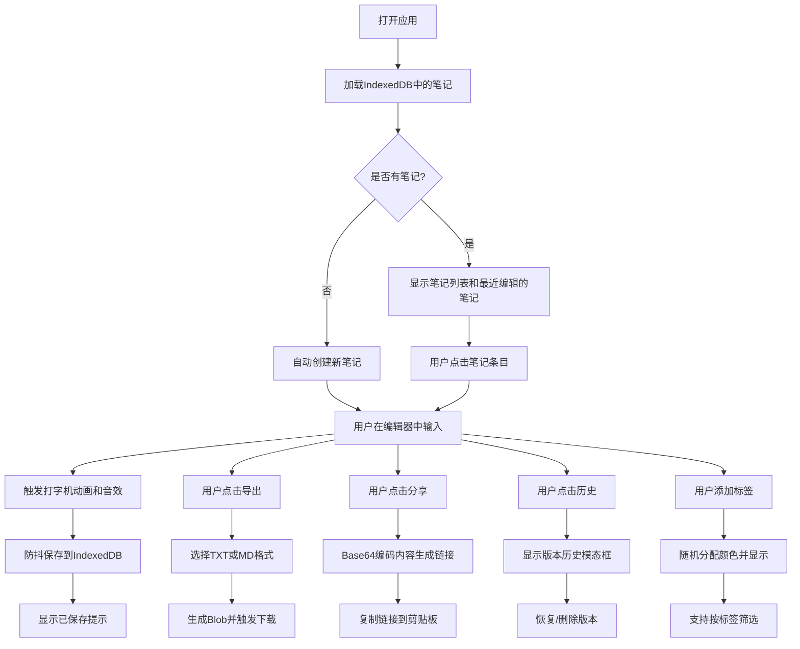

## 1. 产品概述

RetroType是一款复古打字机风格的在线笔记应用，通过打字机的视觉和音效体验让用户记录灵感、待办事项和日记。

- 主要目的：提供沉浸式的复古写作体验，结合打字机的独特音效和视觉效果，提升用户的写作乐趣和专注度
- 目标用户：喜欢复古美学的写作者、笔记爱好者、日常记录者
- 产品价值：将平凡的笔记记录转化为富有仪式感的写作体验

## 2. 核心功能

### 2.1 用户角色

| 角色 | 注册方式 | 核心权限 |
|------|----------|----------|
| 普通用户 | 无需注册（本地存储） | 创建、编辑、删除笔记，搜索，导出，查看分享链接 |

### 2.2 功能模块

1. **主应用页面**：左侧时间线边栏 + 右侧打字机编辑器
2. **打字机编辑器**：复古纸页外观、打字机音效、字符震动动画、光标闪烁效果
3. **笔记管理**：CRUD操作、自动保存、版本历史（最多10个版本）
4. **搜索与标签**：实时搜索过滤、自定义标签管理、标签筛选
5. **导出与分享**：导出为TXT/MD文件、生成只读分享链接

### 2.3 页面详情

| 页面名称 | 模块名称 | 功能描述 |
|----------|----------|----------|
| 主应用页面 | 时间线边栏 | 新建笔记、笔记列表展示、搜索过滤、标签筛选、删除操作 |
| 主应用页面 | 打字机编辑器 | 文字输入、打字机动画音效、自动保存提示、字数统计、标签管理 |
| 主应用页面 | 版本历史模态框 | 展示版本历史、恢复历史版本、删除历史版本 |
| 主应用页面 | 导出分享弹窗 | 导出选项、生成分享链接、复制链接 |
| 分享页面 | 只读查看器 | 展示分享的笔记内容（Base64解码），无编辑功能 |

## 3. 核心流程

## 4. 界面设计

### 4.1 设计风格

- **主色调**：深木色(#5D4037)、米黄色纸页(#F5F0E1)、深棕色边框(#3E2723)、青铜色按钮(#CD7F32)
- **辅助色**：亮黄色高亮(#FFCC00)、金色边框指示(#FFB300)、青铜色悬停(#E8A040)
- **按钮风格**：青铜色圆角按钮，悬停时亮度提升，带轻微阴影
- **字体**：Courier New或等宽字体，模拟打字机输出效果
- **布局风格**：左侧固定边栏(280px) + 右侧内容区，桌面端双栏布局，移动端抽屉式侧边栏
- **视觉效果**：纸页纹理背景、打字机震动动画、旧电影淡入淡出过渡

### 4.2 页面设计概述

| 页面名称 | 模块名称 | UI元素 |
|----------|----------|----------|
| 主应用页面 | 时间线边栏 | 深棕色背景、白色文字、圆形新建按钮、笔记卡片(标题+日期+字数)、左侧边框指示条 |
| 主应用页面 | 打字机编辑器 | 米黄色纸页背景、等宽字体、固定宽度960px、字符震动动画、闪烁黑色光标、保存状态指示器 |
| 主应用页面 | 版本历史模态框 | 半透明遮罩、居中卡片、版本列表(时间戳+内容预览)、恢复/删除按钮 |
| 主应用页面 | 标签区域 | 圆角胶囊样式、随机预设颜色、悬停显示全名、点击删除 |
| 分享页面 | 只读查看器 | 简约纸页风格、隐藏所有编辑功能、仅展示内容 |

### 4.3 响应式设计

- **桌面端(≥768px)**：左侧固定边栏280px，右侧编辑器区域自适应
- **移动端(<768px)**：侧边栏折叠为抽屉，从左侧滑入，编辑器全宽显示
- **触摸优化**：增大按钮点击区域，支持滑动关闭抽屉

### 4.4 动画效果

- **字符输入**：x轴偏移1-2px，持续0.1s的震动动画
- **笔记切换**：左侧30px位移 + 淡出0.3s的滑动效果
- **页面过渡**：旧电影开场般的淡入淡出效果
- **按钮悬停**：青铜色亮度提升，背景色平滑过渡
- **保存提示**：右下角淡入显示"已保存"文字和绿色圆点
