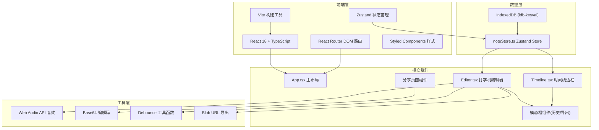
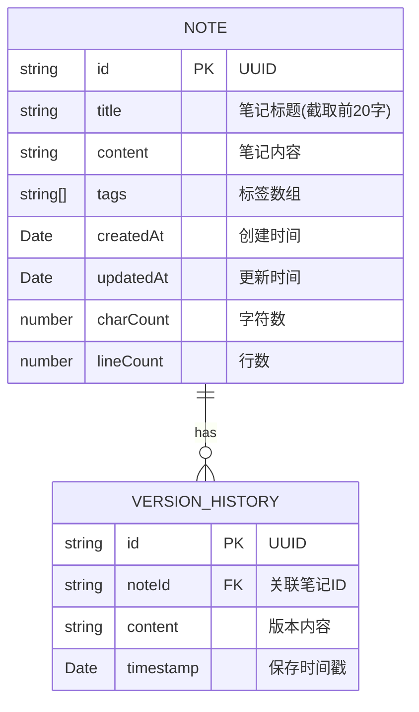

## 1. 架构设计



## 2. 技术描述

- **前端框架**: React@18 + TypeScript@5
- **构建工具**: Vite@5
- **路由管理**: react-router-dom@6
- **状态管理**: zustand@4
- **数据持久化**: idb-keyval@6 (IndexedDB 封装)
- **唯一ID生成**: uuid@9
- **样式方案**: CSS Modules / Styled Components (CSS变量主题)
- **音效**: Web Audio API (原生实现，无需额外依赖)

## 3. 路由定义

| 路由 | 页面 | 用途 |
|------|------|------|
| `/` | 主应用页面 | 笔记编辑 + 时间线边栏 |
| `/share/:data` | 分享页面 | 只读展示分享的笔记内容 |

## 4. 数据模型

### 4.1 数据模型定义



### 4.2 TypeScript 类型定义

```typescript
interface Note {
  id: string;
  title: string;
  content: string;
  tags: string[];
  createdAt: Date;
  updatedAt: Date;
  charCount: number;
  lineCount: number;
  versionHistory: Version[];
}

interface Version {
  id: string;
  content: string;
  timestamp: Date;
}

interface NoteStore {
  notes: Note[];
  currentNoteId: string | null;
  searchQuery: string;
  selectedTag: string | null;
  isLoading: boolean;
  
  // Actions
  createNote: () => Note;
  updateNote: (id: string, content: string) => Promise<void>;
  deleteNote: (id: string) => void;
  setCurrentNote: (id: string) => void;
  setSearchQuery: (query: string) => void;
  setSelectedTag: (tag: string | null) => void;
  addTag: (noteId: string, tag: string) => void;
  removeTag: (noteId: string, tag: string) => void;
  restoreVersion: (noteId: string, versionId: string) => void;
  deleteVersion: (noteId: string, versionId: string) => void;
  loadNotes: () => Promise<void>;
  
  // Computed
  filteredNotes: Note[];
  currentNote: Note | null;
  allTags: string[];
}
```

## 5. 性能优化策略

### 5.1 编辑器性能
- **输入防抖**: 内容变化后300ms内防抖保存，避免频繁IO
- **自动保存**: 每30秒定时保存，结合输入防抖的即时保存
- **虚拟渲染**: 笔记列表使用虚拟滚动（如笔记数量超过100条）
- **CSS动画**: 使用transform属性实现震动动画，避免重排重绘

### 5.2 搜索性能
- **搜索防抖**: 输入停止后200ms再执行过滤
- **索引优化**: 对标题和内容建立内存索引

### 5.3 存储性能
- **IndexedDB异步事务**: 所有存储操作使用异步API，不阻塞主线程
- **版本历史限制**: 每个笔记最多保留10个版本，控制存储体积

## 6. 项目文件结构

```
auto128/
├── package.json
├── index.html
├── vite.config.js
├── tsconfig.json
├── src/
│   ├── main.tsx
│   ├── App.tsx
│   ├── store/
│   │   └── noteStore.ts
│   ├── components/
│   │   ├── Editor.tsx
│   │   ├── Timeline.tsx
│   │   ├── VersionModal.tsx
│   │   ├── ExportModal.tsx
│   │   ├── SharePage.tsx
│   │   └── TagInput.tsx
│   ├── hooks/
│   │   ├── useTypewriterSound.ts
│   │   ├── useDebounce.ts
│   │   └── useAutoSave.ts
│   ├── utils/
│   │   ├── audio.ts
│   │   ├── base64.ts
│   │   ├── export.ts
│   │   └── constants.ts
│   └── styles/
│       ├── global.css
│       └── variables.css
```

## 7. 关键实现要点

### 7.1 打字机音效 (Web Audio API)
- 使用`AudioContext`创建振荡器
- 生成短促的敲击声（频率800-1200Hz，持续0.05-0.1s）
- 不同字符可略有频率差异，增加真实感

### 7.2 字符震动动画
- CSS `@keyframes` 定义震动动画
- 每个字符输入时临时添加动画类
- 使用`transform: translateX()`实现，性能最优

### 7.3 IndexedDB 数据持久化
- 使用`idb-keyval`库简化操作
- Zustand store 订阅变化自动持久化
- 应用启动时异步加载数据

### 7.4 分享链接实现
- 笔记内容 + 标题 Base64 编码
- 作为URL参数传递
- 分享页面解码并渲染
