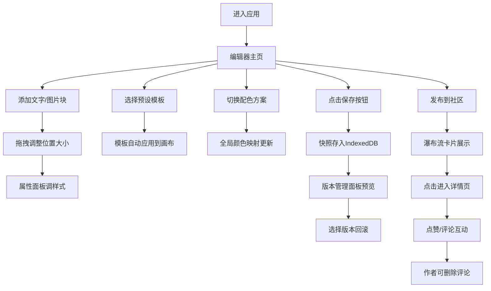

## 1. 产品概述
一款面向非设计师群体的动态排版海报设计与社交分享应用，解决用户在社交媒体快速产出高质量图文海报的痛点。通过模板库、配色方案和直观的拖拽编辑器，让用户零设计基础也能制作专业级海报作品，并通过社区广场实现作品展示与互动。

## 2. 核心特性

### 2.1 用户角色
| 角色 | 注册方式 | 核心权限 |
|------|----------|----------|
| 普通用户 | 本地模拟用户 | 浏览模板、编辑画布、发布作品、点赞评论、管理自己的评论删除权限 |

### 2.2 功能模块
1. **首页/编辑器**：左侧悬浮工具栏、中央画布编辑区、模板与配色面板
2. **模板库面板**：6款预设海报模板，一键应用
3. **配色方案面板**：5套预设色彩主题，全局切换
4. **社区广场**：瀑布流卡片墙，懒加载展示
5. **海报详情页**：大图展示、点赞计数动画、评论列表

### 2.3 页面详情
| 页面名称 | 模块名称 | 功能描述 |
|---------|---------|----------|
| 编辑器主页 | 左侧工具栏 | 添加文字块/图片块、层级调整、保存快照、切换面板、导出功能 |
| 编辑器主页 | 画布编辑区 | 1080x1920固定尺寸画布，支持拖拽、缩放、选中、删除元素 |
| 编辑器主页 | 属性面板 | 字体/字号/颜色/行距/透明度调整（文字），尺寸调整（图片） |
| 编辑器主页 | 版本管理 | 历史版本缩略图预览，最多10个版本，一键回滚 |
| 模板库面板 | 模板列表 | 6款模板缩略图展示（节日、促销、早安等），点击应用到画布 |
| 配色面板 | 主题列表 | 5套配色方案色块展示，点击全局切换色彩映射 |
| 社区广场 | 瀑布流 | 卡片墙布局，悬停微浮动+阴影，懒加载，点击进入详情 |
| 详情页 | 大图展示 | 海报完整预览，点赞按钮带计数动画，评论列表倒序，支持emoji，作者可删评论 |

## 3. 核心流程

### 3.1 主流程描述
用户进入应用后，默认显示空白画布或最近编辑内容。用户可从左侧工具栏添加文字或图片，通过拖拽调整位置和大小，使用属性面板调整样式。可选择预设模板一键套用，或切换配色方案改变整体色调。每次手动保存生成快照，可在版本面板中回溯。完成后发布到社区，其他用户可点赞评论，作者可删除不友善评论。

### 3.2 流程图

## 4. 用户界面设计

### 4.1 设计风格
- **设计语言**：毛玻璃（Glassmorphism）——磨砂半透明背景（backdrop-filter: blur）、模糊边缘、轻微发光边框
- **主色调**：蓝紫色渐变 #667eea → #764ba2
- **辅助色**：白色 #ffffff、浅灰色 #f0f0f5、深灰文字 #2d2d44
- **按钮样式**：圆角12px，悬浮时0.3s过渡，按下时0.1s弹性回弹（scale: 0.96 → 1）
- **字体方案**：标题使用 Playfair Display（衬线优雅），正文使用 Space Grotesk（现代几何无衬线）
- **布局风格**：卡片式布局，左侧固定悬浮工具栏（宽72px→展开宽280px），中央画布居中
- **图标风格**：Lucide 线性图标，hover时放大1.2倍+渐变着色

### 4.2 页面设计概览
| 页面名称 | 模块名称 | UI元素 |
|---------|---------|--------|
| 编辑器 | 左侧工具栏 | 玻璃面板 backdrop-blur-xl, border: 1px solid rgba(255,255,255,0.2), box-shadow: 0 8px 32px rgba(102,126,234,0.15)，图标hover放大+渐变色 |
| 编辑器 | 画布区 | 1080x1920白色画布，阴影深度感，选中元素显示蓝色控制点，拖拽时0.05s平滑跟随 |
| 编辑器 | 版本面板 | 垂直时间轴，缩略图120x213带玻璃态边框，hover放大预览 |
| 模板库 | 模板卡片 | 180x320缩略图，玻璃态卡片，hover时 translateY(-4px) + 阴影加深，点击0.4s缩放淡入过渡 |
| 配色面板 | 主题色块 | 三个圆形色点组合（主色/辅色/背景色），选中态显示渐变发光边框 |
| 社区广场 | 瀑布流卡片 | 宽280px随机高度，悬停 translateY(-6px) + box-shadow: 0 20px 40px rgba(102,126,234,0.2) |
| 详情页 | 点赞按钮 | 心形图标，点击0.3s填充动画 + 数字弹跳 scale(1→1.3→1) |
| 详情页 | 评论区 | 玻璃态输入框，emoji选择器，评论卡片时间倒序，作者评论显示删除按钮 |

### 4.3 响应式设计
- **桌面端（≥1200px）**：左侧固定工具栏，画布居中最大1080x1920，右侧可选面板
- **平板端（768-1199px）**：工具栏收缩为图标列，点击展开抽屉面板，画布按比例缩放
- **手机端（<768px）**：工具栏移至底部弹出式面板（64px高条），向上滑动全屏展开，画布宽度适配屏幕，支持触控拖拽

### 4.4 动效规范
| 交互 | 动效参数 |
|-----|---------|
| 模板切换 | 0.4s ease-out，scale(0.9→1) + opacity(0→1) |
| 发布按钮按下 | 0.1s cubic-bezier(0.34, 1.56, 0.64, 1)，scale(1→0.96→1) |
| 工具栏图标hover | 0.2s ease，transform: scale(1.2) + color渐变 |
| 卡片悬停 | 0.3s ease-out，translateY(-4/-6px) + shadow |
| 点赞计数 | 0.3s cubic-bezier(0.175, 0.885, 0.32, 1.275)，数字弹跳 |
| 拖拽元素 | 0.05s linear 平滑跟随（requestAnimationFrame） |
