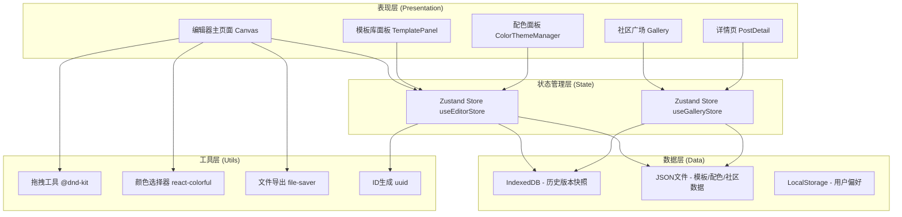
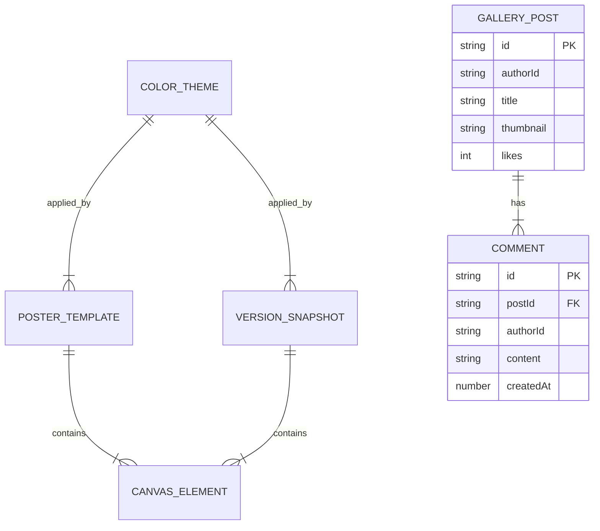

## 1. 架构设计



## 2. 技术说明

### 2.1 前端技术栈
- **框架**：React@18 + TypeScript@5（严格模式 strict）
- **构建工具**：Vite@5（React插件配置，路径别名@）
- **路由**：react-router-dom@6（BrowserRouter，3个路由）
- **状态管理**：zustand@4（扁平化状态，持久化中间件可选）
- **拖拽**：@dnd-kit/core + @dnd-kit/sortable（高性能拖拽排序，FPS≥50）
- **颜色选择**：react-colorful（轻量级HSL颜色选择器）
- **文件导出**：file-saver（Canvas导出PNG下载）
- **工具库**：uuid（唯一ID生成）
- **样式方案**：TailwindCSS@3 + CSS变量（毛玻璃效果统一封装）
- **字体**：Google Fonts - Playfair Display + Space Grotesk

### 2.2 数据存储方案
- **后端**：无后端，全部使用前端模拟
- **模板/配色/社区初始数据**：本地JSON静态文件
- **历史版本**：IndexedDB（键值存储，最多10条，LRU淘汰）
- **用户会话**：LocalStorage（当前选中主题、最近编辑ID）

### 2.3 关键实现策略
1. **画布拖拽性能**：使用 requestAnimationFrame 节流位置更新，Transform 3D加速（translate3d）避免重排
2. **瀑布流布局**：CSS columns 多列布局实现，IntersectionObserver 实现图片懒加载
3. **历史版本快照**：html2canvas 或纯数据序列化（推荐数据序列化，存储元素数组JSON）
4. **配色映射**：元素颜色字段存语义key（primary/secondary/background），渲染时根据当前主题解析
5. **响应式适配**：Tailwind断点 + CSS媒体查询，matchListener监听视口变化
6. **IndexedDB封装**：使用简单Promise包装（idb轻量封装），避免回调地狱

## 3. 路由定义

| 路由路径 | 页面组件 | 用途说明 |
|---------|---------|---------|
| `/` | `EditorPage` | 编辑器主页（默认路由） |
| `/gallery` | `GalleryPage` | 社区广场瀑布流 |
| `/post/:id` | `PostDetailPage` | 海报详情页 |

## 4. 数据模型

### 4.1 核心类型定义

```typescript
// 画布元素基类
interface BaseElement {
  id: string;
  type: 'text' | 'image';
  x: number;
  y: number;
  width: number;
  height: number;
  zIndex: number;
  rotation: number;
  opacity: number;
}

// 文字块元素
interface TextElement extends BaseElement {
  type: 'text';
  content: string;
  fontFamily: string;
  fontSize: number;
  fontWeight: number;
  colorKey: 'primary' | 'secondary' | 'background' | 'custom';
  customColor?: string;
  lineHeight: number;
  letterSpacing: number;
  textAlign: 'left' | 'center' | 'right';
}

// 图片块元素
interface ImageElement extends BaseElement {
  type: 'image';
  src: string;
  objectFit: 'cover' | 'contain' | 'fill';
  borderRadius: number;
}

// 画布元素联合类型
type CanvasElement = TextElement | ImageElement;

// 配色方案
interface ColorTheme {
  id: string;
  name: string;
  colors: {
    primary: string;
    secondary: string;
    background: string;
  };
}

// 模板
interface PosterTemplate {
  id: string;
  name: string;
  category: 'festival' | 'promotion' | 'morning' | 'other';
  thumbnail: string;
  canvasBackground: string;
  colorThemeId: string;
  elements: CanvasElement[];
}

// 历史版本快照
interface VersionSnapshot {
  id: string;
  timestamp: number;
  thumbnail: string;
  elements: CanvasElement[];
  colorThemeId: string;
  canvasBackground: string;
}

// 社区海报帖子
interface GalleryPost {
  id: string;
  authorId: string;
  authorName: string;
  authorAvatar: string;
  title: string;
  thumbnail: string;
  fullImage: string;
  likes: number;
  likedByMe: boolean;
  publishedAt: number;
  comments: Comment[];
}

// 评论
interface Comment {
  id: string;
  postId: string;
  authorId: string;
  authorName: string;
  authorAvatar: string;
  content: string;
  createdAt: number;
  isAuthor: boolean;
}
```

### 4.2 ER图



## 5. 文件组织结构

```
src/
├── main.tsx                      # 应用入口+路由
├── App.tsx                       # 根组件（布局容器）
├── index.css                     # 全局样式+Tailwind+CSS变量
├── types/
│   └── index.ts                  # 全局类型定义
├── store/
│   ├── useEditorStore.ts         # 编辑器状态（核心）
│   └── useGalleryStore.ts        # 社区状态
├── pages/
│   ├── EditorPage.tsx            # 编辑器页面
│   ├── GalleryPage.tsx           # 广场页面
│   └── PostDetailPage.tsx        # 详情页面
├── modules/
│   ├── canvas/
│   │   ├── Canvas.tsx            # 画布编辑区
│   │   ├── CanvasElement.tsx     # 单个元素渲染
│   │   ├── Toolbar.tsx           # 左侧工具栏
│   │   ├── PropertyPanel.tsx     # 属性编辑面板
│   │   └── VersionPanel.tsx      # 版本管理面板
│   ├── template/
│   │   └── TemplatePanel.tsx     # 模板库
│   ├── color/
│   │   └── ColorThemeManager.tsx # 配色面板
│   └── gallery/
│       ├── Gallery.tsx           # 瀑布流
│       ├── GalleryCard.tsx       # 海报卡片
│       └── PostDetail.tsx        # 详情组件
├── data/
│   ├── templates.json            # 6个模板
│   ├── colorThemes.json          # 5个配色
│   └── galleryPosts.json         # 社区初始帖子
└── utils/
    ├── idb.ts                    # IndexedDB封装
    ├── canvasExport.ts           # 画布导出工具
    └── elementFactory.ts         # 元素创建工厂
```
