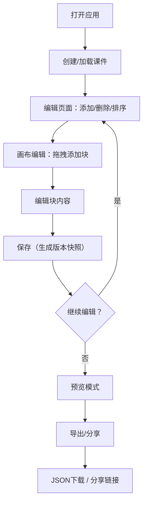

## 1. 产品概述

CourseForge 是一款面向教师的互动式课件制作平台，无需编程即可创建包含图文、测验和视频的在线课件。支持可视化编辑、实时预览和发布分享，解决教师在在线教育场景下课件制作门槛高、交互性差的痛点。

## 2. 核心功能

### 2.1 用户角色

| 角色 | 注册方式 | 核心权限 |
|------|----------|----------|
| 教师 | 无需注册，本地使用 | 创建、编辑、预览、分享课件 |

### 2.2 功能模块

1. **编辑器页面**：课件页面管理、块编辑器、工具栏、画布、版本历史面板
2. **预览模式**：全屏播放、键盘翻页、淡入淡出过渡
3. **分享功能**：JSON导出下载、分享链接生成与加载

### 2.3 页面详情

| 页面名称 | 模块名称 | 功能描述 |
|----------|----------|----------|
| 编辑器页面 | 页面列表面板 | 左侧树形卡片展示所有页面，支持新增、删除、拖拽排序，当前页面高亮，拖拽时平滑缩放偏移动画 |
| 编辑器页面 | 画布编辑区 | 灰白色画布，渲染可拖拽的文字块、图片块、测验块，块有阴影圆角，选中时橙黄边框脉冲发光，拖拽时显示虚线占位指示 |
| 编辑器页面 | 工具栏 | 添加文字块/图片块/测验块按钮，撤销/重做（完整undo/redo栈），保存、预览按钮，所有交互0.2s缓动 |
| 编辑器页面 | 块编辑器-文字块 | contentEditable富文本编辑，支持基础格式 |
| 编辑器页面 | 块编辑器-图片块 | 上传图片或粘贴URL，图片预览展示 |
| 编辑器页面 | 块编辑器-测验块 | 单选或多选题目，自动计分，选项动态增删 |
| 编辑器页面 | 版本历史面板 | 展示所有版本快照的时间戳和备注，点击回退到指定版本 |
| 预览模式 | 全屏播放 | 暗色背景，页面居中，键盘左右键翻页，点击下一页导航，淡入淡出过渡动画，不显示编辑控件 |
| 分享功能 | JSON导出 | 将课件数据序列化为JSON文件下载 |
| 分享功能 | 分享链接 | 生成包含课件ID的分享链接，打开链接自动从IndexedDB加载对应课件 |

## 3. 核心流程

用户打开应用 → 创建新课件 → 添加页面并设置标题和背景色 → 在画布中拖拽添加文字/图片/测验块 → 编辑块内容 → 保存（自动生成版本快照）→ 预览全屏播放 → 导出JSON或生成分享链接

## 4. 用户界面设计

### 4.1 设计风格

- 主色调：深蓝（#1A237E）和白色背景
- 辅色：橙黄（#FF9800）用于按钮和激活态高亮
- 画布背景：灰白色（#F5F5F5）
- 块样式：微弱阴影、圆角，选中时橙黄边框+脉冲发光
- 按钮风格：圆角，橙黄高亮，0.2s缓动过渡
- 字体：Google Fonts - Noto Sans SC（正文）+ Playfair Display（标题装饰）
- 布局：左侧页面列表面板 + 中间画布 + 顶部工具栏

### 4.2 页面设计概览

| 页面名称 | 模块名称 | UI元素 |
|----------|----------|--------|
| 编辑器页面 | 页面列表面板 | 卡片式设计，当前页面橙黄高亮，拖拽排序平滑缩放偏移动画，768px以下折叠为底部抽屉 |
| 编辑器页面 | 画布编辑区 | 灰白色背景，块组件带阴影圆角，选中时橙黄边框脉冲动画，拖拽时虚线占位指示 |
| 编辑器页面 | 工具栏 | 顶部固定，深蓝色背景，橙黄按钮，图标+文字，768px以下折叠为顶部导航栏 |
| 编辑器页面 | 版本历史面板 | 右侧滑出面板，版本卡片列表，时间戳+备注 |
| 预览模式 | 全屏播放 | 暗色背景（#121212），页面居中白卡片，淡入淡出过渡，底部翻页导航 |

### 4.3 响应式

- 桌面优先设计，768px以下将工具栏折叠为顶部导航栏，页面列表折叠为底部抽屉
- 画布区域自适应可用空间
- 所有交互0.2s缓动过渡

### 4.4 性能约束

- 20页面课件切换和预览帧率保持50FPS以上
- 保存操作响应时间不超过200ms（使用防抖和批量写入优化）
- 使用React.memo和虚拟化优化大列表渲染
