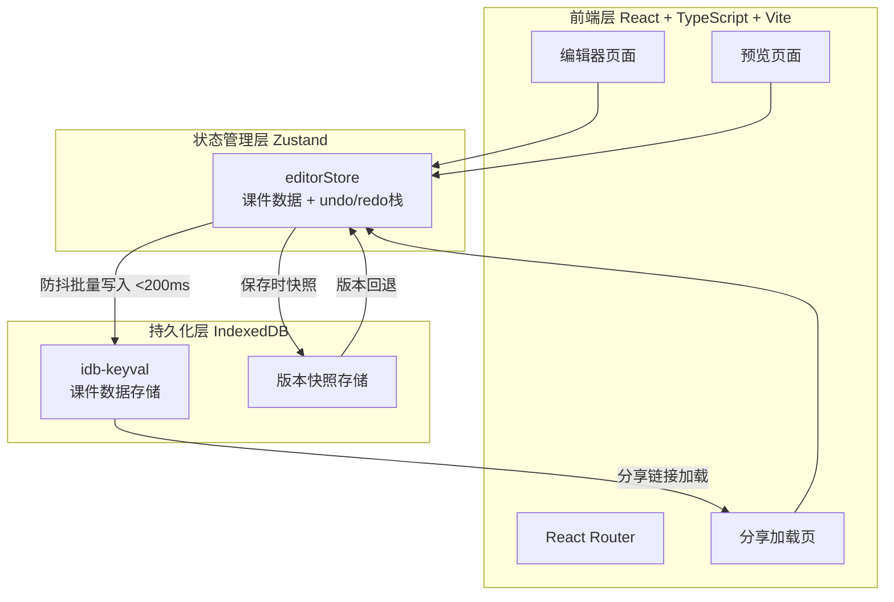
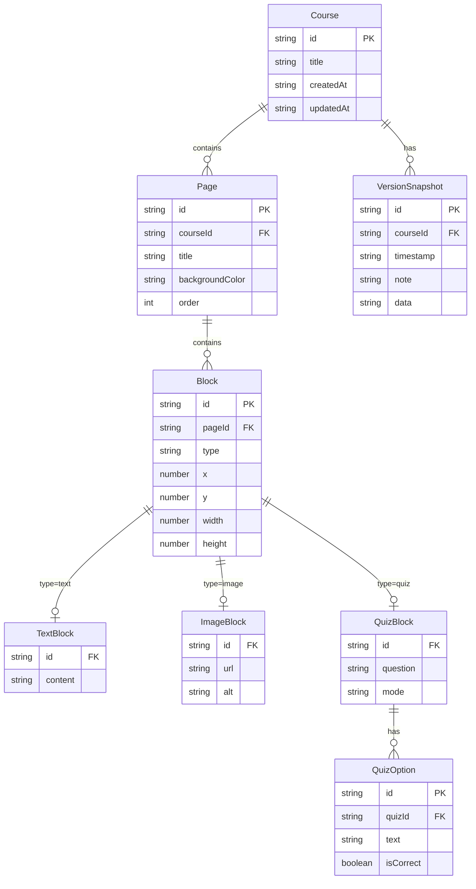

## 1. 架构设计



## 2. 技术说明

- 前端：React@18 + TypeScript + Vite + Tailwind CSS
- 初始化工具：vite-init (react-ts模板)
- 状态管理：zustand@4 + zustand/middleware（persist中间件配合自定义idb-keyval存储）
- 数据存储：IndexedDB（通过idb-keyval封装）
- 路由：react-router-dom@6
- 其他依赖：uuid（生成课件/页面/块唯一ID）、marked（Markdown渲染）
- 无后端，纯前端应用

## 3. 路由定义

| 路由 | 用途 |
|------|------|
| / | 编辑器主页面，包含页面列表、画布、工具栏 |
| /preview | 全屏预览模式 |
| /share/:courseId | 分享链接加载页，从IndexedDB加载对应课件数据 |

## 4. 数据模型

### 4.1 数据模型定义



### 4.2 文件结构与调用关系

```
src/
├── main.tsx                    # 应用入口，挂载Router和全局Provider
├── App.tsx                     # 路由配置（/ → Editor, /preview → Preview, /share/:id → ShareLoader）
├── stores/
│   └── editorStore.ts          # Zustand store：课件数据、页面列表、undo/redo栈、版本快照
│                               # 数据流：组件 → store actions → persist中间件 → idb-keyval → IndexedDB
│                               # 依赖：zustand/middleware, idb-keyval, uuid
├── components/
│   ├── EditorLayout.tsx        # 编辑器主布局：左侧面板 + 画布 + 工具栏
│   ├── PagePanel.tsx           # 左侧页面列表面板，卡片式，拖拽排序
│   ├── Canvas.tsx              # 课件编辑画布，渲染可拖拽块组件，虚线占位指示
│   │                           # 数据流：读取store → 用户拖拽 → 更新store
│   ├── BlockRenderer.tsx       # 块渲染器：根据block.type分发渲染文字/图片/测验块
│   ├── TextBlock.tsx           # 文字块：contentEditable富文本编辑
│   ├── ImageBlock.tsx          # 图片块：上传或URL粘贴
│   ├── QuizBlock.tsx           # 测验块：单选/多选，自动计分
│   ├── Toolbar.tsx             # 工具栏：添加块、撤销/重做、保存、预览
│   │                           # 调用store: addBlock, undo, redo, save, togglePreview
│   ├── HistoryPanel.tsx        # 版本历史面板：展示版本列表，点击回退
│   │                           # 数据流：读取store.versions → 点击版本 → store.rollback
│   ├── PreviewMode.tsx         # 全屏预览：暗色背景，键盘翻页，淡入淡出过渡
│   └── ShareLoader.tsx         # 分享加载：解析URL中courseId → 从IndexedDB加载 → 跳转编辑器
├── utils/
│   ├── export.ts               # 导出函数：序列化为JSON下载 + 生成分享链接URL
│   │                           # 依赖：idb-keyval（读取课件数据）
│   └── storage.ts              # IndexedDB封装：防抖写入、批量操作、idb-keyval集成
│                               # 数据流：editorStore → storage(防抖) → idb-keyval → IndexedDB
├── hooks/
│   ├── useUndoRedo.ts          # Undo/Redo钩子：管理操作栈，提供undo/redo/canUndo/canRedo
│   └── useDragSort.ts          # 拖拽排序钩子：处理拖拽逻辑和动画状态
└── types/
    └── index.ts                # TypeScript类型定义：Course, Page, Block, QuizOption, VersionSnapshot
```

调用关系与数据流向：
1. **编辑操作**：Canvas/Toolbar → editorStore actions → store内部更新state → persist中间件 → storage.ts(防抖) → idb-keyval → IndexedDB
2. **撤销/重做**：Toolbar → useUndoRedo → editorStore.undo/redo → state回退 → persist同步
3. **版本快照**：Toolbar保存 → editorStore.save → 生成VersionSnapshot → storage.ts批量写入
4. **预览**：Toolbar预览按钮 → react-router navigate('/preview') → PreviewMode读取store
5. **分享导出**：Toolbar导出 → export.ts → 序列化JSON下载 / 生成分享URL
6. **分享加载**：/share/:courseId → ShareLoader → storage.ts读取IndexedDB → editorStore.loadCourse
