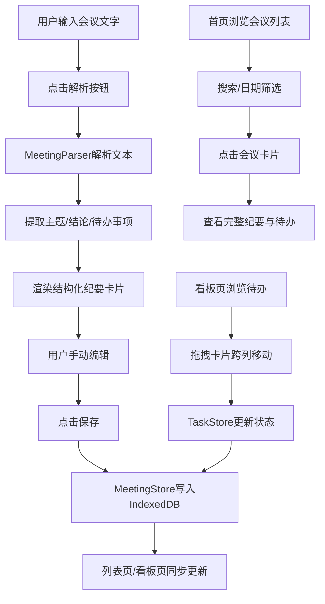

## 1. 产品概述

智能会议纪要与任务分配应用——帮助团队从会议文字记录中自动提取主题、结论和待办事项，生成结构化纪要并指派任务，实现会议成果到执行行动的无缝衔接。
- 核心价值：减少人工整理纪要的时间成本，确保待办事项不被遗漏并明确责任人与截止日期
- 目标用户：项目经理、团队负责人、行政助理等需频繁组织/参与会议的职场人士

## 2. 核心功能

### 2.1 用户角色

| 角色 | 注册方式 | 核心权限 |
|------|----------|----------|
| 默认用户 | 无需注册 | 创建会议、编辑纪要、管理待办事项 |

### 2.2 功能模块

1. **会议列表页（首页）**：搜索筛选、会议卡片列表、快捷操作入口
2. **会议编辑器页**：文本录入与解析、结构化纪要展示与编辑、保存持久化
3. **待办事项看板页**：三列状态看板、拖拽交互、截止日期提醒

### 2.3 页面详情

| 页面名称 | 模块名称 | 功能描述 |
|----------|----------|----------|
| 会议列表页 | 搜索筛选栏 | 按标题关键词搜索，按日期范围筛选，实时过滤 |
| 会议列表页 | 会议卡片列表 | 展示会议标题、日期、待办数量，点击进入详情，悬停淡蓝色高亮 |
| 会议编辑器页 | 文本输入区 | 多行文本框，模拟语音转文字结果输入，点击解析按钮触发解析 |
| 会议编辑器页 | 解析结果展示区 | 结构化卡片显示主题、结论、待办事项列表，支持增删改编辑 |
| 会议编辑器页 | 保存操作 | 保存至IndexedDB，成功后列表页同步更新 |
| 待办事项看板页 | 三列看板 | 待处理/进行中/已完成三列等宽布局，卡片圆角8px白底 |
| 待办事项看板页 | 拖拽交互 | 跨列拖拽移动任务卡片，拖拽时scale(1.05)阴影放大动画 |
| 待办事项看板页 | 截止日期提醒 | 截止日期3天内的卡片右上角显示红色圆点 |

## 3. 核心流程

用户在编辑器页面输入或粘贴会议文字，点击解析后MeetingParser模块提取主题、结论和待办事项（含负责人与截止日期），结果渲染为结构化卡片，用户可手动编辑后保存至IndexedDB。首页展示所有会议记录卡片，支持搜索和日期筛选。看板页从IndexedDB读取所有待办事项，按状态分三列展示，支持拖拽改变状态。删除会议时关联待办事项一并删除。

## 4. 用户界面设计

### 4.1 设计风格

- 主色调：深蓝色（#1E3A5F），辅助色：浅灰色（#F5F7FA）
- 按钮风格：圆角6px，主按钮深蓝底白字，次按钮浅灰底深蓝字
- 字体：正文14px，标题20px，小字12px，使用系统字体栈
- 布局风格：顶部导航栏，内容区域居中，卡片式布局
- 图标风格：线性图标（lucide-react）

### 4.2 页面设计概览

| 页面名称 | 模块名称 | UI元素 |
|----------|----------|--------|
| 会议列表页 | 搜索筛选栏 | 深蓝导航栏，白色搜索输入框，日期选择器，浅灰背景 |
| 会议列表页 | 会议卡片列表 | 白色圆角卡片，标题加粗，日期与待办数灰色小字，hover淡蓝底 |
| 会议编辑器页 | 文本输入区 | 居中800px宽，圆角边框浅灰底色多行文本框，深蓝解析按钮 |
| 会议编辑器页 | 解析结果区 | 分割线分隔主题/结论/任务列表，结论可增删，待办含负责人与截止日期 |
| 待办事项看板页 | 三列看板 | 等宽三列，列标题深蓝字，卡片圆角8px白底，拖拽scale(1.05)阴影 |

### 4.3 响应式适配

- 桌面优先设计，最小宽度360px
- 窄屏（<768px）时看板改为上下滚动单列布局
- 编辑器页窄屏时宽度自适应，最大800px
- 卡片列表窄屏时单列排列

### 4.4 3D场景指引

不适用
