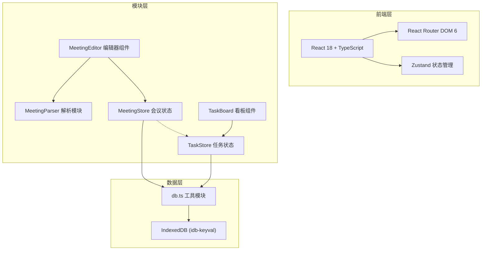
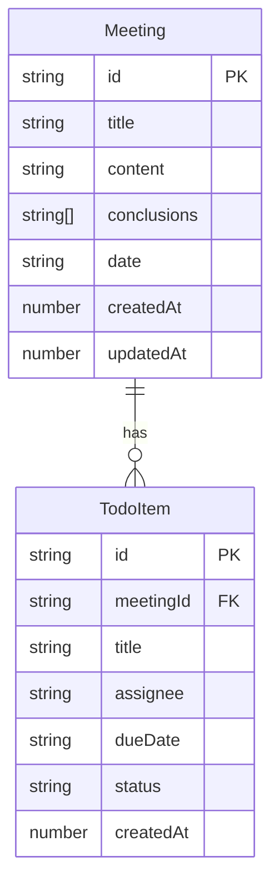

## 1. 架构设计



## 2. 技术说明

- 前端框架：React@18 + TypeScript
- 构建工具：Vite
- 状态管理：Zustand
- 路由：React Router DOM@6
- 数据持久化：IndexedDB（通过idb-keyval封装）
- 样式：TailwindCSS@3
- 日期处理：date-fns
- 唯一标识：uuid
- 初始化工具：vite-init（react-ts模板）
- 后端：无
- 数据库：IndexedDB（浏览器端）

## 3. 路由定义

| 路由 | 用途 |
|------|------|
| / | 会议列表首页，展示所有会议记录卡片 |
| /meeting/new | 新建会议编辑器页面 |
| /meeting/:id | 会议详情/编辑页面 |
| /tasks | 待办事项看板页面 |

## 4. API定义

无后端API，所有数据操作通过IndexedDB在本地完成。

## 5. 服务器架构图

不适用

## 6. 数据模型

### 6.1 数据模型定义



### 6.2 数据定义

**Meeting 对象结构：**
```typescript
interface Meeting {
  id: string;
  title: string;
  content: string;
  conclusions: string[];
  date: string;
  createdAt: number;
  updatedAt: number;
}
```

**TodoItem 对象结构：**
```typescript
interface TodoItem {
  id: string;
  meetingId: string;
  title: string;
  assignee: string;
  dueDate: string;
  status: 'pending' | 'in-progress' | 'completed';
  createdAt: number;
}
```

**IndexedDB 存储结构：**
- Store `meetings`：以id为键存储Meeting对象
- Store `todos`：以id为键存储TodoItem对象
- 索引：todos按meetingId建索引，用于级联删除
