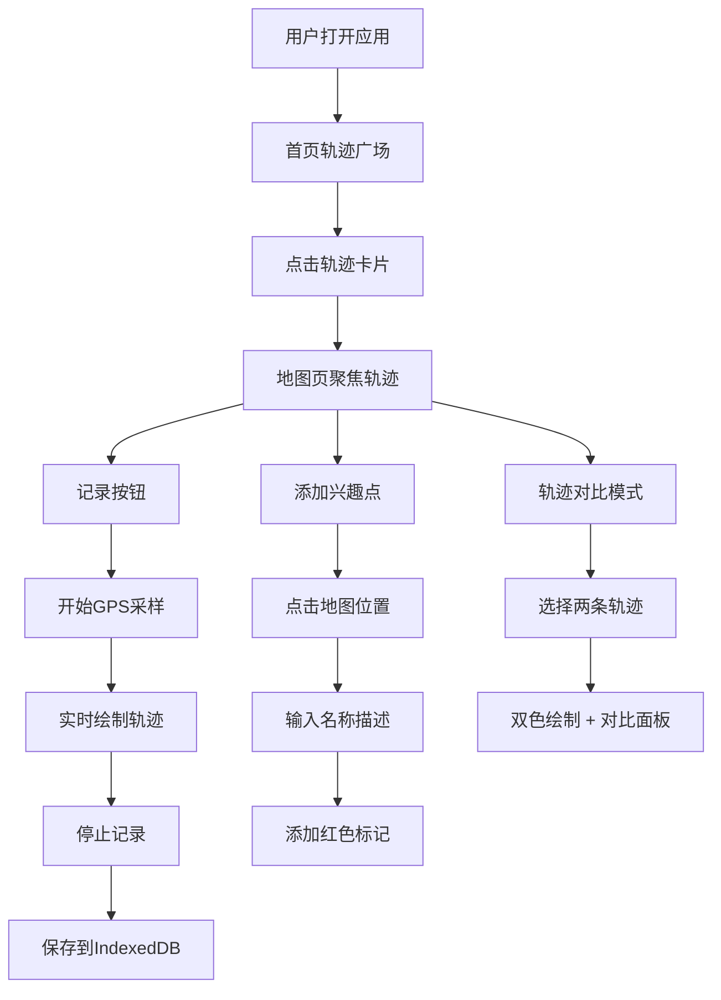

## 1. 产品概述

TrailScope是一款面向户外徒步爱好者的登山轨迹分享应用，帮助用户记录、分享和探索登山路线。用户可以实时记录GPS轨迹，添加兴趣点标记，并与其他驴友分享路线。

- 目标用户：户外徒步爱好者、登山运动爱好者
- 核心价值：便捷的轨迹记录、丰富的兴趣点标注、社交化的路线分享与对比

## 2. 核心功能

### 2.1 用户角色

| 角色 | 注册方式 | 核心权限 |
|------|----------|----------|
| 普通用户 | 本地使用无需注册 | 记录轨迹、添加兴趣点、查看和对比轨迹、点赞公开轨迹 |

### 2.2 功能模块

1. **轨迹记录模块**：实时GPS采样、轨迹绘制、IndexedDB存储、GPX导出
2. **地图展示模块**：Leaflet地图渲染、轨迹折线绘制、兴趣点标记管理
3. **社交互动模块**：轨迹卡片展示、点赞功能、轨迹对比模式
4. **兴趣点管理**：添加/删除/拖动标记、详情弹窗、30字描述限制

### 2.3 页面详情

| 页面名称 | 模块名称 | 功能描述 |
|----------|----------|----------|
| 首页（轨迹广场） | 社交互动模块 | 卡片列表展示所有公开轨迹，显示名称、日期、距离、点赞数 |
| 地图页 | 地图展示模块 + 轨迹记录模块 | 主地图占70%，左侧边栏30%，支持记录、标记、对比功能 |

## 3. 核心流程

### 3.1 轨迹记录流程
用户点击开始记录 → 每5秒采集GPS坐标 → 实时在地图上绘制蓝色轨迹线 → 停止记录 → 自动保存到IndexedDB → 支持导出GPX

### 3.2 兴趣点添加流程
用户在地图非轨迹位置点击 → 弹出名称和描述输入框（30字限制）→ 确认后添加红色图钉标记 → 点击标记查看详情

### 3.3 轨迹对比流程
在地图页选中两条轨迹 → 点击对比按钮 → 两条轨迹分别以蓝色和橙色绘制 → 自动缩放地图 → 右侧浮动面板显示长度差和海拔差

## 4. 用户界面设计

### 4.1 设计风格

- 主色调：深绿色 #2E7D32（户外运动风格）
- 辅助色：米白色 #F5F5DC
- 强调色：蓝色（轨迹线）、红色（兴趣点标记）、橙色（对比轨迹）
- 按钮风格：圆角矩形、轻微阴影、悬停反馈
- 字体：现代无衬线字体，清晰易读
- 图标风格：简约线性图标，与户外主题契合

### 4.2 页面设计概览

| 页面名称 | 模块名称 | UI元素 |
|----------|----------|--------|
| 首页 | 轨迹卡片列表 | 卡片网格布局、轨迹缩略图、点赞动画、深绿色导航栏 |
| 地图页 | 地图 + 侧边栏 | 70%地图区域、30%左侧边栏、记录按钮脉冲动画、底部滑入弹窗 |

### 4.3 响应式

- 桌面端/平板端自适应布局
- 触摸设备按钮尺寸不小于48px
- 主地图区域保持70%宽度，侧边栏可折叠

### 4.4 动效设计

- 记录按钮脉冲红色圆环动画
- 兴趣点弹窗底部滑入过渡（300ms）
- 轨迹激活状态发光描边特效
- 点赞数字动画反馈
- 页面切换平滑过渡
