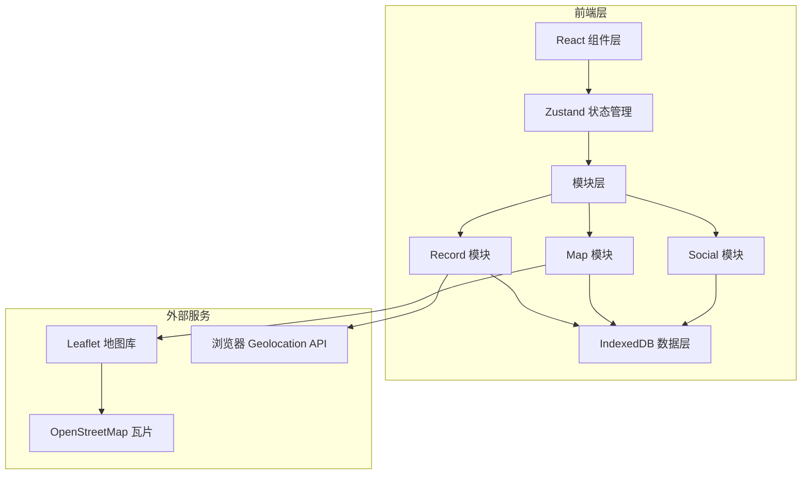
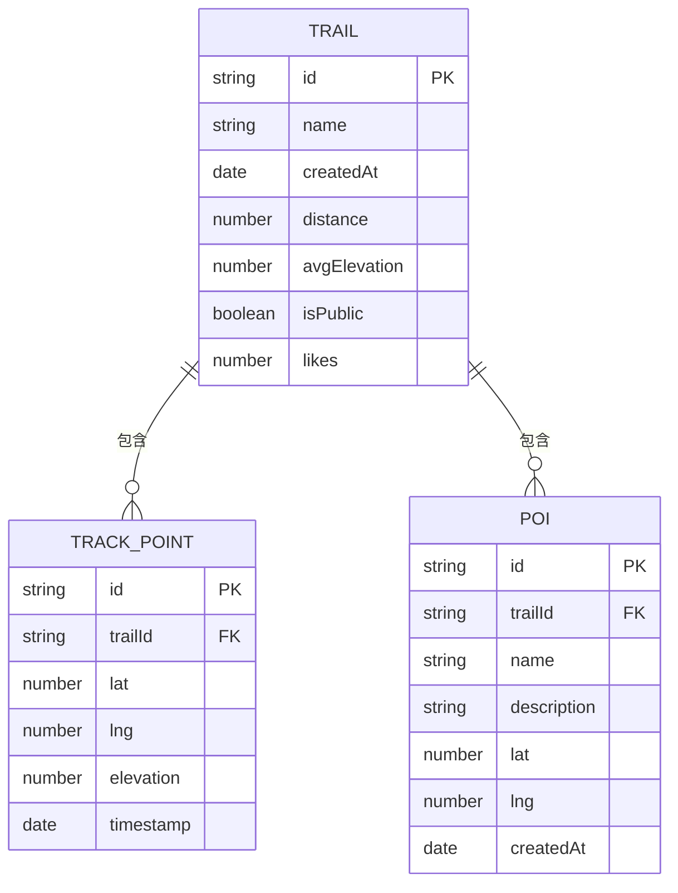

## 1. 架构设计



## 2. 技术描述

- **前端框架**: React@18 + TypeScript
- **构建工具**: Vite
- **状态管理**: Zustand
- **地图库**: Leaflet + react-leaflet
- **本地存储**: IndexedDB (idb-keyval)
- **工具库**: uuid, date-fns
- **样式方案**: CSS Modules / Tailwind CSS

### 文件结构

```
src/
├── main.tsx                 # 应用入口
├── App.tsx                   # 根组件
├── modules/
│   ├── record/              # 轨迹记录模块
│   │   ├── types.ts        # 类型定义
│   │   ├── store.ts          # Zustand store
│   │   ├── hooks.ts          # 自定义hooks
│   │   ├── utils.ts          # GPX导出等工具
│   │   └── index.ts        # 模块入口
│   ├── map/                   # 地图展示模块
│   │   ├── types.ts        # 类型定义
│   │   ├── store.ts          # Zustand store
│   │   ├── components/       # 地图组件
│   │   ├── hooks.ts          # 地图相关hooks
│   │   └── index.ts        # 模块入口
│   └── social/                # 社交互动模块
│       ├── types.ts        # 类型定义
│       ├── store.ts          # Zustand store
│       ├── components/       # 社交组件
│       └── index.ts        # 模块入口
├── shared/
│   ├── db.ts                 # IndexedDB封装
│   └── utils.ts             # 通用工具函数
├── pages/
│   ├── Home.tsx              # 首页（轨迹广场）
│   └── MapPage.tsx           # 地图页
└── styles/
    └── global.css             # 全局样式
```

### 模块间调用关系和数据流向

1. **数据流向**: Record模块 → Map模块 → Social模块**
   - Record模块采集GPS坐标点，存储到IndexedDB
   - Map模块从IndexedDB读取轨迹数据，在地图上渲染
   - Social模块从IndexedDB读取公开轨迹，展示卡片列表

2. **模块依赖**:
   - Record模块 → 依赖 navigator.geolocation API, IndexedDB
   - Map模块 → 依赖 Leaflet, IndexedDB, Record模块的轨迹数据
   - Social模块 → 依赖 IndexedDB, Map模块的轨迹展示能力

## 3. 路由定义

| 路由 | 页面 | 说明 |
|------|------|------|
| / | Home | 首页，轨迹广场 |
| /map | MapPage | 地图页，记录和查看轨迹 |

## 4. 数据模型

### 4.1 数据模型定义



### 4.2 IndexedDB存储表结构

- **trails**: 轨迹表
  - id (主键)
  - name (轨迹名称)
  - createdAt (创建时间)
  - distance (总距离，米)
  - avgElevation (平均海拔，米)
  - isPublic (是否公开)
  - likes (点赞数)

- **trackPoints**: 轨迹点表
  - id (主键)
  - trailId (外键)
  - lat (纬度)
  - lng (经度)
  - elevation (海拔)
  - timestamp (时间戳)

- **pois**: 兴趣点表
  - id (主键)
  - trailId (外键，可为null表示全局)
  - name (名称)
  - description (描述)
  - lat (纬度)
  - lng (经度)
  - createdAt (创建时间)

## 5. 性能优化策略

1. **GPS采样精度**: 使用 setInterval + 误差控制在±500ms内
2. **地图渲染性能**: 超过200个兴趣点时使用 Leaflet MarkerCluster 或 Canvas渲染
3. **IndexedDB操作**: 批量写入轨迹点，避免频繁IO
4. **轨迹折线优化**: 使用简化算法减少渲染点数，远距离时简化轨迹点
5. **动画性能**: CSS动画优先，避免JS动画阻塞主线程
