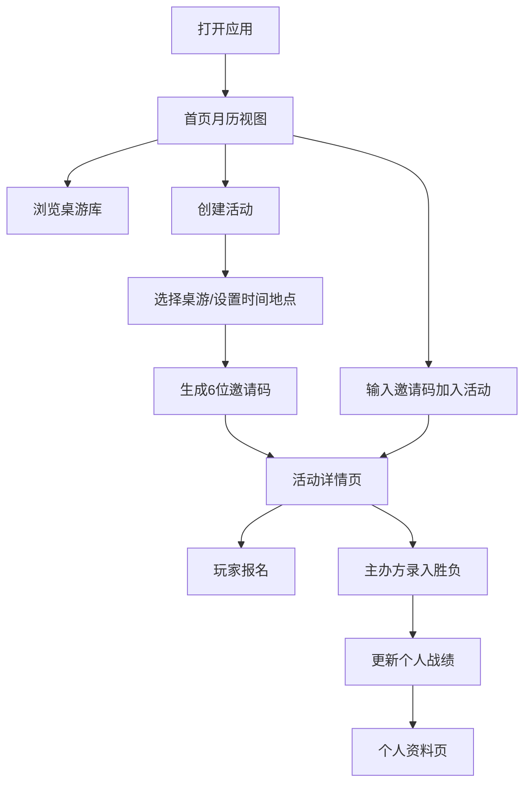

## 1. 产品概述

桌游活动管理应用是一款面向桌游爱好者的线下活动组织工具，解决玩家群体在找桌游、约局和记录胜负时缺乏统一工具的痛点。目标用户为桌游社团、桌游吧常客及休闲桌游玩家，产品价值在于提供一站式的桌游资料库、活动组织和战绩记录服务。

## 2. 核心功能

### 2.1 用户角色
| 角色 | 注册方式 | 核心权限 |
|------|----------|----------|
| 普通用户 | 本地昵称设置 | 浏览桌游库、创建活动、加入活动、查看战绩 |
| 活动主办方 | 活动创建者自动拥有 | 管理活动、录入胜负结果 |

### 2.2 功能模块
1. **首页**：月历视图、即将开始的活动列表、侧边导航
2. **桌游库**：桌游列表、搜索筛选、添加自定义桌游
3. **活动详情**：活动信息、报名列表、胜负录入、邀请码
4. **个人资料**：历史活动、胜率统计、桌游偏好

### 2.3 页面详情
| 页面名称 | 模块名称 | 功能描述 |
|----------|----------|----------|
| 首页 | 月历组件 | 彩色圆点标记活动日期，点击展开当天活动 |
| 首页 | 即将活动列表 | 未来7天活动卡片，按日期升序排列 |
| 首页 | 导航栏 | 左侧可折叠导航，移动端汉堡菜单 |
| 桌游库 | 桌游列表 | 展示内置和自定义桌游，支持搜索 |
| 桌游库 | 添加桌游 | 表单录入自定义桌游信息 |
| 活动详情 | 活动信息卡 | 显示桌游、时间、地点、备注 |
| 活动详情 | 报名列表 | 玩家头像和昵称，报名/取消报名 |
| 活动详情 | 胜负录入 | 主办方输入玩家名次或团队结果 |
| 个人资料 | 战绩统计 | 参与活动数、总胜率 |
| 个人资料 | 偏好统计 | 水平进度条展示各游戏出场次数 |

## 3. 核心流程

用户打开应用后，首页展示月历和即将活动。用户可浏览桌游库查看桌游详情，或创建新活动（选择桌游、设置时间地点、生成邀请码）。其他用户通过邀请码加入活动并报名。活动结束后，主办方录入胜负结果，系统更新各玩家战绩档案。

## 4. 用户界面设计

### 4.1 设计风格
- **主色调**：深胡桃木色 #5D3A1A、暗金色 #C9A84C
- **背景**：微妙木纹纹理CSS渐变模拟
- **风格定位**：桌游吧氛围、温暖质感、复古木质
- **按钮样式**：圆角木质按钮，金色边框，悬停上浮
- **字体**：标题使用衬线字体增强质感，正文清晰易读
- **图标风格**：Unicode emoji 作为桌游图标

### 4.2 页面设计概述
| 页面名称 | 模块名称 | UI元素 |
|----------|----------|--------|
| 首页 | 月历组件 | 木质边框日历格、彩色活动圆点、淡入动画 |
| 首页 | 活动卡片 | 上浮阴影动画、emoji图标、报名人数徽章 |
| 首页 | 导航栏 | 可收缩侧边栏、金色高亮选中项 |
| 活动详情 | 报名列表 | 首字母头像、金色边框卡片 |
| 个人资料 | 进度条 | 金色填充进度条、木质底色 |

### 4.3 响应式
- 桌面端：左侧导航栏 + 主内容区双栏布局
- 平板端：导航栏可折叠为图标模式
- 手机端：顶部汉堡菜单，单栏内容，日历自适应宽度
- 触摸优化：按钮最小高度44px，点击区域充足

### 4.4 动画与微交互
- 活动卡片悬停：transform: translateY(-4px) + 增强阴影
- 报名按钮点击：scale(0.95) 弹跳缩放反馈
- 日历活动标记：淡入动画，同日多点重叠排列
- 列表加载：逐项淡入动画，stagger 延迟
- 导航切换：平滑过渡，FPS不低于45
