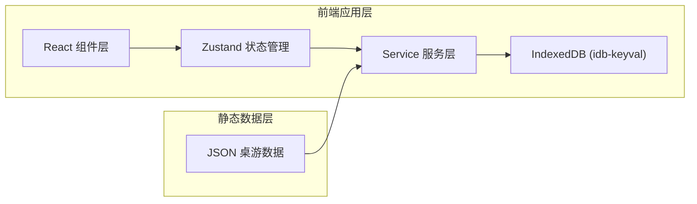
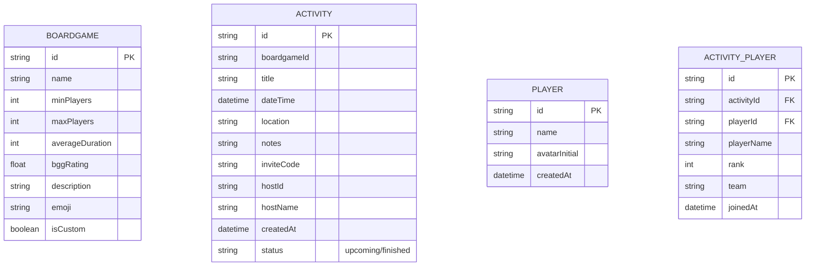

## 1. 架构设计



## 2. 技术描述

- **前端框架**：React@18 + TypeScript
- **构建工具**：Vite
- **路由管理**：react-router-dom@6
- **状态管理**：zustand
- **数据存储**：IndexedDB (idb-keyval)
- **工具库**：date-fns（日期处理）、uuid（唯一ID）
- **样式方案**：CSS Modules + CSS 变量

## 3. 路由定义

| 路由 | 页面组件 | 用途 |
|------|----------|------|
| / | HomePage | 首页 - 月历视图 + 即将活动 |
| /boardgames | BoardgamesPage | 桌游库列表 |
| /activity/:id | ActivityDetailPage | 活动详情页 |
| /profile/:playerId | PlayerProfile | 个人资料页 |
| /join | JoinActivityPage | 输入邀请码加入活动 |

## 4. 数据模型

### 4.1 数据模型定义



### 4.2 数据存储说明

使用 idb-keyval 管理 IndexedDB 存储，分为以下几个 store：
- `boardgames`：桌游数据（内置+自定义）
- `activities`：活动数据
- `players`：玩家信息
- `activityPlayers`：活动报名记录与胜负结果

### 4.3 初始数据

- 内置15款热门桌游静态JSON数据，首次加载时导入IndexedDB
- 包含：卡坦岛、阿瓦隆、画物语、璀璨宝石、车票之旅、波多黎各、七大奇迹、冷战热斗、农场主、展翅翱翔、瘟疫危机、山屋惊魂、大搜查、推理事件簿、决战苏富比

## 5. 文件结构

```
src/
├── modules/
│   ├── boardgame/
│   │   ├── BoardgameData.json
│   │   ├── BoardgameService.ts
│   │   └── BoardgameStore.ts
│   ├── activity/
│   │   ├── ActivityService.ts
│   │   └── ActivityStore.ts
│   └── player/
│       ├── PlayerService.ts
│       └── PlayerProfile.tsx
├── ui/
│   ├── pages/
│   │   ├── HomePage.tsx
│   │   ├── ActivityDetailPage.tsx
│   │   ├── BoardgamesPage.tsx
│   │   └── JoinActivityPage.tsx
│   └── components/
│       ├── CalendarView.tsx
│       ├── ActivityCard.tsx
│       ├── Sidebar.tsx
│       ├── BoardgameCard.tsx
│       └── PlayerAvatar.tsx
├── store/
│   └── useAppStore.ts
├── types/
│   └── index.ts
├── utils/
│   └── db.ts
├── App.tsx
├── main.tsx
└── styles/
    └── global.css
```

## 6. 性能优化

- **首页加载**：50个以内活动列表 500ms 内完成加载和动画
- **日历切换**：月份切换每帧渲染时间 < 16ms
- **动画性能**：使用 transform 和 opacity 属性动画，保证 GPU 加速
- **列表渲染**：列表项使用 CSS stagger 淡入，避免布局抖动
- **数据缓存**：IndexedDB 数据读取使用异步 Promise，不阻塞主线程
