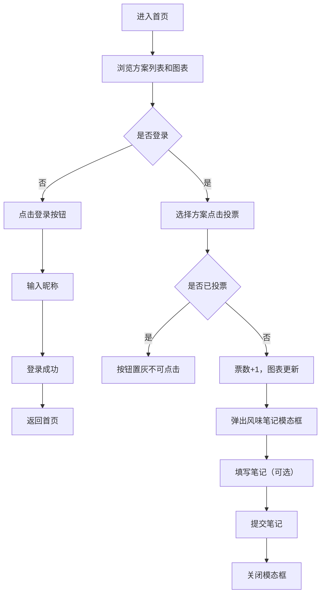

## 1. 产品概述

FlavorFusion 是一款面向独立咖啡店的咖啡拼配豆共创平台，让常客参与新品研发，通过投票和风味笔记反馈增强社区粘性。

- 核心目标：搭建店主与顾客的共创桥梁，提升顾客参与感和品牌忠诚度
- 目标用户：独立咖啡店店主及其常客
- 市场价值：将顾客从消费者转变为共创者，建立独特的社区文化

## 2. 核心特性

### 2.1 用户角色

| 角色 | 注册方式 | 核心权限 |
|------|----------|----------|
| 顾客用户 | 昵称登录（无密码） | 浏览拼配方案、投票、提交风味笔记 |
| 店主用户 | 昵称登录（无密码） | 发布拼配方案、查看所有风味笔记、管理方案 |

### 2.2 功能模块

1. **投票首页**：拼配方案列表、实时投票柱状图、投票操作
2. **登录页面**：昵称输入、登录/登出功能
3. **店主后台**：发布新拼配方案、查看风味笔记
4. **风味笔记模态框**：投票后弹出，提交风味感受

### 2.3 页面详情

| 页面名称 | 模块名称 | 功能描述 |
|----------|----------|----------|
| 投票首页 | 导航栏 | 应用名称、登录/注销按钮、用户昵称展示 |
| 投票首页 | 实时图表区 | Chart.js 柱状图展示各方案票数、总参与人数统计 |
| 投票首页 | 方案列表区 | 拼配方案卡片列表、投票按钮、风味标签 |
| 登录页面 | 登录表单 | 昵称输入框、登录按钮 |
| 店主后台 | 方案发布表单 | 名称、风味描述、拼配比例、音频上传 |
| 店主后台 | 笔记列表 | 按方案分组查看所有风味笔记 |
| 风味笔记模态框 | 笔记表单 | 文本输入、提交按钮 |

## 3. 核心流程

### 3.1 用户投票流程

用户进入首页 → 浏览拼配方案列表 → 点击登录 → 输入昵称 → 选择方案投票 → 弹出风味笔记模态框 → 填写笔记（可选） → 提交 → 图表实时更新

### 3.2 店主发布流程

店主登录 → 进入后台 → 填写拼配方案信息 → 上传介绍音频 → 发布 → 方案出现在首页列表

### 3.3 流程图

## 4. 用户界面设计

### 4.1 设计风格

- **主色调**：咖啡豆色 #6F4E37（深棕色）
- **背景色**：奶白色 #F5E6D0（暖米色）
- **辅助色**：浅棕色 #D4B896、灰色 #B0B0B0（已投票状态）
- **按钮风格**：圆角按钮，hover 放大 1.05 倍，点击 scale(0.95) 反馈
- **字体**：标题使用衬线体增强咖啡文化质感，正文使用无衬线体保证可读性
- **卡片风格**：圆角 + 4px/6px 轻微阴影，暖色调背景
- **图标风格**：咖啡相关线条图标，与整体暖棕色调统一

### 4.2 页面设计概览

| 页面名称 | 模块名称 | UI 元素 |
|----------|----------|---------|
| 投票首页 | 导航栏 | 左侧应用名（带咖啡图标），右侧登录/用户信息 |
| 投票首页 | 图表区域 | 渐变柱状图（浅烘→深棕梯度），总参与人数统计 |
| 投票首页 | 方案卡片 | 名称、风味标签、票数、投票按钮、音频播放按钮 |
| 登录页面 | 登录卡片 | 居中卡片、昵称输入框、登录按钮 |
| 模态框 | 笔记表单 | 底部滑入动画、半透明遮罩、文本域、提交按钮 |

### 4.3 响应式设计

- **桌面端**：左右两栏布局，左侧方案列表（60%），右侧图表区域（40%固定宽度）
- **移动端**（< 768px）：上下布局，图表区域全宽置于列表上方或下方
- **触摸优化**：按钮最小点击区域 44px，适当增加触控间距

### 4.4 动效设计

- **柱状图更新**：0.3秒过渡动画，平滑增长
- **模态框**：底部滑入 0.3s ease-out，背景半透明遮罩 rgba(0,0,0,0.3)
- **按钮状态**：投票后 0.2s fade-out 过渡，从褐色变为灰色
- **微交互**：hover 放大 1.05，点击 scale(0.95) 反馈
