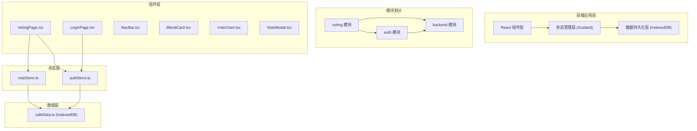
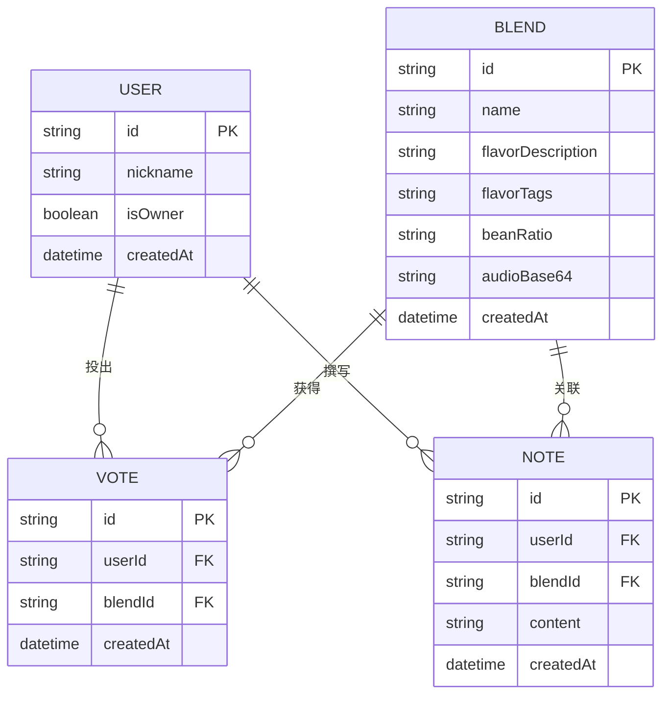

## 1. 架构设计



## 2. 技术描述

- **前端框架**：React@18 + TypeScript
- **构建工具**：Vite
- **路由管理**：react-router-dom@6
- **状态管理**：zustand
- **数据存储**：IndexedDB (idb-keyval)
- **图表库**：chart.js
- **工具库**：uuid、date-fns
- **样式方案**：原生 CSS + CSS Variables

## 3. 文件结构与调用关系

```
src/
├── main.tsx                          # 应用入口
│   └── 初始化 IndexedDB → 加载初始数据 → 挂载路由 Provider + Zustand Store
├── App.tsx                           # 根组件，路由配置
├── styles/
│   └── global.css                    # 全局样式与 CSS 变量
├── modules/
│   ├── voting/
│   │   ├── components/
│   │   │   ├── VotingPage.tsx        # 投票主页
│   │   │   │   ├── 数据来源：voteStore + authStore
│   │   │   │   └── 调用：voteStore.vote() + authStore.user
│   │   │   ├── BlendCard.tsx         # 拼配方案卡片
│   │   │   ├── VoteChart.tsx         # 投票柱状图
│   │   │   └── NoteModal.tsx         # 风味笔记模态框
│   │   └── store/
│   │       └── voteStore.ts          # 投票状态管理
│   │           ├── 依赖：authStore.userId 判定唯一性
│   │           └── 调用：cafeData 进行持久化
│   ├── auth/
│   │   ├── components/
│   │   │   └── LoginPage.tsx         # 登录页面
│   │   │       └── 调用：authStore.login()
│   │   └── store/
│   │       └── authStore.ts          # 认证状态管理
│   │           ├── 数据存储：cafeData
│   │           └── 状态传播：Zustand 订阅机制
│   └── backend/
│       └── data/
│           └── cafeData.ts           # IndexedDB 数据操作层
│               ├── 暴露方法：create/read/update
│               └── 存储对象：用户、拼配方案、投票记录、风味笔记
└── shared/
    └── types.ts                      # 共享类型定义
```

## 4. 数据模型

### 4.1 实体关系图



### 4.2 数据类型定义

```typescript
interface User {
  id: string;
  nickname: string;
  isOwner: boolean;
  createdAt: string;
}

interface Blend {
  id: string;
  name: string;
  flavorDescription: string;
  flavorTags: string[];
  beanRatio: string;
  audioBase64?: string;
  createdAt: string;
}

interface Vote {
  id: string;
  userId: string;
  blendId: string;
  createdAt: string;
}

interface FlavorNote {
  id: string;
  userId: string;
  blendId: string;
  content: string;
  createdAt: string;
}
```

## 5. 路由定义

| 路由路径 | 页面组件 | 功能说明 |
|----------|----------|----------|
| `/` | VotingPage | 投票首页，展示方案列表和图表 |
| `/login` | LoginPage | 用户登录页面 |
| `/admin` | AdminPage | 店主后台（发布方案、查看笔记） |

## 6. IndexedDB 存储方案

### 6.1 Store 列表

| Store 名称 | 主键 | 索引 | 说明 |
|------------|------|------|------|
| `users` | id | nickname | 用户信息 |
| `blends` | id | createdAt | 拼配方案 |
| `votes` | id | userId, blendId | 投票记录 |
| `notes` | id | userId, blendId | 风味笔记 |

### 6.2 核心操作方法

```typescript
// cafeData.ts 暴露的方法
getAllBlends(): Promise<Blend[]>
createBlend(blend: Omit<Blend, 'id' | 'createdAt'>): Promise<Blend>
getVotesByBlend(blendId: string): Promise<Vote[]>
hasUserVoted(userId: string, blendId: string): Promise<boolean>
createVote(vote: Omit<Vote, 'id' | 'createdAt'>): Promise<Vote>
createNote(note: Omit<FlavorNote, 'id' | 'createdAt'>): Promise<FlavorNote>
getNotesByBlend(blendId: string): Promise<FlavorNote[]>
getUserByNickname(nickname: string): Promise<User | undefined>
createUser(user: Omit<User, 'id' | 'createdAt'>): Promise<User>
getUniqueVoterCount(): Promise<number>
```

## 7. 性能优化策略

### 7.1 动画性能
- 使用 CSS transform 和 opacity 实现 60FPS 动画
- 图表更新使用 Chart.js 内置动画（0.3s 过渡）
- 模态框使用 transform: translateY 实现滑入效果

### 7.2 数据操作性能
- IndexedDB 写入操作控制在 200ms 内完成反馈
- 状态更新采用乐观更新模式，先更新 UI 再持久化
- 列表使用虚拟滚动（如数据量大时）

### 7.3 渲染优化
- 使用 React.memo 优化列表项渲染
- Zustand 选择器（selector）减少不必要的重渲染
- 图表数据变更时仅更新数据而非重建实例
