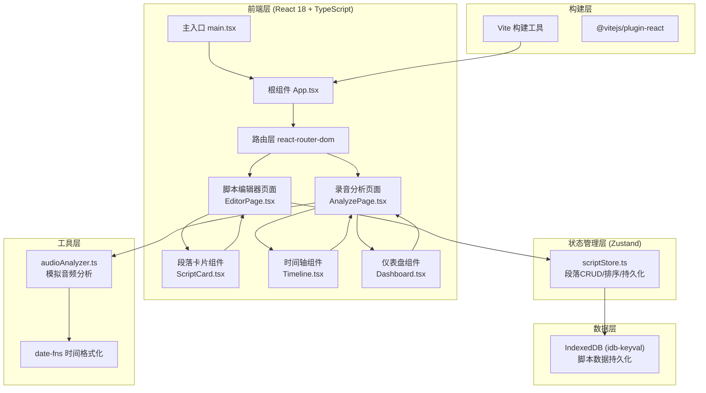
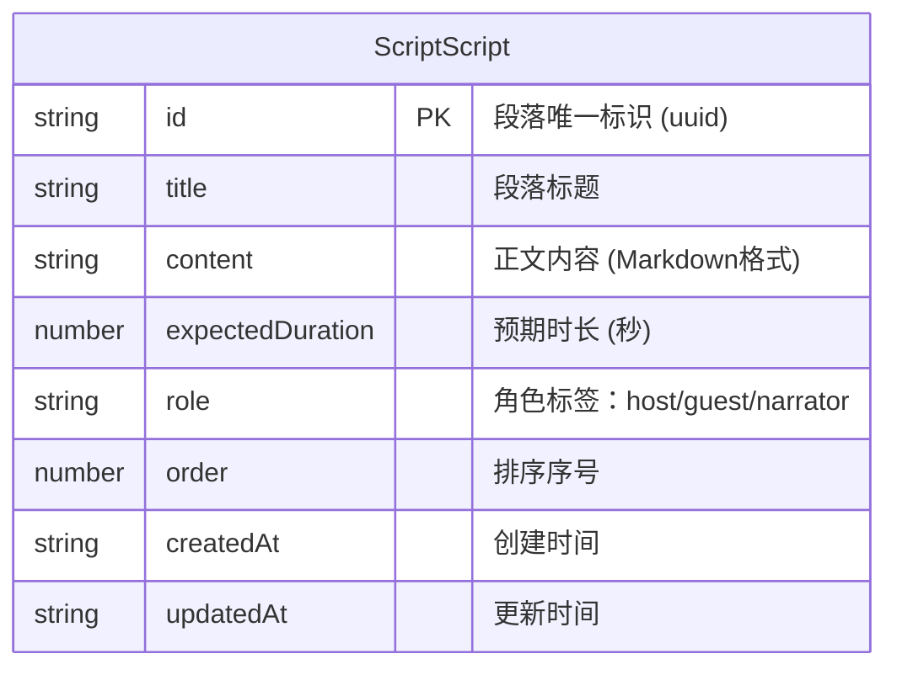

## 1. 架构设计



## 2. 技术选型说明

| 类别 | 技术 | 版本 | 用途 |
|------|------|------|------|
| 框架 | React | 18.x | UI构建，使用函数组件+Hooks |
| 语言 | TypeScript | 5.x | 类型安全，严格模式 |
| 构建工具 | Vite | 5.x | 快速开发与打包 |
| 路由 | react-router-dom | 6.x | 页面路由管理 |
| 状态管理 | Zustand | 4.x | 轻量级状态管理，支持中间件 |
| 本地存储 | idb-keyval | 6.x | IndexedDB封装，脚本持久化 |
| ID生成 | uuid | 9.x | 段落唯一ID生成 |
| 工具库 | date-fns | 3.x | 时间格式化与计算 |
| 图标 | lucide-react | 最新 | 线性图标库 |
| Vite插件 | @vitejs/plugin-react | 4.x | React JSX支持 |

## 3. 路由定义

| 路由路径 | 页面组件 | 用途 |
|---------|---------|------|
| `/` | EditorPage | 重定向到脚本编辑器 |
| `/editor` | EditorPage | 脚本编辑器页面 |
| `/analyze` | AnalyzePage | 录音分析页面 |

## 4. 数据模型

### 4.1 段落数据模型 (ScriptSegment)



### 4.2 TypeScript 类型定义

```typescript
// 角色类型
export type RoleType = 'host' | 'guest' | 'narrator';

// 脚本段落
export interface ScriptSegment {
  id: string;
  title: string;
  content: string;
  expectedDuration: number;
  role: RoleType;
  order: number;
  createdAt: string;
  updatedAt: string;
}

// 时间轴分段数据
export interface TimelineSegment {
  id: string;
  segmentId: string;
  title: string;
  startTime: number;
  endTime: number;
  expectedDuration: number;
  actualDuration: number;
  isOverBudget: boolean;
  deviation: number;
}

// 节奏指标数据
export interface RhythmMetrics {
  speakingRate: number;        // 语速：字/分钟
  speakingRateRange: [number, number];  // 建议范围
  uniformity: number;          // 段落均匀度：0-100
  uniformityRange: [number, number];
  fillerFrequency: number;     // 填充词频率：次/分钟
  fillerFrequencyRange: [number, number];
  fillerWordCount: { word: string; count: number }[];
}

// 分析结果
export interface AudioAnalysisResult {
  totalDuration: number;
  timeline: TimelineSegment[];
  metrics: RhythmMetrics;
}
```

## 5. 状态管理设计 (scriptStore)

```typescript
// Zustand Store 接口
interface ScriptState {
  segments: ScriptSegment[];
  isLoading: boolean;
  
  // 操作方法
  addSegment: (data: Omit<ScriptSegment, 'id' | 'order' | 'createdAt' | 'updatedAt'>) => void;
  updateSegment: (id: string, data: Partial<ScriptSegment>) => void;
  deleteSegment: (id: string) => void;
  reorderSegments: (fromIndex: number, toIndex: number) => void;
  
  // 计算属性
  getTotalDuration: () => number;
  getSegmentPercentages: () => Map<string, number>;
  
  // 持久化
  loadFromStorage: () => Promise<void>;
  persistToStorage: () => Promise<void>;
}
```

**持久化机制**：使用 zustand 中间件 + idb-keyval，每次状态变更自动写入 IndexedDB，应用启动时自动加载。

## 6. 文件结构

```
auto22/
├── package.json
├── vite.config.js
├── tsconfig.json
├── index.html
└── src/
    ├── main.tsx                          # 应用入口
    ├── App.tsx                           # 根组件+路由+全局主题
    ├── index.css                         # 全局样式+CSS变量
    ├── store/
    │   └── scriptStore.ts                # Zustand脚本状态管理
    ├── pages/
    │   ├── EditorPage.tsx                # 脚本编辑器页面
    │   └── AnalyzePage.tsx               # 录音分析页面
    ├── components/
    │   ├── ScriptCard.tsx                # 段落卡片（拖拽+编辑）
    │   ├── Timeline.tsx                  # 时间轴对比组件
    │   └── Dashboard.tsx                 # 节奏仪表盘
    ├── utils/
    │   └── audioAnalyzer.ts              # 模拟音频分析工具
    └── types/
        └── index.ts                      # 类型定义
```

## 7. 性能优化策略

| 优化点 | 策略 |
|-------|------|
| 首屏加载 | 懒加载非关键组件，路由级别代码分割 |
| 时间轴滚动 | 使用 CSS `transform: translateX` + GPU 加速，`will-change: transform` |
| 重渲染优化 | React.memo 包裹 Timeline、Dashboard、ScriptCard 组件 |
| 状态选择器 | Zustand 使用 selector 精确订阅，避免不必要渲染 |
| 拖拽动画 | CSS transition + transform（Y轴），不触发重排 |
| 仪表盘动画 | SVG stroke-dasharray 动画，60fps 圆弧填充 |
| 音频处理 | Web Worker 处理音频元数据解析（可选扩展） |

## 8. 性能指标目标

| 指标 | 目标值 | 测试条件 |
|-----|-------|---------|
| 首次渲染 (FCP) | ≤ 2s | 5分钟音频加载场景 |
| 时间轴滚动帧率 | 60fps | 100+分段数据 |
| 拖拽流畅度 | 无掉帧 | 20+段落快速拖拽 |
| 仪表盘动画 | 平滑0.5s过渡 | 数值变化时 |
| IndexedDB读写 | < 100ms | 100段脚本数据 |
