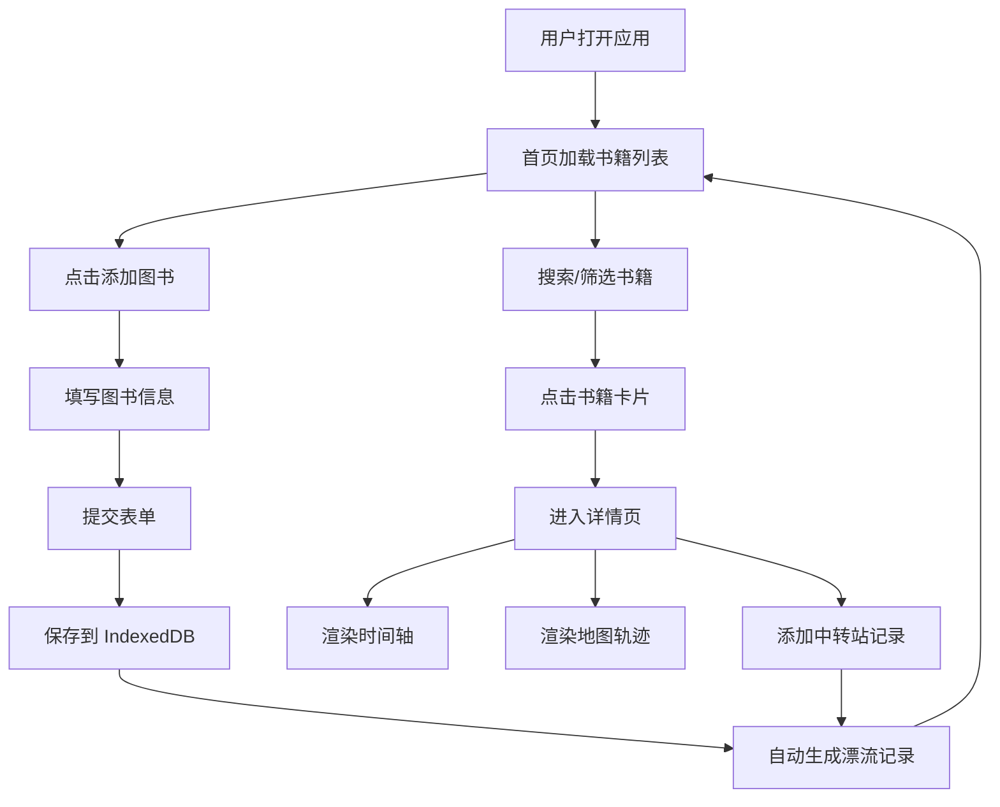

## 1. 产品概述

BookDrift 是一个社区图书馆图书漂流追踪系统，让捐书人和取书人能够自助登记图书的流动轨迹，实现图书信息管理、漂流路线记录和状态可视化追踪。

- **核心价值**：让每一本书的旅程都可追溯，让图书漂流更有温度
- **目标用户**：社区图书馆志愿者、图书捐赠者、图书取阅者
- **解决问题**：传统图书漂流缺乏追踪机制，书籍去向不明，参与感弱

## 2. 核心功能

### 2.1 用户角色

| 角色 | 注册方式 | 核心权限 |
|------|---------|---------|
| 普通用户 | 本地昵称设置 | 添加图书、更新状态、查看漂流轨迹、搜索筛选 |

### 2.2 功能模块

1. **书籍管理模块**：图书信息登记、状态管理、搜索筛选、卡片列表展示
2. **漂流记录模块**：漂流历程自动记录、手动添加中转站、时间线展示
3. **地图可视化模块**：Leaflet 地图轨迹展示、节点标注、路径连线
4. **个人漂流墙**：用户昵称头像、最近漂流书籍、统计数据

### 2.3 页面详情

| 页面名称 | 模块名称 | 功能描述 |
|---------|---------|----------|
| 首页（书籍列表） | 搜索筛选栏 | 关键词搜索（300ms 防抖）、状态筛选（全部/在漂/已到/待漂） |
| 首页（书籍列表） | 个人漂流墙 | 用户昵称头像设置、最近 5 本漂流书、总记录数统计 |
| 首页（书籍列表） | 书籍卡片列表 | 网格布局卡片、封面占位、状态标签、更新时间、点击详情 |
| 首页（书籍列表） | 添加图书表单 | 书名、作者、ISBN、封面 URL、初始位置、状态、提交校验 |
| 详情页（轨迹） | 时间轴组件 | 垂直时间线、状态变化记录、地点/时间/操作人、展开折叠动画 |
| 详情页（轨迹） | 地图组件 | Leaflet 地图、自定义 SVG 标记点、折线路径、信息弹窗、自适应边界 |
| 详情页（轨迹） | 添加漂流记录 | 手动添加中转站、备注说明、位置坐标 |

## 3. 核心流程

### 3.1 用户添加图书流程
用户填写图书表单 → 校验输入 → 保存到 IndexedDB → 自动生成初始漂流记录 → 书籍列表刷新

### 3.2 图书状态变更流程
用户点击状态切换 → 更新书籍状态 → 触发漂流记录自动生成 → 时间线和地图同步更新

### 3.3 查看漂流轨迹流程
点击书籍卡片 → 进入详情页 → 加载漂流记录 → 渲染时间轴和地图 → 自适应地图边界

## 4. 用户界面设计

### 4.1 设计风格
- **整体风格**：温暖木质调，社区图书馆的亲切感
- **主色调**：#8B5E3C（橡木棕）
- **辅助色**：#D2B48C（小麦色）、#FFF8DC（玉米色）
- **状态色**：在漂 #4CAF50（绿色）、已到 #2196F3（蓝色）、待漂 #FF9800（橙色）
- **卡片样式**：浅色背景、轻微阴影（0 2px 8px rgba(0,0,0,0.1)）
- **交互反馈**：悬停上移 4px + 阴影加深，过渡 0.3s ease-out
- **按钮动效**：点击轻微缩放动画

### 4.2 页面设计概述

| 页面名称 | 模块名称 | UI 元素 |
|---------|---------|---------|
| 首页 | 顶部导航 | Logo、标题、用户头像入口 |
| 首页 | 个人漂流墙 | 圆形头像、昵称、统计数字、最近书籍横滑 |
| 首页 | 搜索筛选栏 | 搜索框、状态筛选标签、添加按钮 |
| 首页 | 卡片网格 | 3 列桌面/2 列平板/1 列手机，封面色块、状态标签 |
| 详情页 | 返回按钮 | 左对齐返回图标 + 书名标题 |
| 详情页 | 时间轴 | 左侧圆点竖线、右侧详情卡片、展开折叠动画 |
| 详情页 | 地图 | 全屏高度、自定义书籍 SVG 图标、彩色折线路径 |

### 4.3 响应式设计
- **桌面端（>1024px）**：3 列卡片网格，地图全高显示
- **平板端（768-1024px）**：2 列卡片网格，地图高度适度缩减
- **手机端（<768px）**：单列卡片布局，地图折叠显示，时间轴单列展示
- **触控优化**：按钮最小 44px 触控区域，卡片点击区域充足

### 4.4 动画与交互
- **页面入场**：卡片错峰淡入上移（staggered reveal）
- **时间轴展开**：高度过渡 + 内容渐显
- **状态切换**：标签颜色过渡动画
- **地图标记**：悬停缩放、点击弹跳
- **按钮点击**：scale(0.95) 按压反馈
