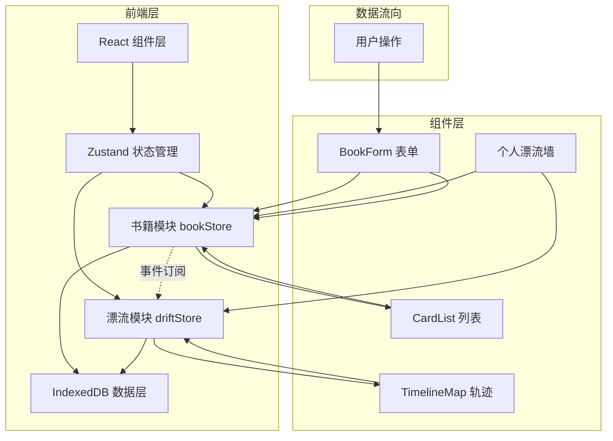
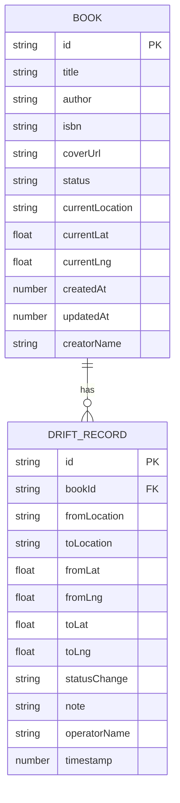

## 1. 架构设计



## 2. 技术描述

- **前端框架**：React@18 + TypeScript
- **构建工具**：Vite@5
- **路由管理**：react-router-dom@6
- **状态管理**：zustand
- **数据存储**：IndexedDB（idb-keyval 封装）
- **地图组件**：react-leaflet + leaflet
- **工具库**：uuid（ID 生成）、date-fns（日期处理）
- **样式方案**：CSS Modules + CSS 变量
- **性能优化**：React.memo、useMemo、useCallback、搜索防抖

## 3. 路由定义

| 路由 | 页面 | 说明 |
|------|------|------|
| `/` | 首页（书籍列表） | 搜索筛选、卡片列表、个人漂流墙 |
| `/book/:id` | 书籍详情页 | 时间轴、地图轨迹、添加记录 |

## 4. 数据模型

### 4.1 核心类型定义

```typescript
// 书籍状态
type BookStatus = 'pending' | 'drifting' | 'arrived';

// 书籍
interface Book {
  id: string;
  title: string;
  author: string;
  isbn: string;
  coverUrl: string;
  status: BookStatus;
  currentLocation: string;
  currentLat: number;
  currentLng: number;
  createdAt: number;
  updatedAt: number;
  creatorName: string;
}

// 漂流记录
interface DriftRecord {
  id: string;
  bookId: string;
  fromLocation: string;
  toLocation: string;
  fromLat: number;
  fromLng: number;
  toLat: number;
  toLng: number;
  statusChange: BookStatus | null;
  note: string;
  operatorName: string;
  timestamp: number;
}

// 用户
interface User {
  name: string;
  avatarColor: string;
}
```

### 4.2 ER 图



## 5. 文件结构

```
src/
├── types.ts              # 核心类型定义（两模块共享）
├── stores/
│   ├── bookStore.ts      # 书籍管理状态库
│   └── driftStore.ts     # 漂流记录状态库
├── components/
│   ├── BookForm.tsx      # 图书表单（添加/编辑）
│   ├── CardList.tsx      # 书籍卡片列表
│   ├── BookCard.tsx      # 单本书籍卡片
│   ├── TimelineMap.tsx   # 轨迹可视化（时间轴+地图）
│   ├── DriftTimeline.tsx # 漂流时间轴
│   ├── DriftMap.tsx      # 地图组件
│   ├── UserProfile.tsx   # 用户漂流墙
│   └── SearchFilter.tsx  # 搜索筛选栏
├── utils/
│   ├── idb.ts            # IndexedDB 封装
│   └── debounce.ts       # 防抖工具
├── App.tsx               # 根组件（路由+布局）
└── index.css             # 全局样式
```

## 6. 状态管理设计

### 6.1 bookStore（书籍模块）
- **状态**：books 数组、loading、filterStatus、searchKeyword
- **方法**：
  - `fetchBooks()` - 从 IndexedDB 加载所有书籍
  - `addBook(bookData)` - 添加新书，触发 book:created 事件
  - `updateBook(id, updates)` - 更新书籍，检测状态变化
  - `deleteBook(id)` - 删除书籍
  - `filterByStatus(status)` - 按状态筛选
  - `search(keyword)` - 关键词搜索
- **事件**：状态变更时通过自定义事件通知 driftStore

### 6.2 driftStore（漂流模块）
- **状态**：records 数组（按 bookId 分组）
- **方法**：
  - `fetchRecords(bookId)` - 获取指定书籍的漂流记录
  - `addRecord(recordData)` - 添加漂流记录
  - `autoRecordFromBookChange(book, oldStatus, newStatus)` - 自动生成记录
- **订阅**：监听 bookStore 的书籍更新，自动插入漂流记录

## 7. 性能约束与优化

| 指标 | 目标 | 优化方案 |
|------|------|----------|
| 列表渲染 | <100ms（200 本书） | 虚拟滚动？不，200 条用 React.memo 即可 |
| 地图交互 | ≥30fps（≤50 个标记点） | Leaflet 原生渲染、标记点聚合 |
| 搜索响应 | <200ms | 本地数据过滤 + 300ms 防抖 |
| 首次加载 | 快速渲染 | IndexedDB 异步加载 + 骨架屏 |

## 8. 数据流向说明

1. **用户操作 → 书籍模块**：表单提交/状态切换调用 bookStore
2. **书籍模块 → IndexedDB**：更新持久化存储
3. **书籍模块 → 漂流模块**：通过状态订阅/事件总线检测变化
4. **漂流模块 → 轨迹组件**：新记录触发时间轴和地图重渲染
5. **数据同步**：两个 store 共享同一 IndexedDB，确保数据一致
