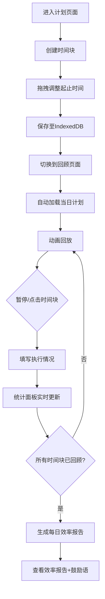

## 1. 产品概述

个人时间块规划与回顾应用（TimeBlock Planner），帮助用户以时间块（Time Block）方式规划每日任务，并在一天结束后通过时间轴动画回顾实际完成情况。目标用户为注重时间管理和自我复盘的个人用户。

- 核心问题：传统待办列表缺乏时间维度，难以直观感受时间分配与实际执行差距
- 产品价值：通过可视化时间块规划+动画回顾复盘，形成"计划→执行→回顾"的完整闭环

## 2. 核心功能

### 2.1 用户角色
| 角色 | 注册方式 | 核心权限 |
|------|----------|----------|
| 个人用户 | 无需注册 | 全部功能（本地应用） |

### 2.2 功能模块
1. **计划页面**：时间轴视图、时间块创建/编辑/拖拽、任务管理
2. **回顾页面**：动画回放、执行情况填写、统计面板、每日效率报告

### 2.3 页面详情
| 页面名称 | 模块名称 | 功能描述 |
|----------|----------|----------|
| 计划页面 | PlanTimeline | 每日计划时间轴视图，半小时刻度，00:00-23:59横向滚动，红色虚线标记当前时间（5秒自动刷新），时间块彩色条块显示（最多3并行），拖动创建占位符提示 |
| 计划页面 | PlanEditor | 时间块编辑组件，创建/拖拽调整时间块，15分钟精度，6种预设色标签，任务类型选择（工作/学习/生活/运动/社交/其他），备注输入，数据存入IndexedDB |
| 回顾页面 | ReviewTimeline | 回顾时间轴动画回放，自动加载当日计划，从计划开始到结束线性播放，时间块从左到右依次绘制出现，播放速度可调（1x/2x/4x），暂停查看+点击详情卡片 |
| 回顾页面 | ReviewStats | 统计面板：计划完成率（环形进度条）、时间利用率（百分比进度条）、任务类型分布（柱状图），数据实时更新 |
| 回顾页面 | 执行评价 | 双击/播放后填写：是否完成、实际起止时间微调、满意度评分（1-5星），保存覆盖原计划，全部完成后自动生成"每日效率报告"含随机鼓励语 |

## 3. 核心流程

用户在计划页面创建当日时间块→拖拽调整时间→数据存入IndexedDB→切换至回顾页面→系统加载当日计划→动画回放→用户点击时间块填写执行情况→统计面板实时更新→所有时间块回顾完毕→自动生成每日效率报告

## 4. 用户界面设计

### 4.1 设计风格
- **主题**：深色主题
- **背景色**：#1a1a2e
- **卡片底色**：#16213e
- **强调色**：#0f3460
- **主色**：#e94560
- **卡片效果**：磨砂玻璃（backdrop-filter: blur(6px)），2px圆角
- **时间轴背景**：深灰渐变（#2c2c3a至#1e1e2e）
- **刻度线**：半透明白色（opacity 0.15）
- **时间块**：柔和阴影（0 4px 12px rgba(0,0,0,0.3)），2px圆角
- **拖拽状态**：放大1.05倍+亮色边框
- **回顾动画**：时间块从左侧滑入+淡入（transition: all 0.8s ease-out）
- **统计环形进度条**：渐变描边，动画填充1秒
- **字体**：中文字体使用系统默认，英文/数字使用等宽或无衬线字体

### 4.2 页面设计概览
| 页面名称 | 模块名称 | UI元素 |
|----------|----------|--------|
| 计划页面 | 时间轴区域 | 横向滚动时间轴，半小时刻度线，红色虚线当前时间指示，彩色时间块条，拖拽占位符 |
| 计划页面 | 编辑面板 | 模态/侧边面板，任务名称输入，时间选择器，颜色标签选择器，类型下拉，备注文本域 |
| 回顾页面 | 动画播放区 | 时间轴+播放控制栏（播放/暂停/速度切换），进度指示器，时间块详情弹窗 |
| 回顾页面 | 统计面板 | 环形进度条（完成率），百分比进度条（利用率），柱状图（类型分布） |
| 全局 | 导航栏 | 顶部/底部导航，计划/回顾切换 |
| 全局 | 侧边栏 | 日期选择，任务类型筛选 |

### 4.3 响应式设计
- 桌面优先设计
- 平板（768px以上）：显示侧边栏
- 手机（768px以下）：侧边栏折叠为底部导航

### 4.4 性能要求
- 时间轴滚动和拖拽帧率 ≥ 55FPS
- 回顾动画帧率 ≥ 30FPS
- 播放进度指示器与时间轴同步误差 ≤ 100ms
