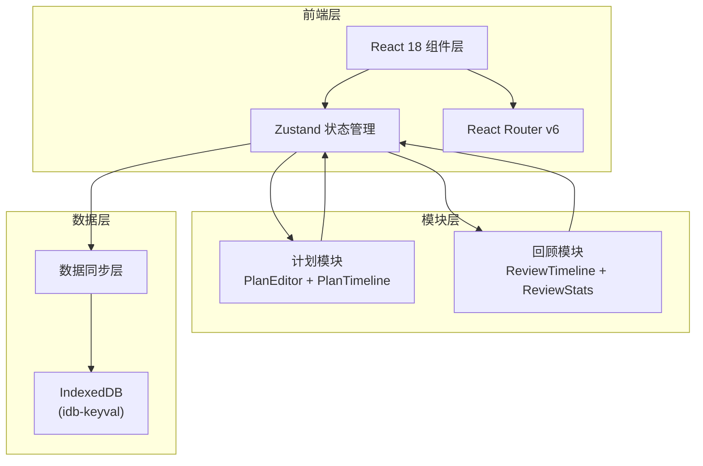
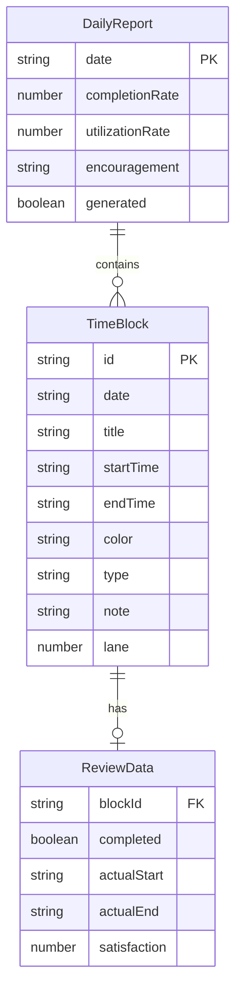

## 1. 架构设计



## 2. 技术说明
- **前端框架**：React@18 + TypeScript
- **构建工具**：Vite
- **状态管理**：Zustand
- **路由**：react-router-dom@6
- **数据持久化**：IndexedDB（idb-keyval）
- **日期处理**：date-fns
- **唯一ID**：uuid
- **样式方案**：CSS Modules + CSS Variables（深色主题）
- **初始化工具**：vite-init（react-ts模板）

## 3. 路由定义
| 路由 | 用途 |
|------|------|
| / | 重定向到 /plan |
| /plan | 计划页面，时间块创建与编辑 |
| /review | 回顾页面，动画回放与统计 |

## 4. 数据模型

### 4.1 数据模型定义



### 4.2 数据定义

**TimeBlock**（时间块）
```typescript
interface TimeBlock {
  id: string;
  date: string;           // YYYY-MM-DD
  title: string;
  startTime: number;      // 分钟数（0-1439），15分钟精度
  endTime: number;        // 分钟数（0-1439），15分钟精度
  color: string;          // 6种预设色之一
  type: 'work' | 'study' | 'life' | 'exercise' | 'social' | 'other';
  note: string;
  lane: number;           // 并行车道（0-2）
}
```

**ReviewData**（回顾数据）
```typescript
interface ReviewData {
  blockId: string;
  completed: boolean;
  actualStart: number;    // 分钟数
  actualEnd: number;      // 分钟数
  satisfaction: number;   // 1-5
}
```

**DailyReport**（每日效率报告）
```typescript
interface DailyReport {
  date: string;
  completionRate: number; // 0-1
  utilizationRate: number;// 0-1
  typeDistribution: Record<string, number>;
  encouragement: string;
  generated: boolean;
}
```

## 5. 文件结构
```
├── package.json
├── vite.config.js
├── tsconfig.json
├── index.html
├── src/
│   ├── main.tsx
│   ├── App.tsx
│   ├── modules/
│   │   ├── plan/
│   │   │   └── components/
│   │   │       ├── PlanEditor.tsx
│   │   │       └── PlanTimeline.tsx
│   │   └── review/
│   │       └── components/
│   │           ├── ReviewTimeline.tsx
│   │           └── ReviewStats.tsx
│   └── store/
│       └── usePlanStore.ts
```

## 6. 状态管理设计

Zustand Store 结构：
```typescript
interface PlanStore {
  currentDate: string;
  blocks: TimeBlock[];
  reviews: Record<string, ReviewData>;
  report: DailyReport | null;
  
  // 日期操作
  setCurrentDate: (date: string) => void;
  
  // 时间块CRUD
  addBlock: (block: Omit<TimeBlock, 'id'>) => void;
  updateBlock: (id: string, updates: Partial<TimeBlock>) => void;
  deleteBlock: (id: string) => void;
  moveBlock: (id: string, startTime: number, endTime: number) => void;
  
  // 回顾操作
  setReview: (blockId: string, review: ReviewData) => void;
  generateReport: () => void;
  
  // 数据同步
  loadFromDB: (date: string) => Promise<void>;
  saveToDB: () => Promise<void>;
}
```
