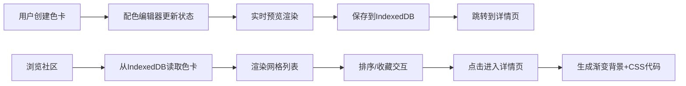

## 1. 产品概述

PaletteHub是一个面向独立插画师和设计师的配色方案灵感共享社区，用户可以发布、浏览、收藏配色方案，并基于色卡生成渐变背景。

- 解决设计师寻找配色灵感的痛点，提供社区化的色卡分享与发现平台
- 目标用户：插画师、平面设计师、UI设计师等创意工作者
- 市场价值：建立设计师社区，沉淀高质量配色方案资源

## 2. 核心功能

### 2.1 用户角色

| 角色 | 注册方式 | 核心权限 |
|------|----------|----------|
| 访客用户 | 无需注册 | 浏览色卡、生成渐变、收藏色卡 |

### 2.2 功能模块

1. **色卡创建页**：配色编辑器、实时预览、保存到IndexedDB
2. **社区发现页**：色卡网格展示、排序切换、收藏交互
3. **色卡详情页**：完整色卡展示、渐变背景生成、CSS代码复制

### 2.3 页面详情

| 页面名称 | 模块名称 | 功能描述 |
|----------|----------|----------|
| 色卡创建页 | 配色编辑器 | 5个颜色选择器+16进制输入框，实时同步更新 |
| 色卡创建页 | 实时预览 | 水平排列5色色块，显示色值标签 |
| 社区发现页 | 网格布局 | 响应式三列/两列/单列网格展示色卡 |
| 社区发现页 | 排序功能 | 按收藏数/创建时间排序，300ms过渡动画 |
| 色卡详情页 | 色卡展示 | 完整5色色块+标题+收藏数 |
| 色卡详情页 | 渐变预览 | 上到下线性渐变背景，CSS代码一键复制 |

## 3. 核心流程

用户创建色卡：用户在编辑器选择5个颜色→实时预览更新→点击保存→写入IndexedDB→跳转到色卡详情页

用户发现灵感：进入探索页→从IndexedDB加载所有色卡→渲染网格→点击排序切换→列表重排动画→点击色卡→跳转详情页

用户收藏色卡：点击心形图标→Zustand状态更新→同步到IndexedDB→心形填充/空心切换+脉冲动画

## 4. 用户界面设计

### 4.1 设计风格
- 主色调：蓝紫渐变（#6c63ff → #a855f7）
- 背景色：#1e1e2e（深色主题）
- 卡片色：#2a2a3e
- 文字色：#e0e0e0（浅灰色）
- 按钮风格：圆角8px，主色渐变填充
- 字体：Space Grotesk用于标题，Inter用于正文
- 布局风格：卡片式布局，左侧编辑区+右侧预览区（2:1比例）

### 4.2 页面设计概述

| 页面名称 | 模块名称 | UI元素 |
|----------|----------|----------|
| 色卡创建页 | 编辑器 | 5组颜色选择器+输入框，弹性缩放过渡200ms |
| 色卡创建页 | 预览区 | 水平色块排列，色值标签 |
| 社区发现页 | 网格卡片 | 悬停上移4px+阴影加深，缩略色块显示前3色 |
| 社区发现页 | 排序按钮 | 收藏数/创建时间切换 |
| 色卡详情页 | 渐变预览 | 大面积渐变背景，等宽字体CSS代码 |
| 色卡详情页 | 收藏按钮 | 涟漪扩散效果（after伪类） |

### 4.3 响应式
- 桌面端（>=1024px）：三列网格
- 平板端（768px-1023px）：两列网格
- 手机端（<768px）：单列网格，颜色选择器改为横向可滚动画廊

### 4.4 动效规范
- 页面切换：200ms淡入过渡
- 色块更新：200ms弹性缩放
- 卡片悬停：向上平移4px+阴影加深
- 收藏按钮：0.5倍缩放脉冲动画
- 列表重排：300ms CSS transform过渡
- 复制成功：绿色对勾淡入淡出
