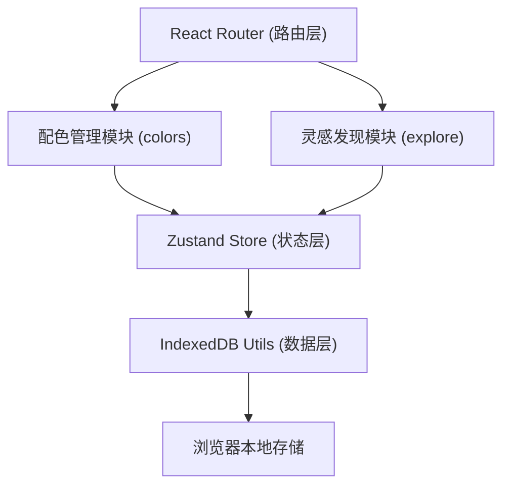
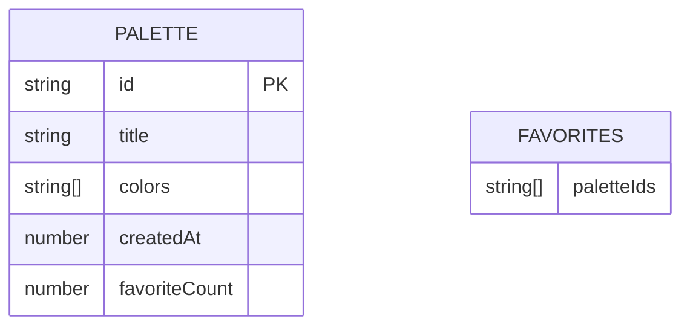

## 1. 架构设计



## 2. 技术描述

- 前端框架：React@18 + TypeScript + Vite@5
- 路由管理：react-router-dom@6
- 状态管理：zustand
- 数据持久化：idb-keyval（IndexedDB封装）
- 颜色处理：chroma-js
- 唯一ID：uuid
- UI样式：纯CSS（CSS Modules + CSS Variables）

## 3. 路由定义

| 路由 | 用途 |
|------|------|
| `/` | 社区发现页（ExploreGrid） |
| `/create` | 色卡创建页（ColorEditor） |
| `/palette/:colorId` | 色卡详情页（ColorCard + GradientPreview） |

## 4. 数据模型

### 4.1 数据模型定义



### 4.2 TypeScript类型定义

```typescript
interface Palette {
  id: string;
  title: string;
  colors: string[];
  createdAt: number;
  favoriteCount: number;
}

interface PaletteStore {
  currentColors: string[];
  favorites: string[];
  sortBy: 'popular' | 'latest';
  setCurrentColors: (colors: string[]) => void;
  setColor: (index: number, color: string) => void;
  toggleFavorite: (id: string) => void;
  setSortBy: (sort: 'popular' | 'latest') => void;
}
```

## 5. 模块结构

```
src/
├── modules/
│   ├── colors/
│   │   ├── ColorEditor.tsx      # 配色编辑组件
│   │   ├── ColorCard.tsx        # 色卡展示组件
│   │   └── ColorPreview.tsx     # 实时预览组件
│   └── explore/
│       ├── ExploreGrid.tsx      # 社区发现网格
│       └── GradientPreview.tsx  # 渐变预览组件
├── stores/
│   └── usePaletteStore.ts       # Zustand状态管理
├── utils/
│   └── indexedDB.ts             # IndexedDB工具
├── pages/
│   ├── CreatePage.tsx           # 创建页
│   ├── ExplorePage.tsx          # 探索页
│   └── DetailPage.tsx           # 详情页
├── App.tsx                      # 路由配置
├── main.tsx                     # 入口文件
└── index.css                    # 全局样式
```

## 6. 性能优化策略

- 色卡编辑器：使用React.memo优化预览组件，确保16ms内完成重渲染
- 大数据量渲染：超过100条时使用虚拟滚动（react-window）或分页加载
- 动画：使用CSS transform和opacity属性触发GPU加速
- 状态更新：Zustand选择器模式避免不必要的重渲染
- IndexedDB操作：使用异步API避免阻塞主线程
