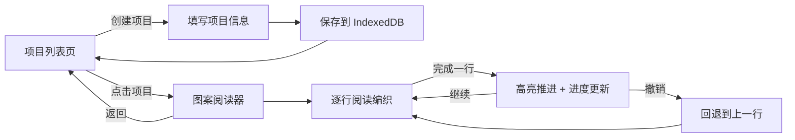

## 1. 产品概述

毛线编织渐进式图案阅读器是一款面向手工编织爱好者的工具应用，帮助用户从纸质/图片图案转换到电子阅读模式，解决看错行、漏针、无法记录进度的痛点。

- 核心目标：提升编织效率，减少错误，让手工编织更轻松愉快
- 目标用户：手工编织爱好者、初学者和资深织工
- 市场价值：填补编织图案数字化阅读的细分市场空白

## 2. 核心功能

### 2.1 功能模块

1. **项目列表页**：项目卡片展示、创建/删除项目、进度概览
2. **图案阅读器**：渐进式高亮、行聚焦、撤销操作、进度统计
3. **项目管理**：项目信息编辑、图案录入、毛线颜色设置

### 2.2 页面详情

| 页面名称 | 模块名称 | 功能描述 |
|-----------|-------------|---------------------|
| 项目列表页 | 项目卡片网格 | 展示毛线颜色块、项目名称、进度条 |
| 项目列表页 | 创建项目按钮 | 弹窗表单录入项目信息 |
| 项目列表页 | 删除项目 | 确认后删除项目及其数据 |
| 图案阅读器 | 进度面板 | 当前行号/总行数、已用时长、预计剩余时间 |
| 图案阅读器 | 图案网格 | 符号矩阵网格渲染、行高亮、行聚焦 |
| 图案阅读器 | 操作按钮 | 完成一行、撤销、返回列表 |

## 3. 核心流程

用户打开应用后，首先看到项目列表页。可以创建新项目（填写名称、毛线颜色、针数、行数、上传参考图、录入图案），也可以点击已有项目进入阅读器。

在阅读器中，用户逐行阅读图案，每完成一行点击"完成一行"按钮，当前行高亮并自动推进。用户可随时撤销（最多5步）。顶部进度面板实时显示进度和时间统计。

## 4. 用户界面设计

### 4.1 设计风格

- **主色调**：#F5E6CC 米白色（暖绒感背景）
- **辅助色**：#BF9780 浅棕色（文字、边框）
- **强调色**：#D48B5C 橘色（按钮、交互元素）
- **高亮色**：浅蓝色渐变（当前行高亮）
- **完成色**：淡灰色（已读行背景）
- **鼓励色**：淡绿色（剩余<10行时的进度面板）

**按钮风格**：圆角矩形，悬停透明度变化（0.2秒过渡）
**字体选择**：温暖有手工感的衬线/无衬线字体组合
**布局风格**：卡片式布局，柔和阴影，圆润边角
**整体氛围**：温暖、舒适、有手工质感

### 4.2 页面设计概览

| 页面名称 | 模块名称 | UI 元素 |
|-----------|-------------|-------------|
| 项目列表页 | 顶部导航 | 应用标题、创建按钮、响应式汉堡菜单 |
| 项目列表页 | 卡片网格 | 毛线颜色块、项目名称、进度条、删除按钮 |
| 项目列表页 | 新建弹窗 | 表单输入、颜色选择器、图片上传、图案文本框 |
| 图案阅读器 | 进度面板 | 行号统计、时间统计、呼吸动画（接近完成时） |
| 图案阅读器 | 图案网格 | 仿纸张背景、1px边框单元格、行高亮渐变、行聚焦遮罩 |
| 图案阅读器 | 底部操作栏 | 完成一行按钮、撤销按钮、返回按钮 |

### 4.3 响应式设计

- **桌面端**：多列卡片网格，完整工具栏
- **平板端**：两列卡片网格，网格字体适当缩小
- **手机端**：单列卡片布局，导航栏变为汉堡菜单，网格字体自适应缩小
- **触摸优化**：按钮最小触控面积 44px，手势操作支持

### 4.4 动效设计

- 当前行高亮：0.3秒渐变色过渡动画
- 按钮悬停：0.2秒透明度变化反馈
- 进度面板接近完成：淡绿色背景 + 轻微呼吸动画
- 页面切换：平滑过渡效果
- 性能要求：行高亮动画帧率 ≥ 50fps
