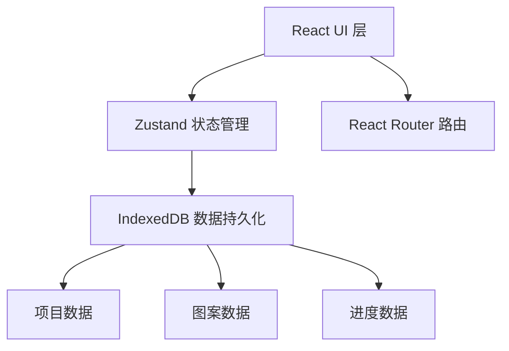

## 1. 架构设计

纯前端单页应用，数据本地存储于 IndexedDB，无需后端服务。



## 2. 技术选型

- **前端框架**：React@18 + TypeScript
- **构建工具**：Vite
- **路由管理**：react-router-dom@6
- **状态管理**：zustand
- **本地存储**：idb-keyval（IndexedDB 封装）
- **工具库**：uuid（唯一ID生成）、date-fns（时间格式化）
- **样式方案**：原生 CSS（CSS 变量 + CSS Modules）

## 3. 路由定义

| 路由 | 页面 | 用途 |
|-------|------|---------|
| / | ProjectList | 项目列表首页 |
| /project/:id | ProjectReader | 图案阅读器页面 |

## 4. 数据模型

### 4.1 项目数据结构

```typescript
interface Project {
  id: string;
  name: string;
  yarnColor: string;
  stitchCount: number;
  rowCount: number;
  referenceImage?: string; // base64
  patternText: string;
  currentRow: number;
  createdAt: number;
  updatedAt: number;
  startTime?: number;
  elapsedSeconds: number;
  undoStack: number[]; // 存储历史行号，最多5条
}
```

### 4.2 图案解析

图案文本由符号矩阵组成，每行用换行符分隔，每个字符代表一个针脚符号：
- `｜` 代表下针
- `O` 代表空针
- `/` 代表左上二并一
- 其他自定义符号

## 5. 文件结构

```
src/
  ├── App.tsx              # 应用根组件，路由配置
  ├── main.tsx             # 入口文件
  ├── index.css            # 全局样式
  ├── store/
  │   └── projectStore.ts  # Zustand 状态管理
  ├── pages/
  │   ├── ProjectList.tsx  # 项目列表页
  │   └── ProjectReader.tsx # 图案阅读器
  ├── components/
  │   ├── ProjectCard.tsx  # 项目卡片组件
  │   ├── CreateModal.tsx  # 创建项目弹窗
  │   ├── ProgressBar.tsx  # 进度条组件
  │   ├── PatternGrid.tsx  # 图案网格组件
  │   └── ProgressPanel.tsx # 进度面板组件
  └── utils/
      ├── pattern.ts       # 图案解析工具
      └── time.ts          # 时间计算工具
```

## 6. 性能优化

- **虚拟滚动**：对于大图案（50x50以上）考虑虚拟滚动
- **CSS 硬件加速**：行高亮动画使用 transform + opacity
- **避免重排**：行号更新使用 CSS 变量而非 DOM 操作
- **IndexedDB 异步读写**：不阻塞主线程
- **图片压缩**：参考图上传时压缩到合理尺寸
