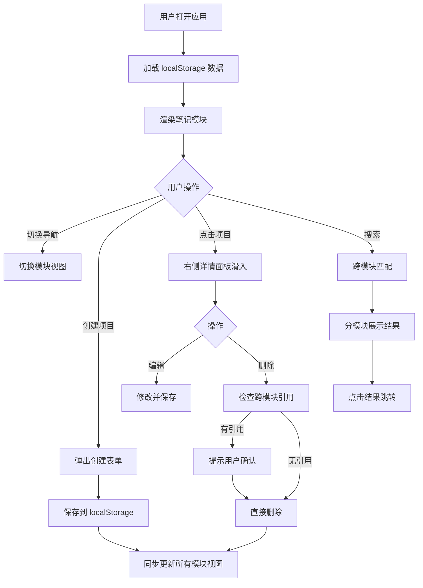

## 1. 产品概述

多面板知识管理看板应用，为用户提供笔记、待办事项和书签的统一管理平台。目标用户是需要高效组织个人知识资产的知识工作者、开发者和学生。

- 核心价值：一站式知识管理，打通笔记、任务和书签之间的关联，提升个人效率
- 市场定位：轻量级个人知识管理工具，无需注册，数据本地存储，注重隐私和性能

## 2. 核心功能

### 2.1 用户角色

| 角色 | 注册方式 | 核心权限 |
|------|----------|----------|
| 普通用户 | 无需注册，直接使用 | 完整使用所有功能，数据存储在本地浏览器 |

### 2.2 功能模块

1. **笔记模块**：文章列表、Markdown 编辑器、实时预览、语法高亮
2. **任务模块**：任务看板（三列状态）、拖拽排序、优先级标记、截止日期
3. **书签模块**：书签网格、自定义分组、网站图标、瀑布流布局
4. **全局搜索**：跨模块搜索、分类展示结果、点击跳转
5. **详情面板**：右侧滑入式详情展示、编辑操作入口

### 2.3 页面详情

| 页面名称 | 模块名称 | 功能描述 |
|----------|----------|----------|
| 主页面 | 笔记列表 | 展示所有笔记卡片，支持创建、删除、搜索过滤 |
| 主页面 | 笔记编辑器 | Markdown 语法编辑区，左侧编辑右侧实时预览，中间可拖拽分隔条 |
| 主页面 | 任务看板 | 三列布局（待开始/进行中/已完成），支持 HTML5 拖拽切换状态 |
| 主页面 | 任务卡片 | 显示任务标题、优先级标签、截止日期，拖拽时有提升效果 |
| 主页面 | 书签网格 | 4列瀑布流布局，卡片悬停放大1.05倍并显示删除按钮 |
| 主页面 | 书签分组 | 用户自定义分组标签，支持快速筛选 |
| 主页面 | 全局导航 | 左侧120px竖排图标导航，移动端移至底部 |
| 主页面 | 顶部搜索栏 | 跨模块关键词搜索，结果分模块展示 |
| 主页面 | 详情面板 | 右侧滑入（ease-out缓动），展示项目详情和编辑操作 |

## 3. 核心流程

### 主操作流程

用户打开应用后，默认进入笔记模块。可通过左侧导航切换到任务或书签模块。在任意模块中：
- 点击"+"按钮创建新项目
- 点击项目卡片可在右侧详情面板查看详情
- 在顶部搜索栏输入关键词可跨模块搜索
- 删除操作时检查跨模块引用并给出提示

## 4. 用户界面设计

### 4.1 设计风格

- **主色调**：深蓝色 `#1a1a2e`（页面背景）、青蓝色 `#16213e`（卡片/侧边栏背景）
- **强调色**：琥珀色 `#f5a623`（高优先级/激活状态）、翠绿色 `#27ae60`（成功/已完成）
- **文字颜色**：浅灰色 `#e0e0e0`（主文字）、中灰色 `#8892b0`（次要文字）
- **按钮样式**：轻微圆角（6px），悬停时颜色渐变过渡（0.25s ease）
- **字体**：使用系统字体栈 `Segoe UI`, -apple-system, BlinkMacSystemFont, `PingFang SC`, `Microsoft YaHei` 确保中文显示清晰
- **布局风格**：深色卡片式布局，卡片有微妙阴影，采用三栏结构
- **图标风格**：使用简洁的 SVG 图标，线条风格，与琥珀色强调色呼应

### 4.2 页面设计概述

| 页面名称 | 模块名称 | UI 元素 |
|----------|----------|---------|
| 主页面 | 左侧导航 | 固定120px宽度，竖排图标+文字，激活项有琥珀色高亮条 |
| 主页面 | 顶部搜索栏 | 全宽输入框，带搜索图标，输入时实时过滤 |
| 主页面 | 笔记编辑器 | 左右分栏，中间可拖拽分隔条（5px宽，悬停变琥珀色） |
| 主页面 | 任务看板列 | 等宽三列，列标题带计数徽章，卡片间距16px |
| 主页面 | 任务卡片 | 8px圆角，轻微阴影，顶部有优先级色条（高=红/中=黄/低=蓝） |
| 主页面 | 书签网格 | CSS Grid 4列，gap: 20px，卡片 transform: scale(1.05) 悬停效果 |
| 主页面 | 详情面板 | 固定宽度400px，transform: translateX(100%)→0，过渡0.3s ease-out |
| 主页面 | 分隔条 | 5px宽的垂直条，cursor: col-resize，hover时背景色过渡 |

### 4.3 响应式设计

- **桌面端**（>768px）：三栏布局（左导航120px + 中间内容区 + 右详情面板）
- **移动端**（≤768px）：三栏堆叠，导航移至底部（固定定位，横向滚动图标），详情面板变为全屏覆盖层
- **触摸优化**：增大点击区域（最小44px），禁用悬停效果，改用长按/点击触发操作

### 4.4 动效规范

- **详情面板滑入**：`transition: transform 0.3s cubic-bezier(0.16, 1, 0.3, 1)`（ease-out）
- **按钮/链接悬停**：`transition: all 0.25s ease`，颜色从浅灰渐变到琥珀色
- **卡片悬停**：`transform: scale(1.05)` + `box-shadow` 增强，0.2s过渡
- **拖拽效果**：拖拽源 `opacity: 0.5`，放置目标 `border: 2px dashed #f5a623`
- **页面加载**：分模块渐入（staggered fade-in），延迟 50ms/模块
