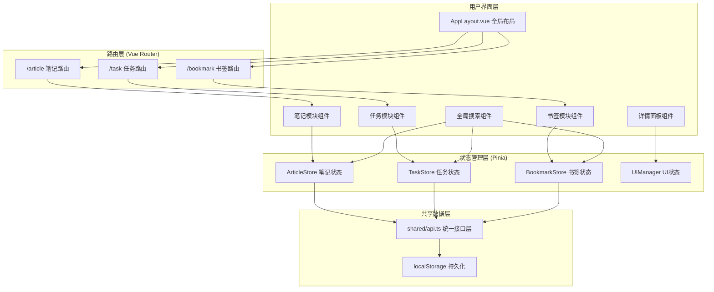
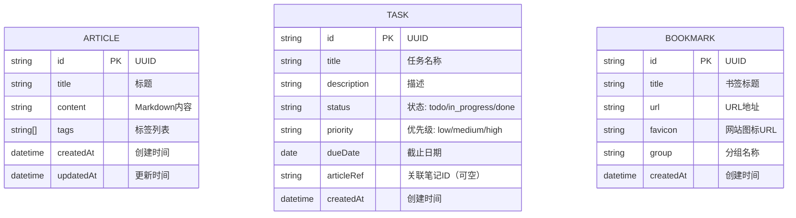

## 1. 架构设计



## 2. 技术栈说明

- **前端框架**：Vue@3.4 + Composition API + `<script setup>`
- **构建工具**：Vite@5
- **类型系统**：TypeScript@5（strict模式，esnext模块）
- **路由管理**：Vue Router@4（Hash模式）
- **状态管理**：Pinia@2
- **Markdown渲染**：marked@12
- **代码高亮**：highlight.js@11
- **唯一ID生成**：uuid@9
- **样式方案**：原生CSS + CSS变量 + Scoped Styles
- **拖拽实现**：HTML5 Drag & Drop API
- **数据持久化**：localStorage（JSON序列化）
- **后端模拟**：shared/api.ts 统一封装CRUD操作

## 3. 路由定义

| 路由路径 | 名称 | 用途 |
|----------|------|------|
| `/` | 根路径 | 重定向到 `/article` |
| `/article` | 笔记 | 笔记列表+编辑器视图 |
| `/task` | 任务 | 任务看板视图 |
| `/bookmark` | 书签 | 书签网格视图 |

## 4. 模块导出约定

### 4.1 笔记模块 (src/modules/article/)

**导出内容：**
- `ArticleList.vue` - 文章列表组件
- `ArticleEditor.vue` - Markdown编辑器组件（左右分栏+分隔条）
- `ArticleDetail.vue` - 文章详情展示组件（在详情面板使用）
- `useArticleStore` - Pinia状态管理

### 4.2 任务模块 (src/modules/task/)

**导出内容：**
- `TaskBoard.vue` - 三列任务看板组件（支持拖拽）
- `TaskCard.vue` - 任务卡片组件
- `TaskStats.vue` - 任务统计组件
- `useTaskStore` - Pinia状态管理

### 4.3 书签模块 (src/modules/bookmark/)

**导出内容：**
- `BookmarkGrid.vue` - 书签网格组件（4列瀑布流）
- `BookmarkCard.vue` - 书签卡片组件
- `BookmarkSearch.vue` - 书签搜索组件
- `useBookmarkStore` - Pinia状态管理

## 5. 数据模型

### 5.1 实体关系图



### 5.2 数据接口定义 (shared/api.ts)

```typescript
// 基础实体接口
interface BaseEntity {
  id: string;
  createdAt: string;
}

// 笔记实体
interface Article extends BaseEntity {
  title: string;
  content: string;
  tags: string[];
  updatedAt: string;
}

// 任务实体
type TaskStatus = 'todo' | 'in_progress' | 'done';
type TaskPriority = 'low' | 'medium' | 'high';

interface Task extends BaseEntity {
  title: string;
  description: string;
  status: TaskStatus;
  priority: TaskPriority;
  dueDate: string | null;
  articleRef: string | null;
}

// 书签实体
interface Bookmark extends BaseEntity {
  title: string;
  url: string;
  favicon: string;
  group: string;
}

// 统一CRUD接口
interface Repository<T extends BaseEntity> {
  getAll(): Promise<T[]>;
  getById(id: string): Promise<T | undefined>;
  create(data: Omit<T, 'id' | 'createdAt'>): Promise<T>;
  update(id: string, data: Partial<T>): Promise<T | undefined>;
  delete(id: string): Promise<boolean>;
  search(keyword: string): Promise<T[]>;
}

// 跨模块引用检查
interface CrossModuleReference {
  type: 'task';
  id: string;
  title: string;
}
function checkArticleReferences(articleId: string): CrossModuleReference[];
```

### 5.3 localStorage 存储键

| 键名 | 数据类型 | 说明 |
|------|----------|------|
| `kb_articles` | Article[] | 笔记列表 |
| `kb_tasks` | Task[] | 任务列表 |
| `kb_bookmarks` | Bookmark[] | 书签列表 |
| `kb_ui_state` | Object | UI状态（当前路由、面板开关等） |

## 6. 文件结构

```
auto3/
├── package.json
├── vite.config.js
├── tsconfig.json
├── index.html
└── src/
    ├── main.ts
    ├── App.vue
    ├── modules/
    │   ├── article/
    │   │   ├── index.ts
    │   │   ├── components/
    │   │   │   ├── ArticleList.vue
    │   │   │   ├── ArticleEditor.vue
    │   │   │   └── ArticleDetail.vue
    │   │   └── stores/
    │   │       └── article.ts
    │   ├── task/
    │   │   ├── index.ts
    │   │   ├── components/
    │   │   │   ├── TaskBoard.vue
    │   │   │   ├── TaskCard.vue
    │   │   │   └── TaskStats.vue
    │   │   └── stores/
    │   │       └── task.ts
    │   └── bookmark/
    │       ├── index.ts
    │       ├── components/
    │       │   ├── BookmarkGrid.vue
    │       │   ├── BookmarkCard.vue
    │       │   └── BookmarkSearch.vue
    │       └── stores/
    │           └── bookmark.ts
    └── shared/
        ├── api.ts
        ├── types.ts
        └── components/
            └── AppLayout.vue
```

## 7. 性能优化策略

| 优化点 | 策略 | 指标目标 |
|--------|------|----------|
| Markdown渲染 | 使用`requestAnimationFrame`分批渲染，1000字文档DOM分批插入 | < 500ms |
| 拖拽性能 | 避免在`dragover`中触发重排，使用CSS transform实现视觉反馈 | ≥ 30fps |
| 首次加载 | 代码分割按路由懒加载，CSS关键路径内联 | < 2s |
| 列表渲染 | `v-for` + key，使用虚拟滚动处理超过50条的列表 | - |
| 搜索性能 | debounce 300ms，按模块并行搜索，Map缓存已渲染结果 | - |
| 状态更新 | Pinia action 批量更新，减少响应式触发次数 | - |
