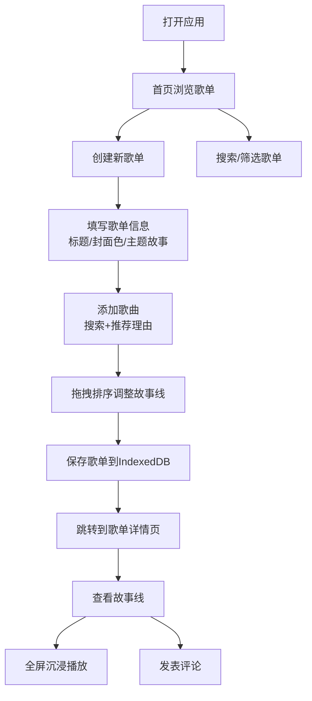

## 1. 产品概述

TuneTales是一个面向社区音乐爱好者的协作叙事歌单创作平台，让成员能够共同创建和编辑具有叙事性的主题歌单，并分享每首歌曲背后的故事。

- 核心价值：将音乐与叙事结合，让歌单成为讲述故事的载体，促进音乐爱好者之间的情感连接和创意表达
- 目标用户：社区音乐爱好者小组、音乐播客创作者、音乐主题活动组织者

## 2. 核心功能

### 2.1 用户角色
| 角色 | 注册方式 | 核心权限 |
|------|----------|----------|
| 普通用户 | 无需注册，本地使用 | 创建、编辑、浏览歌单，发表评论 |

### 2.2 功能模块
1. **首页**：歌单列表展示、搜索过滤、排序切换
2. **歌单编辑页**：歌单信息编辑、歌曲搜索添加、拖拽排序、推荐理由填写
3. **歌单详情页**：故事线展示、全屏沉浸播放、评论区互动

### 2.3 页面详情
| 页面名称 | 模块名称 | 功能描述 |
|----------|----------|----------|
| 首页 | 搜索栏 | 实时搜索歌单标题和主题描述，debounce 200ms |
| 首页 | 排序选择 | 按创建时间/歌曲数量排序 |
| 首页 | 歌单卡片网格 | 响应式2列布局，展示封面色、标题、歌曲数、评论数 |
| 编辑页 | 歌单信息表单 | 标题、封面色（12种预设）、主题故事（200字限制） |
| 编辑页 | 歌曲列表 | 拖拽排序，显示歌曲名、歌手、推荐理由预览 |
| 编辑页 | 添加歌曲表单 | 搜索50首模拟歌曲库，填写推荐理由（10-100字） |
| 详情页 | 故事线展示 | 按顺序展示歌曲及推荐理由 |
| 详情页 | 全屏故事线播放 | 沉浸模式，自动播放，手动切换，进度条 |
| 详情页 | 评论区 | 昵称+内容发表评论，时间升序排列，首字母头像 |

## 3. 核心流程

用户打开应用 → 浏览首页歌单列表 → 点击创建新歌单 → 填写歌单基本信息 → 添加歌曲并填写推荐理由 → 保存歌单 → 分享/查看详情 → 播放故事线 → 发表评论

## 4. 用户界面设计

### 4.1 设计风格
- **主色调**：深蓝灰 #1a1a2e（深色模式背景）
- **强调色**：12种预设封面色盘，用于歌单封面识别
- **按钮风格**：圆角设计，悬停有微动画，深色模式下采用半透明毛玻璃效果
- **字体**：现代无衬线字体，标题使用有设计感的展示字体，正文使用清晰易读的字体
- **布局风格**：卡片式布局，圆角矩形（border-radius: 16px），充足留白
- **图标风格**：线性简约图标，与深色背景协调

### 4.2 页面设计概览
| 页面名称 | 模块名称 | UI元素 |
|----------|----------|--------|
| 首页 | 搜索栏 | 顶部搜索框+排序下拉，毛玻璃效果背景 |
| 首页 | 歌单卡片 | 封面色块（占卡片高度一半）+ 标题 + 歌曲数/评论数图标 |
| 首页 | 悬停效果 | 卡片上浮4px，阴影加深，0.3s ease过渡 |
| 编辑页 | 左右分栏 | 左侧70%歌曲列表，右侧30%添加表单 |
| 编辑页 | 拖拽效果 | 拖拽时卡片缩放0.95+半透明阴影，松手回弹0.2s ease |
| 详情页 | 故事线卡片 | 按顺序排列，每首歌配推荐理由 |
| 详情页 | 全屏模式 | 径向渐变背景，毛玻璃卡片，白色文字，光晕脉冲按钮 |
| 详情页 | 评论区 | 首字母圆形头像，昵称，时间戳，评论内容 |

### 4.3 响应式设计
- 桌面端：2列网格布局
- 平板端：2列网格布局
- 手机端：1列布局，编辑页改为上下布局
- 触摸优化：增大点击区域，支持触摸滑动切换

### 4.4 动画与交互
- 页面切换：fade in 0.3s过渡动画
- 卡片悬停：上浮+阴影加深 0.3s ease
- 拖拽排序：缩放+阴影 0.2s ease
- 故事线播放：从底部淡入上滑，停留3秒自动过渡
- 按钮光晕：CSS keyframes脉冲动画
- 进度条：平滑过渡动画
