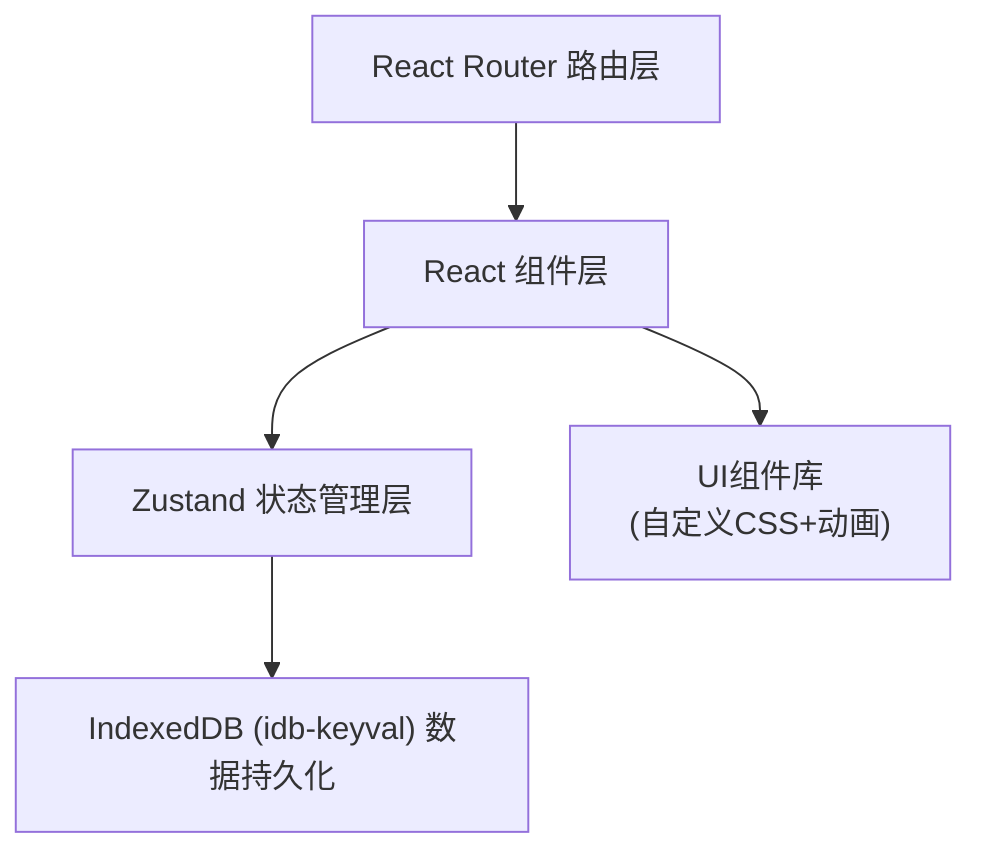
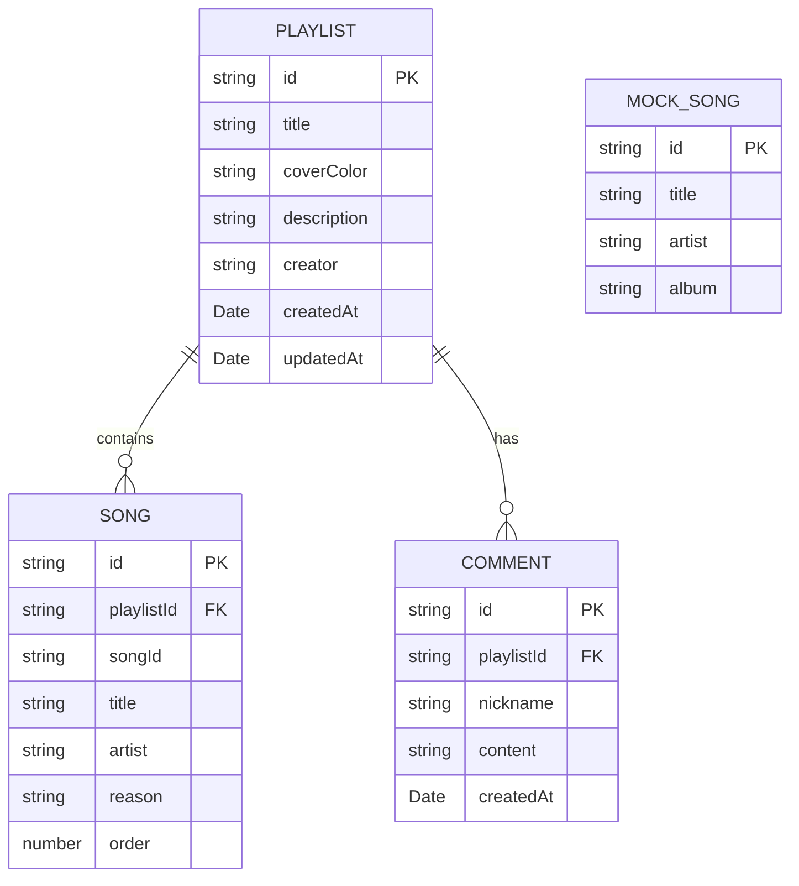

## 1. 架构设计



## 2. 技术选型

- **前端框架**：React@18 + TypeScript
- **构建工具**：Vite
- **路由管理**：react-router-dom@6
- **状态管理**：zustand
- **数据持久化**：IndexedDB (idb-keyval)
- **拖拽排序**：react-beautiful-dnd
- **工具库**：uuid, date-fns
- **样式方案**：原生CSS + CSS变量 + CSS Modules

## 3. 路由定义

| 路由 | 页面组件 | 用途 |
|------|----------|------|
| / | HomePage | 首页，展示歌单列表、搜索、排序 |
| /create | PlaylistEditor | 创建新歌单 |
| /edit/:id | PlaylistEditor | 编辑已有歌单 |
| /playlist/:id | DetailPage | 歌单详情页，故事线+评论 |

## 4. 数据模型

### 4.1 数据模型定义



### 4.2 TypeScript 类型定义

```typescript
// Playlist - 歌单
interface Playlist {
  id: string;
  title: string;
  coverColor: string;
  description: string;
  creator: string;
  createdAt: number;
  updatedAt: number;
}

// Song - 歌单中的歌曲（带推荐理由）
interface Song {
  id: string;
  playlistId: string;
  songId: string;
  title: string;
  artist: string;
  reason: string;
  order: number;
}

// Comment - 评论
interface Comment {
  id: string;
  playlistId: string;
  nickname: string;
  content: string;
  createdAt: number;
}

// MockSong - 模拟歌曲库中的歌曲
interface MockSong {
  id: string;
  title: string;
  artist: string;
  album: string;
}
```

## 5. 项目文件结构

```
src/
├── types.ts              # 全局TypeScript类型定义
├── main.tsx              # 应用入口
├── App.tsx               # 根组件，路由配置
├── index.css             # 全局样式，CSS变量
├── data/
│   └── mockSongs.ts      # 50首模拟歌曲数据
├── store/
│   └── playlistStore.ts  # Zustand状态管理
├── components/
│   ├── PlaylistCard.tsx  # 歌单卡片组件
│   └── PlaylistEditor.tsx # 歌单编辑器组件
├── pages/
│   ├── HomePage.tsx      # 首页
│   └── DetailPage.tsx    # 详情页
├── hooks/
│   └── useDebounce.ts    # 防抖自定义Hook
└── utils/
    └── colors.ts         # 颜色工具函数
```

## 6. 数据流向

1. **组件 → Store**：用户交互触发组件调用store的action方法
2. **Store → IndexedDB**：store通过idb-keyval读写数据到IndexedDB
3. **IndexedDB → Store**：数据变更后更新store状态
4. **Store → 组件**：状态变化触发组件重新渲染UI

## 7. 性能优化策略

- 首页歌单列表：最多100个，使用React.memo优化卡片渲染
- 搜索过滤：debounce 200ms延迟触发，减少不必要的计算
- 歌曲库搜索：50首歌曲，线性遍历即可，保证100ms内响应
- IndexedDB读写：异步操作，不阻塞UI渲染
- 动画效果：使用CSS transform和opacity，触发GPU加速

## 8. 存储键名设计

IndexedDB使用idb-keyval，存储键名：
- `playlists` - 歌单列表数组
- `songs` - 所有歌曲对象（按歌单分组存储或单独存储）
- `comments` - 所有评论对象（按歌单分组）

实际采用扁平存储，每个歌单的歌曲和评论分别存储：
- `playlist:{id}` - 单个歌单
- `playlists:list` - 歌单ID列表
- `songs:{playlistId}` - 该歌单的歌曲列表
- `comments:{playlistId}` - 该歌单的评论列表
