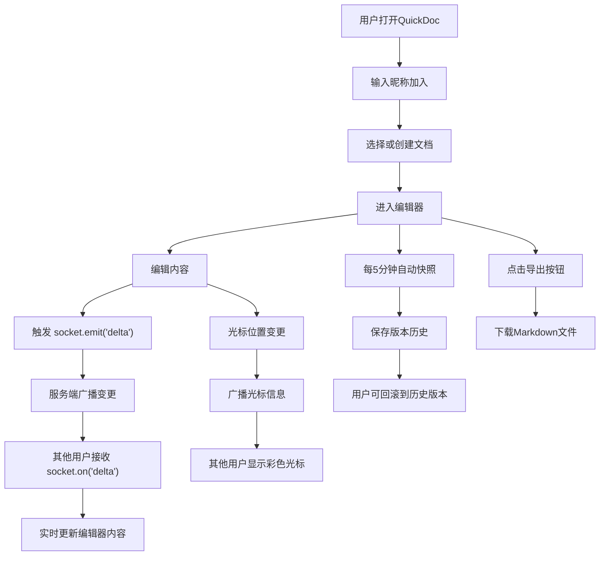
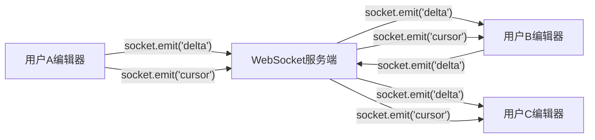

## 1. 产品概述

QuickDoc 是一款面向小型创业团队的轻量级在线文档协作平台，支持多用户实时编辑 Markdown 文档。解决团队成员间草稿同步效率低、版本管理混乱的问题，让协作编辑像面对面讨论一样流畅自然。

- 目标用户：5-20人的小型创业团队，需要频繁协作编辑项目文档、会议纪要和技术草稿
- 核心价值：零门槛实时协作，毫秒级同步，让团队专注于内容创作而非工具操作

## 2. 核心功能

### 2.1 用户角色

| 角色 | 注册方式 | 核心权限 |
|------|----------|----------|
| 团队成员 | 输入昵称即可加入 | 创建/编辑/删除/导出文档，查看版本历史 |

### 2.2 功能模块

1. **编辑器页面**：富文本编辑器、实时协作同步、光标位置显示、在线用户列表
2. **文档管理**：侧边栏文档列表、创建/重命名/删除文档、文档切换
3. **版本历史**：自动快照、版本回滚、历史版本浏览
4. **导出功能**：一键导出为 Markdown 文件下载

### 2.3 页面详情

| 页面名称 | 模块名称 | 功能描述 |
|----------|----------|----------|
| 编辑器页面 | 侧边栏 | 折叠式文档列表，悬停展开，创建/重命名/删除文档操作 |
| 编辑器页面 | 编辑器主体 | Quill 富文本编辑器，实时同步变更，全屏模式 |
| 编辑器页面 | 工具栏 | 毛玻璃效果工具栏，全屏时自动隐藏，格式化操作按钮 |
| 编辑器页面 | 在线用户面板 | 编辑器右上角显示在线用户头像/昵称列表 |
| 编辑器页面 | 光标指示器 | 不同颜色显示各用户光标位置和选中范围 |
| 编辑器页面 | 版本历史面板 | 版本快照列表，点击回滚到指定版本 |
| 编辑器页面 | 导出按钮 | 一键将当前文档导出为 .md 文件下载 |
| 编辑器页面 | 连接状态提示 | WebSocket 重连时显示半透明 toast "重新连接中..." |

## 3. 核心流程

### 3.1 文档编辑协作流程

用户打开应用 → 输入昵称加入 → 侧边栏选择/创建文档 → 进入编辑器 → 输入内容触发 delta 事件 → WebSocket 广播变更 → 其他用户实时接收并更新 → 光标位置同步显示 → 每5分钟自动保存快照

### 3.2 流程图

### 3.3 WebSocket 数据流向

## 4. 用户界面设计

### 4.1 设计风格

- **主色调**：白色背景 (#ffffff) 配以沉稳深蓝色 (#2c3e50) 作为导航和标题色
- **强调色**：明亮翠绿色 (#27ae60) 表示在线状态和操作成功
- **按钮风格**：圆角 (border-radius: 6px)，扁平化设计，hover 时微妙的阴影提升
- **字体**：标题使用思源黑体风格的深蓝粗体，正文使用清晰易读的无衬线字体
- **布局风格**：左侧折叠侧边栏 + 中央无边框编辑器 + 右上角在线用户面板
- **图标风格**：线性图标，24px，与深蓝色主色调一致

### 4.2 页面设计概览

| 页面名称 | 模块名称 | UI 元素 |
|----------|----------|---------|
| 编辑器页面 | 侧边栏 | 深蓝背景，默认收起仅显示图标(48px宽)，悬停展开(240px宽)，过渡动画0.3s ease，文档列表项hover浅色高亮 |
| 编辑器页面 | 编辑器主体 | 白色背景无边框，Quill编辑器占满剩余空间，文档切换淡入淡出动画0.3s ease |
| 编辑器页面 | 工具栏 | 毛玻璃效果(backdrop-filter: blur(10px))，半透明白色背景，全屏模式自动隐藏 |
| 编辑器页面 | 在线用户面板 | 右上角固定定位，圆形头像/昵称标签，翠绿色在线指示点 |
| 编辑器页面 | 光标指示器 | 不同颜色的竖线光标 + 用户名标签，选中范围以对应颜色半透明高亮 |
| 编辑器页面 | 版本历史面板 | 右侧滑出抽屉式面板，时间轴式版本列表，点击回滚按钮 |
| 编辑器页面 | 连接状态Toast | 屏幕顶部居中，半透明深色背景，白色文字"重新连接中..."，连接成功后淡出消失 |

### 4.3 响应式设计

- **桌面端 (>768px)**：左侧折叠侧边栏 + 中央编辑器 + 右上角在线用户
- **平板端 (≤768px)**：侧边栏自动转为底部标签栏，编辑器占满屏幕，在线用户缩为图标点击展开
- 触摸优化：按钮点击区域不小于44px，侧边栏滑动操作支持
